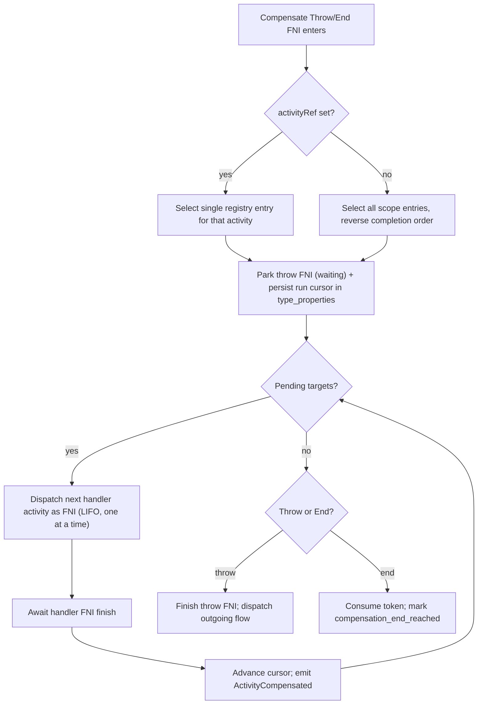
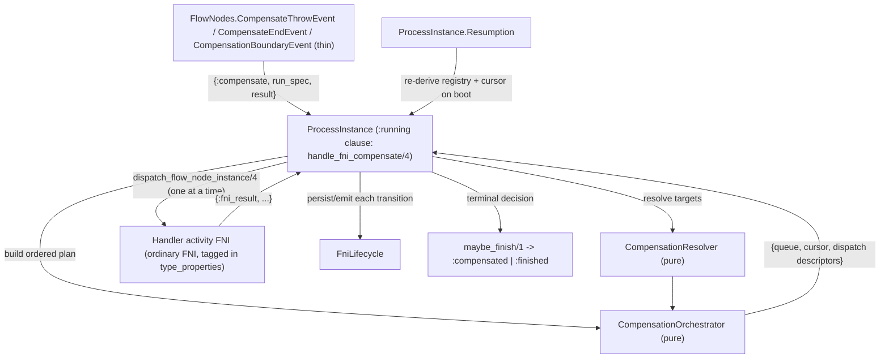

# Engine Compensation Support

**Goal:** Turn the existing compensation groundwork (parsed + validated, but `unsupported_event_definition` at runtime) into a fully executing BPMN 2.0 Compensation feature, integrated with resume/retry/abort/fatal/error/escalation, per the confirmed decisions.

**Confirmed decisions (this plan):**
- Scope = Compensation only: Compensate Throw, Compensate End, Compensation Boundary, Compensation-start Event Subprocess, plus `isForCompensation` + `<bpmn:association>` parsing. Transaction + Cancel End/Boundary are a documented follow-up (they *depend* on this work).
- Execution = sequential, strict reverse-completion order (LIFO), one handler at a time; `activityRef` targets a single activity.
- Crash recovery = re-derive the compensation registry on resume from persisted finished FNIs + the BPMN model (no new registry table); in-flight throw runs resume from a persisted cursor.
- Subprocess / Call Activity scope (v1, confirmed) = compensate an embedded subprocess or call activity as an **atomic unit** via a compensation boundary on the *shell* + a parent-scope handler. A child-scope error/escalation caught by the shell boundary triggers parent-scope compensation (broadcast or `activityRef`). NO cross-PI recursion into a child PI's inner completed activities in v1 (applies to both embedded-subprocess child PIs and call-activity child PIs). Deep hierarchical recursion into embedded-subprocess internals is a documented follow-up.
- State model = only the PI terminal `:compensated` ships in v1. No `compensating` PI state and no new FNI state (confirmed): "compensation is active / what was compensated" is expressed via the two new events + `type_properties` markers. A live `compensating` indicator is a deferred follow-up.
- Responsibility split = thin handlers return a tuple tag; a new pure `CompensationResolver` matches; a new pure `ProcessInstance.CompensationOrchestrator` builds the plan (no spawning); the PI stays a thin executor; `FniLifecycle`/`Resumption` are reused. Explicitly avoids a God-ProcessInstance.
- Studio, JS SDK/Client, a user guidebook, and a full test suite (unit + umbrella integration with real BPMN + conformance) are in scope as tracked todos.

## Spec baseline (verified)

Verified against OMG BPMN 2.0 issue-10429 resolution text + Camunda 7 / Camunda 8 / Flowable references:
- Compensation is triggered explicitly by a Compensate Throw/End (and, in the future, by transaction cancel). `activityRef` present -> compensate that one activity; absent -> broadcast to all completed activities in the scope, reverse completion order.
- A Compensation Boundary Event activates on host **successful completion** (not on start); `cancelActivity` does not apply. It references exactly one handler via a directed `<bpmn:association>`.
- Only **completed** activities with a compensation handler are compensated; active/terminated activities are not. Compensation runs synchronously (throw/end waits for handlers). `waitForCompletion="false"` is treated as `true` (matches Camunda/Flowable).
- Compensation is PI-local: not propagated into Call Activity child instances, and (v1) not recursed into embedded-subprocess child PIs either. Embedded subprocesses and call activities are compensated as atomic units via a compensation boundary on the shell + a parent-scope handler. (BPMN's deeper rule — recurse into completed embedded-subprocess scopes — is a v1-deferred follow-up; call-activity non-propagation is permanent per spec.)

## Existing groundwork (do not rebuild)

- Parser (`apps/core_bpmn/lib/evil_engine/bpmn/parser/sax_handler.ex`): `compensateEventDefinition` -> `%EventDefinition.Compensation{activity_ref, wait_for_completion}`; `cancelEventDefinition` -> `%EventDefinition.Cancel{}`.
- Validator (`apps/core_bpmn/lib/evil_engine/bpmn/validator.ex` `@valid_event_positions`): Compensation allowed on End/IntermediateThrow/Boundary; Cancel on End/Boundary.
- Runtime guard (`apps/core_execution/lib/evil_engine/execution/handler_dispatch.ex` ~234-236): returns `:unsupported_event_definition` -> FNI/PI fatal. This is what we replace.
- Docs already sketch the LIFO registry + `:compensated` PI state (`docs/ImplementationPlan.md` ~997-1041, 385).
- NOT present: `isForCompensation`, `<bpmn:association>`, `<bpmn:transaction>`, compensation handlers, per-PI completion ordering column.

## Architecture

### Registry (in-memory, re-derived)
Add `compensation_registry` to the PI in-memory state (`apps/core_execution/lib/evil_engine/execution/process_instance/state.ex`). Each entry: `{completed_fni_id, flow_node_id, handler_activity_id, token_snapshot, completion_order}`.
- **Push** in `do_handle_fni_ok` (in `process_instance.ex`) when a just-finished activity has a resolvable Compensation Boundary (handler activity id resolved via association at model-build time). The compensated activity's output token is snapshotted (BPMN: handler runs with the activity's completion data).
- **Order** by a monotonically increasing per-PI counter kept in state (no DB column needed); on resume, order by `finished_at` then FNI UUIDv7.
- **Re-derive on resume**: new step in `apps/core_execution/lib/evil_engine/execution/process_instance/resumption.ex` — scan persisted finished FNIs, match against the model's compensation-boundary attachments, rebuild the registry in completion order. This is the same "reconstructed vs re-derived" philosophy already used for join routing.

### Compensate Throw / End execution
The handler returns a new tuple tag; the PI orchestrates a sequential run (mirrors the escalation/terminate precedents in `process_instance.ex` `handle_fni_escalation_*` / `handle_fni_terminate`).

- New PI state field `compensation_runs: %{throw_fni_id => %{queue, cursor, mode, outgoing, token}}`; supports concurrent throws from parallel branches (keyed by throw FNI).
- Handler activity FNIs are ordinary FNIs tagged in `type_properties` with `compensation_for` (compensated FNI id) and `compensation_throw_fni_id`; they run through normal dispatch (events, persistence, boundaries).
- **Resume-safe cursor**: the throw FNI persists its ordered target list + cursor in `type_properties`; on resume a `:waiting` compensate-throw FNI rebuilds its run and continues from the next pending target (completed handler FNIs are already `finished` in the DB).

### Compensation End vs terminate
Per BPMN a Compensate End is a throw + normal end (NOT a terminate). Decision COMP-D: it does **not** interrupt parallel branches. After its handlers finish it consumes its token like a None end; when the PI naturally quiesces (`active_count == 0`, no error/escalation/terminate) and a compensation-end was reached, the PI terminal state is `:compensated`, else `:finished`.

**Rationale (trigger vs. mechanism) — document this in the guidebook.** Compensation is a general-purpose "undo completed work" *mechanism*, decoupled from whatever *triggers* it (a Transaction Cancel, an error/escalation boundary wired to a Compensate Throw, or a plain modeled business decision like "customer cancelled — undo the booking"). The handlers do not know why they ran. Whether the flow then stops or continues is therefore a *separate* modeling choice: a **Compensate Intermediate Throw** waits for its handlers and then continues on its outgoing flow (e.g. undo, then send a cancellation email, then end); a **Compensate End** waits for its handlers and then ends only *its own path* — parallel branches keep running because, like any ordinary End Event, it is not a Terminate (only a Terminate End Event stops the whole instance). The "compensate, then stop" case most people intuitively expect is simply the common shape where the compensated path is the sole/last token, so the PI quiesces into `:compensated`. This matches BPMN 2.0 §10.6 and the Camunda/Flowable behavior ("a compensation end event triggers compensation and the current path of execution is ended; same behavior as a compensation intermediate throwing event"). The engine **never auto-triggers** compensation — see the edge-case matrix.

### Compensation Boundary
Not pre-spawned (unlike error/timer/escalation boundaries). It is a **registration carrier** resolved at completion time; the handler activity (an `isForCompensation` activity, out of normal sequence flow, target of the association) is dispatched only when compensation fires.

### Compensation-start Event Subprocess (highest risk, isolate)
A `triggeredByEvent` subprocess whose start event is Compensation. Per spec it *consumes* a thrown compensation for its scope and runs its inner flow (which may itself throw compensation). Implement as: register the ESP as the scope's compensation handler; a scope-level compensate throw runs the ESP child PI (reusing ESP-D1 child-PI machinery) instead of the boundary-handler path. Keep semantics narrow and documented; this is the piece most likely to be split out if it grows.

## Responsibility allocation (no God-ProcessInstance)

The codebase already enforces an anti-god-module pattern for scope-wide effects (Terminate/Error/Escalation End): **handlers stay thin and return a tuple tag; a resolver computes matches; an orchestrator computes a plan of side effects (but does not spawn); the PI executes the plan via its existing primitives; `FniLifecycle` persists/emits.** Compensation follows the exact same seams — the closest precedent is the `ProcessInstance.BoundaryOrchestrator` (which explicitly documents "does not spawn FNIs — those remain in ProcessInstance").

### What is added to the PI, and why (kept minimal)
- **In-memory state fields only** (`state.ex`): `compensation_registry` (list of `{completed_fni_id, flow_node_id, handler_activity_id, token_snapshot, completion_order}`), a monotonic `compensation_completion_counter`, and `compensation_runs: %{throw_fni_id => run}`. *Why:* the PI is the single owner of live per-instance runtime state (like `join_routing`, `escalation_info`); putting it anywhere else would require a parallel process or a DB table (rejected — registry is re-derived, not stored).
- **Registry push hook** in `do_handle_fni_ok/3`: when a just-finished activity has a resolvable compensation boundary, append an entry (snapshot output token, assign completion order). *Why:* this is the one place the PI already observes "an activity finished"; it is a 3–5 line append, not logic.
- **One new `:running` clause + `handle_fni_compensate/4`**: mirror `handle_fni_terminate/3` — call the resolver+orchestrator, park the throw FNI, dispatch the first handler; on each handler `:fni_result` advance the cursor and dispatch the next; when the queue drains, continue the outgoing flow (throw) or consume the token and flag `compensation_end_reached` (end). *Why:* only the PI may call `dispatch_flow_node_instance/4` and route tokens; this clause is thin sequencing glue, no matching/ordering logic.
- **`maybe_finish/1` extension**: if `compensation_end_reached` and no stronger terminal (error/escalation/terminate), PI terminal = `:compensated`. *Why:* `maybe_finish/1` is already the single terminal-decision point.

### What lives OUTSIDE the PI, and why
- **`FlowNodes.CompensateThrowEvent`, `CompensateEndEvent`, `CompensationBoundaryEvent`, `CompensationStartEvent` (ESP)** — thin handlers. Each only builds a `run_spec` (activityRef | scope, throw|end) and returns a new tuple tag; the boundary is a passive registration carrier (pre-spawned like `ErrorBoundaryEvent`/`EscalationBoundaryEvent` for debugger visibility, real work at completion time). *Why:* handlers must not know about scope-wide sequencing — same rule that keeps `TerminateEndEvent` a 20-line module.
- **`EvilEngine.Execution.CompensationResolver` (new, pure)** — `activityRef -> [handler activity nodes]`, boundary `<bpmn:association>` -> handler activity id, scope membership. Sibling of `EscalationResolver`/`BoundaryResolver`. *Why:* isolates BPMN-model matching from runtime state.
- **`EvilEngine.Execution.ProcessInstance.CompensationOrchestrator` (new, pure)** — given `data` + `run_spec`, produce the ordered target queue (reverse completion order for broadcast; single entry for `activityRef`), the initial cursor, and `{target, token, prev_ids}` dispatch descriptors. **Does not spawn or dispatch.** Sibling of `BoundaryOrchestrator`. *Why:* this is exactly where the God-object risk concentrates (ordering, empty-target no-op, parallel-throw keying) — keeping it a pure function that returns a plan makes it unit-testable in isolation and keeps the PI a pure executor.
- **`FniLifecycle`** — handler activity FNIs are ordinary FNIs; reuse `finish/4`, `transition_to_interrupted/7`, `transition_to_aborted/7`, `handle_aborted/1`. *Why:* zero new persistence/emit code paths.
- **`ProcessInstance.Resumption`** — one new step to re-derive `compensation_registry` from persisted finished FNIs + model boundaries, and to rebuild any `:waiting` throw FNI's run from its persisted `type_properties` cursor. *Why:* Resumption already owns "reconstruct runtime state from the DB" (join routing, waiter reactivation).
- **`HandlerDispatch`** — replace the three `:unsupported_event_definition` clauses for Compensation with routing to the new handlers. *Why:* dispatch table is the correct place, one-line-per-position change.

Net PI growth: ~1 running-clause + 1 orchestration function + 3 state fields + a registry-append hook. All matching/ordering/plan logic sits in the two new pure modules.

## State model decision (COMP-D-STATES)

- **PI terminal `:compensated`** — implemented end-to-end (`Helpers.parse_*`, `@terminal_states`, retry `resettable_state_for/1`, persistence). Compensation-end reached with no stronger terminal -> `:compensated`; otherwise `:finished`. SDK already exposes `ProcessInstanceState.Compensated`; Studio already has a `&--compensated` badge.
- **No `compensating` state in v1** (confirmed decision): the PI stays `:running` while a compensation run is active, and no new FNI state is introduced. Compensated activities' FNIs remain `:finished` (terminal invariant preserved). "A compensation is active/what got compensated" is surfaced purely via (a) the `CompensationTriggered` / `ActivityCompensated` events and (b) `type_properties` markers on the involved FNIs (`compensation_run` on the parked throw FNI; `compensation_for` + `compensation_throw_fni_id` on handler FNIs). This is what the Studio debugger keys its distinct compensation-flow coloring off — no lifecycle-state change required. A live persisted `compensating` indicator is an explicit deferred follow-up (revisit on user demand).

## Studio follow-up work (separate BFW-Studio item)

Tracked here for completeness; executed in the BFW-Studio repo after the SDK publishes. Key file anchors from investigation:
- **SDK bump:** `studio/package.json` consumes `@elraptorus/daemonengine_sdk` / `@elraptorus/daemonengine_client` (`^0.1.0`); bump after publish so the new event types and markers are available.
- **Debugger compensation-flow visualization (primary ask — distinct from execution flow):**
  - New color tokens + backdrop/shadow classes in `studio/src/modules/engine-debugger/EngineDebugger.scss` (theme-token ownership rule: colors live here, not core theme SCSS).
  - A `compensation` visual flag in `studio/src/modules/engine-debugger/overlays/OverlayFactory.ts` (`createFlowNodeInstanceCover`, `getFlowNodeBoxShadowByState`) keyed off `fni.type_properties.compensation_for` / `compensation_throw_fni_id` — orthogonal to the normal state color so it composes rather than replaces.
  - **New association-path markers:** today only `bpmn:SequenceFlow` edges get the `connection-done` marker (in `EngineBpmnDebuggerEditorDocumentModel.refreshSequenceFlowMarkers`); compensation handlers are linked by `<bpmn:association>`. Add parallel marker logic to highlight the executed association(s) in the compensation color.
  - Handle `CompensationTriggered` / `ActivityCompensated` in `studio/src/modules/engine-core/SubscribeThenSnapshot.ts` and `engine-debugger/libs/EngineAdapter.ts`.
- **Optional panes:** runtime `CompensationBoundaryEventPane.tsx` (register in `engine-debugger/initializers/initializePanes.ts` + a `shouldDisplay…` in `property-panel/ShouldBeDisplayedConditions.ts`); editor `PropertiesCompensationBoundaryEvent.tsx` (register in `bpmn-editor/initializers/initializeBpmnPanes.ts`) to surface the boundary->handler association. Help markdown already exists at `panes/properties/CompensationBoundaryEvent/PropertiesCompensationBoundaryEvent.md`.
- **engine-model-viewer:** no runtime coloring needed (static viewer).
- **Formatters:** `engine-core/Formatters.ts` already labels the `compensated` PI state; no FNI label change needed in v1.

## Edge case & state-change matrix

- **Parallel branches:** a throw compensates only *completed* activities in the scope; active/waiting siblings keep running and are never interrupted by a throw. Compensation End does not interrupt siblings either.
- **Aborted:** abort bypasses compensation entirely (like it bypasses boundaries). In-flight compensation handler FNIs receive `handle_aborted/1`; no new compensation is triggered. Emergency stop = no rollback.
- **Fataled:** a normal-flow fatal does NOT auto-trigger compensation. If a compensation *handler* activity itself fatals, the throw FNI fatals -> PI fatals (partial compensation is left as-is; retry can re-drive). Document.
- **Errored (Error End / uncaught error):** no auto-compensation. Author opts in via error boundary -> handler -> Compensate Throw. Registry is discarded on PI error.
- **Escalated:** no auto-compensation; author wires escalation boundary -> Compensate Throw. This is the explicitly-supported "escalation drives rollback" pattern from the prior discussion — add a dedicated integration test.
- **Embedded subprocess / Call Activity (atomic unit, v1):** a child-scope error or escalation propagates up (existing `{:child_pi_bpmn_error, ...}` / `{:escalation_passthrough, ...}` machinery) to a boundary on the subprocess/CA **shell** in the parent. The boundary handler throws compensation in the **parent** scope (broadcast or `activityRef` — including compensating the subprocess/CA activity itself if it carries a compensation boundary). Compensation does **not** enter the child PI's inner completed activities in v1. The compensated child activity's handler is an ordinary parent-scope `isForCompensation` activity (the modeled "undo", e.g. a Service/Call Activity that reverses the child's effect). Deep recursion into embedded-subprocess internals is deferred.
- **Retry / checkpoint reset:** compensation handler FNIs are ordinary FNIs handled by the existing 3-phase reset; clearing downstream finished FNIs automatically removes their registry entries on the subsequent resume (registry is re-derived). Any persisted `compensation_runs` cursor on reset FNIs is cleared. Retry only applies to terminal PIs, so no live run exists at retry time.
- **Resume after engine restart:** registry re-derived from finished FNIs + model; a `:waiting` compensate-throw FNI resumes from its persisted cursor. Relevant and handled.
- **activityRef with no completed registration / boundary with no resolvable handler:** runtime no-op (nothing to compensate), continue on the outgoing flow; emit a `CompensationTriggered` with zero handlers for observability. Not a deploy failure (leniency).

## Validation split (deploy stays lenient)

- **Studio linter (design-time, gated by linter-gate config):** compensation boundary should have exactly one association to an `isForCompensation` handler; `activityRef` should resolve to an activity with a compensation boundary in the same scope; broadcast-throw with no handlers is a warning. WIP diagrams still deploy. (Studio-side; mostly already scaffolded in the other repo.)
- **Deploy-time validator (lenient — structural/position only):** keep existing position rules; add one hard position rule: a Compensation **Start** event is legal only inside an Event Subprocess (`triggeredByEvent`), mirroring ESP-D7 style (`:invalid_event_position` / dedicated atom). Do NOT hard-fail on missing associations, unresolved `activityRef`, or handler-less boundaries — those are linter/runtime concerns.
- **Runtime:** unresolved/empty targets -> no-op + event; handler activity failure -> throw fatal -> PI fatal.

## Events, telemetry, persistence state

- New engine events in `apps/core_types/lib/evil_engine/types/event.ex` + `Jason.Encoder` in `apps/core_events/lib/evil_engine/events/json_encoders.ex` (follow `EscalationRaised`): `CompensationTriggered` (throw/end/boundary run start; `activity_ref`, `throw_type`, scope + `root_process_instance_id`) and `ActivityCompensated` (per handler completion). Paired telemetry `[:evil_engine, :compensation, :triggered]` / `[:evil_engine, :compensation, :activity_compensated]`. Mirror TypeScript types in `packages/js/sdk/src/events/engine-events.ts`. WS root-PI fan-out is automatic once `root_process_instance_id` is present.
- Add `:compensated` PI terminal state end-to-end: `Helpers.parse_*`, `@terminal_states` in `apps/api_facade/lib/evil_engine/api.ex` (already lists `"compensated"`), retry `resettable_state_for/1`, and PI state persistence.

## JS SDK & Client updates

The published SDK/Client are the contract for the Studio (`@elraptorus/daemonengine_sdk` / `@elraptorus/daemonengine_client`, both `^0.1.0`).
- **SDK (`packages/js/sdk/`):** add `CompensationTriggered` and `ActivityCompensated` `export interface`s in `src/events/engine-events.ts` (PascalCase `type`, matching the engine wire names exactly), append both to the `EngineEvent` discriminated union, and re-export from `src/events/index.ts` and `src/index.ts`. Optionally add a `CompensationTypeProperties` interface (snake_case keys `compensation_for`, `compensation_throw_fni_id`) in `src/types/compensation.ts` as documentation for the handler-FNI markers. **No enum changes:** `ProcessInstanceState.Compensated` already exists; `FlowNodeInstanceState` is unchanged (markers ride in `typeProperties`); no `compensating` value in v1.
- **Client (`packages/js/client/`):** **no receive-path code change** — `NotificationClient.onEngineEvent` / `subscribeProcessInstance` pass `EngineEventEnvelope`s through and consumers discriminate on `event.type`. Fix stale terminal-state assumptions that omit `compensated`: JSDoc in `src/rest/process-instance-client.ts` and the `cleanupInstances` allow-list in `test/support/test-engine.ts`. Optionally add a `waitForCompensationEvent` test helper.
- **Versioning:** rebuild and version-bump both packages so the Studio can consume the new event types.

## Documentation & user guidebook

- **Architecture/reference docs** (agent-facing): `AGENTS.md` (compensation runtime semantics, the two new events, updated event-position tables including compensation-start-only-in-ESP), `docs/architecture/execution.md` (orchestration + responsibility split + registry), `docs/architecture/event-system.md` (new events + WS root-PI fan-out), `docs/architecture/data-model.md` (registry is in-memory/re-derived, no new table), `docs/architecture/common-pitfalls.md` (e.g. "compensation is not auto-triggered by fatal/error/escalation/abort"), and the README element-support table. Follow the `maintain-documentation` + `architecture-docs` skills.
- **User guidebook** (human-facing) at `docs/guides/handbook/compensation.md`, mirroring the existing `docs/guides/handbook/complex-gateways.md` style: concept, how to model (`isForCompensation` handler + compensation boundary + `<bpmn:association>`, Compensate Throw/End, `activityRef` vs broadcast, compensation-start Event Subprocess), LIFO semantics, the escalation-drives-rollback and saga patterns, the explicit list of what is NOT auto-compensated, the `:compensated` terminal state, and complete worked BPMN examples. Link from `docs/architecture/index.md` and the guides index.

## Testing strategy

Coverage must include happy, edge/error, and security/sanity paths, and follow the `build.mdc` requirement to test after each logical change.
- **Unit (Elixir, per-app):** `CompensationResolver` (activityRef resolution, association->handler, scope membership, unresolved -> empty); `CompensationOrchestrator` (reverse-completion ordering, single vs broadcast, empty-target no-op, parallel-throw keying, cursor advance); registry push in `do_handle_fni_ok`; registry re-derivation in `Resumption`.
- **Umbrella-level integration with real `.bpmn` fixtures** (the primary ask — new fixtures under `apps/*/test/fixtures/bpmns/` and `packages/js/client/test/integration/fixtures/`): boundary registration on host completion; `activityRef` single-target vs broadcast reverse-order; compensation-end -> `:compensated`; escalation-boundary -> Compensate Throw (escalation-drives-rollback); abort bypass (no compensation, `handle_aborted` on in-flight handlers); fatal-in-handler -> throw fatal -> PI fatal; error/escalation no auto-compensation; retry + checkpoint reset re-derivation and cursor clearing; **resume after engine restart** continues from persisted cursor; unresolved/empty-target no-op emits a zero-handler `CompensationTriggered`; parallel branches keep running (no sibling interruption); compensation-start Event Subprocess consumes-and-runs. **Combined child-process cases (required, not exhaustive):** (a) embedded subprocess child raises an error caught by an error boundary on the subprocess shell -> handler throws broadcast compensation in the parent; (b) embedded subprocess child raises an escalation caught by an escalation boundary on the shell -> handler throws `activityRef` compensation for a specific parent-scope activity; (c) call activity child raises an error/escalation caught by a boundary on the call-activity shell -> parent-scope compensation (broadcast and `activityRef` variants), asserting compensation does NOT enter the child PI. Assert both new events fire by subscribing before triggering (WS/global-engine-events pattern).
- **Conformance (SDK golden snapshots):** parser/validator coverage for `isForCompensation`, `<bpmn:association>`, and the compensation-start-in-ESP position rule (extend the existing `parser_coverage_escalation_compensation.json` family).
- **Security/sanity:** compensation is PI-local (never propagated into Call Activity children); retry auth unchanged; no new endpoint (nothing new to authorize).

## Plan-file note

Per the repo convention (`.cursor/rules/plans-to-files.mdc`), during execution also persist this plan to `ThomasTheDaemonEngine/.cursor/plans/engine_compensation_support_<hex>.plan.md` with frontmatter (title/date/status).

## Verification

Run the full quality gate from the Engine root after each logical change and at the end: `mix compile --warnings-as-errors`, `mix credo --strict`, `mix dialyzer`, `mix sobelow` (api_web), `mix docs --warnings-as-errors`, `mix test`, integration + conformance. Ensure the test DB container is up first (`ensure-test-db` skill). Tests must cover happy paths, edge/error paths, and the resume/retry/abort/escalation interactions above.
