# Evil Engine — Architecture Diagram

> **Companion document to [`ImplementationPlan.md`](./ImplementationPlan.md)
> and the [`architecture/`](./architecture/index.md) detail documents.**
> This file shows the engine's architecture as a single conceptual picture.
> Detailed specifications for each subsystem live in `docs/architecture/*.md`;
> `ImplementationPlan.md` retains the decision log (§0), runtime specs, and
> testing strategy. Every box below is cross-referenced to a document in §4.

## 1. How to read this

The engine is an **Elixir umbrella project** whose boxes below correspond
one-to-one to the `apps/` directories listed in `ImplementationPlan.md` §2.
The diagram is laid out as a **triangle**: external actors + wire surfaces
at the top, the shared service layer `EvilEngine.Api` at the apex, and the
Core and Peripheral domains side-by-side as the base.

Arrows show the **permitted** direction of runtime dependencies:

- **API wire → `EvilEngine.Api` → Core / Peripheral** for commands (ingress flow).
- **Core → Peripheral / External** for typed events via `EngineEventBus` (egress flow).
- **Core never calls API.** Peripheral never blocks Core.
- **Plugins live at the edges** (`peripheral_plugins`, loaded in-BEAM in v1;
  a gRPC sidecar host is deferred, PLUG-D1) and call `EvilEngine.Api` **directly** for commands
  — no HTTP round-trip, no wire-format re-encode.

## 2. Full architecture (Mermaid)

```mermaid
flowchart TB
  %% ============ Row 1: External actors (top) ============
  subgraph EXT["External actors & systems"]
    direction LR
    Studio["Bifrost Forge World Studio (React · @elraptorus/daemonengine_client)"]
    OtherClients["CLI · dashboards · 3rd-party clients"]
    Obs["External observability · Prometheus · Datadog · OTel · Kafka"]
    Sidecars["gRPC plugin sidecars · deferred PLUG-D1"]
  end

  %% ============ Row 2: API wire surfaces ============
  subgraph APIWIRE["API wire surfaces — §10"]
    direction LR
    api_auth["api_auth · JWT · HS/RS/ES + JWKS"]
    api_web["api_web · REST + GraphQL + WebSocket + Admin"]
  end

  %% ============ Row 3: Shared service layer (triangle apex) ============
  api_svc[["EvilEngine.Api · Ash Code Interface · one shared service layer for HTTP surfaces AND plugins · §2.2 / §9"]]

  %% ============ Row 4: Core + Peripheral side-by-side (triangle base) ============
  subgraph BASE[" "]
    direction LR

    subgraph PERI["Peripheral Domains — §2 / §4 / §9 / §11"]
      direction TB
      peri_persist["peripheral_persistence · Ash + AshPostgres · RetentionRunner"]
      peri_telem["peripheral_telemetry · :telemetry counters · /stats (§11)"]
      peri_plugins["peripheral_plugins · Registry · gRPC bridge · supervised isolation (§9)"]
      subgraph PERI_SINKS["EventSinks on EngineEventBus"]
        direction LR
        sink_console["console · ON"]
        sink_telem["telemetry · ON"]
        sink_ws["websocket · ON"]
        sink_db["database · OFF"]
        sink_plugin["plugin sinks · user-defined"]
      end
    end

    subgraph CORE["Core Domains — §2 / §3 / §5"]
      direction TB
      core_types["core_types · behaviour-free structs"]
      subgraph CORE_RUN[" "]
        direction LR
        core_exec["core_execution · PI/FNI runtime · Resume · PayloadCap"]
        core_events["core_events · EngineEventBus · Pending Sweeper"]
        core_timers["core_timers · ISO 8601 scheduler"]
        core_expr["core_expressions · FEEL · Identity resolver"]
        core_bpmn["core_bpmn · XML parser · ModelCache · Linter gate"]
      end
      core_types --- CORE_RUN
    end
  end

  %% ============ Storage + seed (bottom) ============
  Postgres[("PostgreSQL 14+ · monthly partitions")]
  SeedingDir[/"Seeding Directory · *.bpmn auto-deploy"/]

  %% ============ Edges: Ingress (wire clients → wire surfaces) ============
  Studio -->|REST · GraphQL · WS| APIWIRE
  OtherClients -->|REST · GraphQL · WS| APIWIRE
  OtherClients -.->|Swagger| api_web

  api_web --> api_auth

  %% ============ Edges: wire surfaces → shared service ============
  api_web --> api_svc

  %% ============ Edges: Plugins bypass HTTP and call the service layer directly ============
  peri_plugins ==>|direct in-process call · no HTTP| api_svc

  %% ============ Edges: service layer → Core / Peripheral ============
  api_svc -->|commands| core_exec
  api_svc -->|Ash read-model| peri_persist
  api_svc -->|Model graph| core_bpmn

  %% ============ Edges: Core internal ============
  core_exec <--> core_events
  core_exec <--> core_timers
  core_exec <--> core_expr
  core_exec <--> core_bpmn
  core_events <--> core_timers

  %% ============ Edges: Core → Persistence ============
  core_exec -->|Ash actions| peri_persist
  peri_persist <-->|SQL · partitions| Postgres

  %% ============ Edges: Event egress (dashed, fan-out) ============
  core_events -.->|Event.* fan-out · parallel · crash-isolated| PERI_SINKS
  sink_db --> peri_persist
  sink_telem --> peri_telem
  sink_ws --> api_web
  sink_console -->|stdout JSON| Obs
  sink_plugin --> peri_plugins
  sink_plugin -->|forward| Obs

  %% ============ Edges: sidecar bridge + seeding ============
  peri_plugins -.->|gRPC streams| Sidecars
  SeedingDir -->|*.bpmn at boot| core_bpmn

  %% ============ Styling ============
  classDef ext fill:#fdf6e3,stroke:#b58900,color:#073642
  classDef api fill:#e8f4fd,stroke:#268bd2,color:#073642
  classDef svc fill:#c9ddf4,stroke:#0d4b8d,color:#073642,stroke-width:2px
  classDef core fill:#eef7ee,stroke:#859900,color:#073642
  classDef peri fill:#fbeef2,stroke:#d33682,color:#073642
  classDef db fill:#fff2b3,stroke:#b58900,color:#073642
  classDef sink fill:#fbeef2,stroke:#d33682,color:#073642,stroke-dasharray: 4 2

  class Studio,OtherClients,Obs,Sidecars,SeedingDir ext
  class Postgres db
  class api_web,api_auth api
  class api_svc svc
  class core_types,core_exec,core_events,core_timers,core_expr,core_bpmn core
  class peri_persist,peri_telem,peri_plugins peri
  class sink_console,sink_telem,sink_ws,sink_db,sink_plugin sink
```

## 3. Layer-by-layer reading guide

### 3.1 API wire surfaces (blue)

Two `api_*` apps form the wire surface. `api_web` is a **thin adapter
over HTTP / GraphQL / WS** — its only job is to translate a wire request
into a call on the shared service layer (§3.2). All ingress passes through
`api_auth` for JWT validation (§13). The REST surface handles
lightweight trigger-style calls; GraphQL handles complex queries over the
Ash read-model plus the Process Model graph. The WebSocket layer is
**both** an ingress surface (clients subscribing to PI topics) and an egress
target (the `websocket` EventSink pushes `Event.*` payloads live to
subscribed clients). Module namespaces (`EvilEngineWeb.Http.*`,
`EvilEngineWeb.Ws.*`, `EvilEngineWeb.Graphql.*`) are preserved inside the
single `api_web` app.

### 3.2 Shared service layer — `EvilEngine.Api` (darker blue)

**The triangle apex of the architecture.** `EvilEngine.Api` is an **Ash Code
Interface**: every Ash action in the engine — `start_process_instance/2`,
`publish_message/3`, `retry_pi/2`, `purge_process_instances/1`, … — is
exposed as a plain Elixir function. Every wire adapter above and every
plugin below converges here:

| Caller | Path |
|---|---|
| REST controller in `api_web` | `EvilEngine.Api.start_process_instance(input, actor)` |
| GraphQL resolver in `api_web` | same function call, after Absinthe decoding |
| WebSocket handler in `api_web` | same function call, after channel decoding |
| In-BEAM plugin (`peripheral_plugins`, §9.2 mode 1) | **same function call — no HTTP round-trip, no JSON re-encode, no auth replay** |
| gRPC sidecar plugin (§9.2 mode 2) | **Deferred (PLUG-D1).** Not implemented in v1. A future bridge in `peripheral_plugins` would decode the proto into a call on the same function |

This is the guarantee behind the diagram's heavy arrow from `peri_plugins`
to `api_svc` (labelled *direct in-process call · no HTTP*). Validation,
authorization policies, and audit hooks live **inside** the Ash action, so
every caller — wire or plugin — gets identical enforcement. No code path
bypasses the service layer to reach Core or Persistence directly; the
Core-only edges from plugins (`peri_plugins -.-> core_events`) are reserved
for event-level integration (registering handlers and EventSinks), not
commands.

### 3.3 Core layer (green)

No Core domain imports from any API or Peripheral domain (§2). The five
runtime services collaborate around `core_types` for shared, behavior-free
structs — there is no diamond dependency. `core_bpmn` owns the canonical
in-memory Process Model AST (§2.1.3) via `EvilEngine.BPMN.ModelCache`
(per-node, ETS-backed); every handler and resolver goes through the cache,
never re-parsing XML at runtime.

`core_events` is the heart of egress. It hosts:

- The legacy in-process `Phoenix.PubSub` topics (§3.3.1) for intra-engine
  coordination (subscriptions, correlation registries, pending-event TTL
  sweeper).
- The public `EngineEventBus` wrapping PubSub with a sink-routing stage
  that fans out every typed `EvilEngine.Types.Event.*` to every registered
  `@behaviour EvilEngine.Plugin.EventSink`. **This is the only channel through
  which observability, audit logging, and external integrations ever see
  engine events.**

### 3.4 Peripheral layer (pink)

Three distinct concerns, all decoupled from Core:

1. **`peripheral_persistence`** — Ash resources + AshPostgres migrations +
   the `RetentionRunner` (two-pass
   housekeeping) + the `mix evil.partitions.ensure` Mix task. Owns every
   persistent row. Receives writes from `core_execution` via Ash actions.
2. **`peripheral_telemetry`** — in-process `:telemetry` counters that back
   `/stats` (§11). Fed exclusively by the `telemetry` EventSink. **No
   Prometheus, no OpenTelemetry in v1 core** — those integrations ship as
   plugin sinks.
3. **`peripheral_plugins`** — plugin registry, in-BEAM loader, conflict
   detector (§9.3). A gRPC sidecar bridge is specified in §9.2.3 but deferred
   (PLUG-D1). Plugins register under a supervised task tree so a
   crashing plugin cannot take down the engine. This is also where plugin
   EventSinks live on the way back into `EngineEventBus`.

### 3.5 EventSink fan-out (dashed edges in the diagram)

Every `Event.*` published via `EngineEventBus.publish/1` fans out in parallel
to every sink that returned `true` from `accepts?/2`. Built-in sinks:

| Sink | Default | Purpose |
|---|---|---|
| `console` | **ON** | `logger_json` → stdout (consumed by `kubectl logs`, Loki, Cloudwatch, …) |
| `telemetry` | **ON** | Increments `/stats` counters |
| `websocket` | **ON** | Phoenix.Channels push to connected clients (Studio debugger live view) |

The built-in `database` sink was removed. The `process_instance_events`
table is retained for migration compatibility but is no longer populated by any
built-in sink. Operators who need DB-backed event storage register a plugin
sink instead.

Plugin sinks (rightmost box) are registered via
`EvilEngine.Plugin.Registry.register(:event_sink, …)` on boot. Typical
deployments: a Datadog sink forwarding `Event.*` to Datadog Logs, a
Prometheus-exporter plugin translating `Event.*` counters into a
Prometheus-format `/metrics` endpoint on its own plug, a Kafka sink with
internal buffering + retry for at-least-once delivery.

### 3.6 External surface

- **The Studio** depends on `@elraptorus/daemonengine_client` (which
  depends on `@elraptorus/daemonengine_sdk`). No SQL, no PubSub, no gRPC
  coupling.
- **Other clients** (CLIs, 3rd-party dashboards) use the same REST + GraphQL +
  WebSocket surfaces.
- **PostgreSQL** is the sole persistent backend. The engine owns its schema
  via AshPostgres migrations; partitioning runs nine tables
  in `PARTITION BY RANGE (timestamp)` with monthly partitions pre-created
  `EVIL_PARTITION_AHEAD_MONTHS` ahead on each boot.
- **The Seeding Directory** (`EVIL_SEEDING_DIRECTORY`) is scanned once at boot;
  every `*.bpmn` file is deployed through the same code path as `POST
  /processes`, including the linter-score gate.
- **Observability** integrations (Prometheus, Datadog, Loki, OTel, Kafka) are
  **not built into the engine core**. They are realized by plugin EventSinks,
  keeping the core unopinionated about wire format.

## 4. Mapping to documentation

| Diagram region | Architecture doc | Plan section |
|---|---|---|
| DDD boundaries & invariants | — | §2 |
| Shared service layer (`EvilEngine.Api`, Ash Code Interface) | [`plugins.md`](./architecture/plugins.md) §9.2.5 | §2.2 |
| Parsed Process Model AST + ModelCache | — | §2.1.3 |
| Runtime (PI / FNI / handlers) | — | §3.1, §3.2, §5, §7 |
| Event bus + EventSinks | [`event-system.md`](./architecture/event-system.md) | §3.3 |
| Timer scheduler | — | §3.4 |
| Message / Signal / Escalation routing | [`routing.md`](./architecture/routing.md) | §3.5 |
| Pending events (TTL hold) | [`routing.md`](./architecture/routing.md) §3.5.4–§3.5.7 | §3.5 |
| FEEL | [`expressions.md`](./architecture/expressions.md) | — |
| Plugins & SDKs | [`plugins.md`](./architecture/plugins.md) | §9 |
| REST + GraphQL + WS | [`api.md`](./architecture/api.md) | — |
| /stats + /health + /info | [`observability.md`](./architecture/observability.md) | — |
| Persistence schema | [`data-model.md`](./architecture/data-model.md) | — |
| Retention & housekeeping | [`configuration.md`](./architecture/configuration.md) §14.6 | §14.6 |
| Configuration (env vars) | [`configuration.md`](./architecture/configuration.md) §14.3 | — |
| Linter-score deploy gate | [`configuration.md`](./architecture/configuration.md) §14.5 | §14.5 |
| Shipping & deployment | [`shipping.md`](./architecture/shipping.md) | §14 |
| Testing strategy | [`testing.md`](./architecture/testing.md) | — |
| Security | [`security.md`](./architecture/security.md) | §13 |
| JWT auth + authorization | [`authorization.md`](./architecture/authorization.md) | §13 |
| Architecture detail index | [`architecture/index.md`](./architecture/index.md) | — |
| Phases (roll-out order) | — | [`ImplementationPhases.md`](./ImplementationPhases.md) |
| Glossary of terms | — | [`Glossary.md`](./Glossary.md) |
| Database schema diagram | — | [`Schema.md`](./Schema.md) |
