# Evil Engine — Database Schema Diagram

> **Companion document to [`ImplementationPlan.md`](./ImplementationPlan.md).**
> The authoritative specification of every column and invariant lives in §4
> ("Data model (Postgres)") of `ImplementationPlan.md`. This file shows the
> tables as a single ER-style diagram and gives a one-paragraph narrative per
> table so a reader can orient themselves without scanning the full spec.
> Cross-references to the plan are given inline.

## 1. Legend

- **Solid lines** = real FK (enforced by Postgres).
- **Dashed lines** = logical FK only (the two tables share a partitioning
  scheme so a native multi-table FK isn't expressible cleanly; integrity is
  enforced at the application layer — see `ImplementationPlan.md` §4.3 notes
  under `pending_messages` / `pending_signals` / `pending_escalations`).
- **Tables tagged "PARTITIONED (monthly)"** use `PARTITION BY RANGE (ts)` with
  one child table per calendar month. Partitions are pre-created by
  `mix evil.partitions.ensure` on every engine boot (see
  `ImplementationPlan.md` §14.6).
- **LZ4**: JSONB column declared `COMPRESSION lz4` (Postgres 14+;
  `ImplementationPlan.md` §4.2).

## 2. Full schema (Mermaid)

```mermaid
erDiagram
  %% ===========================================================
  %% Catalog (§4.1)
  %% ===========================================================
  processes ||--o{ process_versions : "has versions"
  processes {
    uuid        id PK
    text        process_model_id "UNIQUE"
    text        name
    boolean     enabled
    timestamptz created_at
  }

  process_versions {
    uuid        id PK
    uuid        process_id FK
    text        version "evil:version, required"
    text        definitions_id "nullable; bpmn:definitions@id"
    text        bpmn_xml "source of truth"
    jsonb       deployer
    timestamptz deployed_at
    boolean     deleted "deletion flag, default false"
    timestamptz deleted_at "nullable; set when deleted=true"
    jsonb       deleted_by "nullable; identity claim of deleter"
  }

  %% ===========================================================
  %% DMN Catalog (Phase 3–5)
  %% ===========================================================
  decision_definitions ||--o{ decision_versions : "has versions"
  decision_definitions {
    uuid        id PK
    text        decision_definition_id "UNIQUE; DMN definitions@id"
    text        name
    boolean     enabled "default true"
    timestamptz created_at
  }

  decision_versions {
    uuid        id PK
    uuid        definition_id FK
    text        version "from DMN definitions"
    text        dmn_xml "source of truth"
    jsonb       deployed_by "identity claim"
    timestamptz deployed_at
    boolean     deleted "soft-delete flag, default false"
    timestamptz deleted_at "nullable"
    jsonb       deleted_by "nullable"
  }

  %% ===========================================================
  %% Execution state — CRUD snapshots (§4.2)
  %% ===========================================================
  process_versions ||--o{ process_instances : "instantiated as"
  process_instances ||--o{ process_instances : "parent PI (Call Activity)"
  process_instances ||--o{ flow_node_instances : "runs"
  process_instances ||--o{ data_objects : "owns"
  process_instances ||--o{ gateway_pending_arrivals : "has pending joins"

  process_instances {
    uuid        id PK
    uuid        process_version_id FK
    uuid        parent_process_instance_id FK "nullable"
    text        business_key "business key"
    uuid        triggerer_flow_node_instance_id "nullable"
    text        state "running|finished|fatal|aborted|error|escalated|compensated"
    timestamptz started_at
    timestamptz finished_at "nullable"
    jsonb       started_by "identity claim"
    jsonb       started_with_context "LZ4, capped by EVIL_TOKEN_MAX_BYTES"
    jsonb       error_info "nullable, fatal/abort reason"
  }

  flow_node_instances ||--o{ flow_node_instances : "previous (array, for joins)"
  flow_node_instances {
    uuid        id PK
    uuid        process_instance_id FK
    text        flow_node_id "BPMN element id"
    text        flow_node_type
    text        event_type "nullable, event def subtype"
    text        state
    timestamptz started_at
    timestamptz finished_at "nullable"
    uuid_ARRAY  previous_flow_node_instance_ids
    uuid        triggerer_flow_node_instance_id "nullable"
    jsonb       input_token "LZ4, EVIL_TOKEN_MAX_BYTES"
    jsonb       output_token "LZ4, nullable"
    jsonb       type_properties "LZ4"
  }

  gateway_pending_arrivals {
    uuid        id PK
    uuid        process_instance_id FK
    uuid        gateway_flow_node_instance_id FK "join gateway FNI"
    text        source_branch_sequence_flow_id
    uuid        source_flow_node_instance_id FK "tail of incoming branch"
    jsonb       arrived_payload "LZ4, cap"
    timestamptz arrived_at
  }

  data_objects ||--o{ data_object_writes : "history"
  data_objects {
    uuid        id PK
    uuid        process_instance_id FK
    text        data_object_id "BPMN id"
    uuid        flow_node_instance_id FK
    jsonb       value "LZ4, cap; row absence = unset"
    timestamptz created_at
  }

  %% ===========================================================
  %% Audit / communication — append-only (§4.3)
  %% ===========================================================

  process_instances ||--o{ process_instance_events : "emits"
  flow_node_instances ||--o{ process_instance_events : "emits"
  process_instance_events {
    uuid        id "UUIDv7"
    uuid        process_instance_id FK
    uuid        flow_node_instance_id FK "nullable"
    text        event_type
    text        severity "error|warn|info|debug|verbose"
    timestamptz occurred_at "PARTITION KEY (monthly)"
    jsonb       payload "LZ4"
  }

  process_instances ||--o{ data_object_writes : "produces"
  flow_node_instances ||--o{ data_object_writes : "authored by"
  data_object_writes {
    uuid        id "UUIDv7"
    uuid        process_instance_id FK
    text        data_object_id
    uuid        flow_node_instance_id FK
    jsonb       value "LZ4, cap"
    timestamptz created_at "PARTITION KEY (monthly)"
  }

  messages ||--o{ pending_messages : "logical FK (shared partition)"
  messages {
    uuid        id "UUIDv7"
    text        message_name
    jsonb       payload "LZ4, cap"
    text        correlation_value "nullable; NULL = :none"
    jsonb       origin
    timestamptz published_at "PARTITION KEY (monthly)"
    jsonb       correlations "[{process_instance_id,flow_node_instance_id,delivered_at}]"
  }

  pending_messages {
    uuid        id "UUIDv7"
    uuid        message_id "logical FK"
    text        message_name
    text        correlation_value "nullable"
    jsonb       payload "LZ4"
    timestamptz published_at "PARTITION KEY"
    timestamptz expires_at "= published_at + EVIL_MESSAGE_PENDING_TTL"
    text        state "pending|delivered|expired|cancelled"
    timestamptz delivered_at "nullable"
    timestamptz expired_at "nullable"
  }

  signals ||--o{ pending_signals : "logical FK (shared partition)"
  signals {
    uuid        id "UUIDv7"
    text        signal_name
    jsonb       payload "LZ4, cap"
    jsonb       origin
    timestamptz published_at "PARTITION KEY"
    jsonb       correlations "[receivers]"
  }

  pending_signals {
    uuid        id "UUIDv7"
    uuid        signal_id "logical FK"
    text        signal_name
    jsonb       payload "LZ4"
    timestamptz published_at "PARTITION KEY"
    timestamptz expires_at "= published_at + EVIL_SIGNAL_PENDING_TTL"
    text        state
    timestamptz delivered_at "nullable"
    timestamptz expired_at "nullable"
  }

  escalations ||--o{ pending_escalations : "logical FK (shared partition)"
  escalations {
    uuid        id "UUIDv7"
    text        escalation_code
    text        escalation_name "nullable"
    jsonb       payload "LZ4"
    jsonb       origin "{process_instance_id, flow_node_instance_id}"
    timestamptz published_at "PARTITION KEY"
    jsonb       scope_chain "scope-chain walker trace"
    text        outcome "caught|uncaught_root|uncaught_intermediate_throw_noop|late_caught_observed"
    jsonb       caught_at "nullable"
  }

  pending_escalations {
    uuid        id "UUIDv7"
    uuid        escalation_id "logical FK"
    text        escalation_code
    jsonb       payload "LZ4"
    jsonb       origin
    jsonb       scope_chain
    timestamptz published_at "PARTITION KEY"
    timestamptz expires_at "= published_at + EVIL_ESCALATION_PENDING_TTL"
    text        state
    timestamptz delivered_at "nullable"
    timestamptz expired_at "nullable"
  }

  process_instances ||--o{ compensations : "triggers"
  flow_node_instances ||--o{ compensations : "raised by"
  compensations {
    uuid        id "UUIDv7"
    uuid        process_instance_id FK
    uuid        ⟪triggering_flow_node_instance_id⟫ FK
    text        activity_ref "nullable"
    jsonb       payload "LZ4"
    timestamptz triggered_at "PARTITION KEY"
  }

  process_instances ||--o{ engine_timers : "arms"
  flow_node_instances ||--o{ engine_timers : "arms for"
  engine_timers {
    uuid        id PK
    uuid        process_instance_id FK "nullable for global start timers"
    text        flow_node_id
    uuid        flow_node_instance_id FK "nullable"
    timestamptz fire_at
    text        kind "date|duration|cycle"
    text        iso_spec
    text        state "armed|fired|cancelled"
  }
```

> **Rendering note**: a few `_ARRAY` type names (e.g. `uuid_ARRAY`) are used in
> place of the strict Mermaid-ER `uuid[]` syntax because Mermaid ER does not
> accept bracketed type names. The authoritative column declarations in
> `ImplementationPlan.md` §4.2 use `uuid[]` (Postgres array type).

## 3. Relationship narrative

| From | → To | Kind | Purpose |
|---|---|---|---|
| `processes` | `process_versions` | 1:N, real FK | Multiple deployed versions per process definition. |
| `decision_definitions` | `decision_versions` | 1:N, real FK | Multiple deployed versions per DMN decision definition. Mirrors BPMN `processes` ↔ `process_versions`. |
| `process_versions` | `process_instances` | 1:N, real FK | A PI is pinned to an immutable version for its lifetime. |
| `process_instances` | `process_instances` | self, nullable | Parent PI when started via Call Activity (§3). |
| `process_instances` | `flow_node_instances` | 1:N, real FK | Every PI's execution trace. |
| `process_instances` | `data_objects` | 1:N, real FK | PI-scoped DO snapshots (current value). |
| `process_instances` | `gateway_pending_arrivals` | 1:N, real FK | Pending parallel/inclusive join arrivals (replaces `active_tokens`). |
| `flow_node_instances` | `flow_node_instances` | self, nullable array | Previous FNI ids (`uuid[]`) to support joins — an FNI can have multiple predecessors at a parallel/inclusive join. |
| `data_objects` | `data_object_writes` | 1:N, real FK | Append-only write history per DO per PI. |
| `process_instances` | `process_instance_events` | 1:N, real FK | Event timeline — only populated when `database` EventSink is on. |
| `flow_node_instances` | `process_instance_events` | 1:N, real FK nullable | Events may be PI-scoped with no FNI (e.g. `pi.resumed`). |
| `process_instances` | `compensations` | 1:N, real FK | Compensation trigger log (always PI-local in v1). |
| `flow_node_instances` | `compensations` | 1:N, real FK | Which FNI raised each compensation. |
| `process_instances` | `engine_timers` | 1:N, nullable FK | Armed timers for the PI; `process_instance_id` is NULL for global timer-start event timers. |
| `flow_node_instances` | `engine_timers` | 1:N, nullable FK | Timer-boundary / intermediate timer catch owners. |
| `messages` | `pending_messages` | 1:N, **logical** FK | `(message_id, published_at)` pair. Native FK isn't declared because Postgres would require the two partitioned tables to share a native partition-aware reference (doable but schema-churn-heavy for a marginal safety gain). The engine enforces it in application code at publish + drain time. |
| `signals` | `pending_signals` | 1:N, **logical** FK | Same pattern as messages ↔ pending_messages. |
| `escalations` | `pending_escalations` | 1:N, **logical** FK | Same pattern; `pending_escalations` is observability-only (inserted *after* the terminal state is already applied). |

No FK exists from `messages` / `signals` / `escalations` into `process_instances`
— those tables are engine-wide audit with broadcast/fan-out semantics. The
per-delivery linkage lives inside the `correlations` JSONB array on each row.
This is deliberate and is what makes engine-audit retention independent of PI retention.

## 4. Per-table one-liners

### 4.1 Catalog

- **`processes`** — one row per deployed BPMN process definition (by `process_model_id`, which is the BPMN `bpmn:process@id` attribute). Carries the `enabled` master switch. `ImplementationPlan.md` §4.1.
- **`process_versions`** — one row per deployed BPMN *version* of a process. `definitions_id` stores the `bpmn:definitions@id` attribute from the BPMN XML (nullable for legacy deploys). Deletion is a binary flag: `deleted BOOLEAN NOT NULL DEFAULT false`, paired with `deleted_at TIMESTAMPTZ NULL` (timestamp of deletion) and `deleted_by JSONB NULL` (identity claim of the deleter, same shape as `started_by` on `process_instances`). `WHERE NOT deleted` is the active-version predicate. Mirrors the sibling boolean `processes.enabled`. Stores the raw `bpmn_xml` as the **single persistent source of truth** — the parsed AST is only in-memory via `EvilEngine.BPMN.ModelCache`. `ImplementationPlan.md` §4.1.
- **`decision_definitions`** — one row per deployed DMN decision definition (by `decision_definition_id`, the DMN `definitions@id` attribute). Carries its own `enabled` master switch. Mirrors the BPMN `processes` pattern. See [`dmn.md`](./architecture/dmn.md) §Persistence Layer.
- **`decision_versions`** — one row per deployed DMN *version* of a decision definition. Stores the raw `dmn_xml` as the persistent source of truth. Same soft-delete pattern as `process_versions`: `deleted` boolean + `deleted_at` + `deleted_by`. `WHERE NOT deleted` is the active-version predicate. See [`dmn.md`](./architecture/dmn.md) §Persistence Layer.

### 4.2 Execution state

- **`process_instances`** — one row per Process Instance. Pinned to an immutable `process_version_id` for its lifetime so Resume always sees the originally-deployed BPMN. No `final_token` column (derived via the `finalTokens` GraphQL calc from End-Event FNIs' `output_token`). `ImplementationPlan.md` §4.2.
- **`flow_node_instances`** — one row per executed Flow Node. Carries `input_token` (always set) + `output_token` (nullable, retained in v1 ) both LZ4-compressed and capped by `EVIL_TOKEN_MAX_BYTES`. Array `previous_flow_node_instance_ids` supports parallel/inclusive joins. `ImplementationPlan.md` §4.2.
- **`gateway_pending_arrivals`** — one row per (gateway-FNI, incoming-branch) awaiting siblings at a parallel/inclusive join. Atomically deleted when the gateway fires or when the enclosing scope is interrupted. Replaces the former `active_tokens` table. Not partitioned — working set is bounded by the count of currently-waiting joins across all running PIs. `ImplementationPlan.md` §4.2.
- **`data_objects`** — current-value snapshot per (PI, DO). Upserted on every write; history goes into `data_object_writes`. Row absence means "unset" — distinct from a legitimately-written `jsonb 'null'`. `ImplementationPlan.md` §4.2 / §7.

### 4.3 Audit / communication

- **`process_instance_events`** — **partitioned monthly** by `occurred_at`. Populated only when `database` EventSink is on (default-OFF); otherwise empty and events flow only through live sinks (console/websocket/plugin). **Not required** for debugger BPMN-flow reconstruction — that uses the always-on kernel tables (see `ImplementationPlan.md` §11.1). Enable to obtain a flat, SQL-queryable engine event log (compliance audit, severity sweeps, plugin-emitted out-of-flow events). `ImplementationPlan.md` §4.3.
- **`messages`** — **partitioned monthly** by `published_at`. One row per published message (via API trigger or Message Throw event). `correlations` JSONB array records who received it (broadcast-within-key ). `ImplementationPlan.md` §3.5.2 / §4.3.
- **`pending_messages`** — **partitioned monthly** by `published_at`. Messages published with zero matching subscriptions are held until `EVIL_MESSAGE_PENDING_TTL` expires or a matching subscription registers (§3.5.4). Operational state (`state='pending'`) is NEVER retention-swept; terminal states (`delivered`/`expired`/`cancelled`) are retention-eligible. `ImplementationPlan.md` §4.3.
- **`signals`** — **partitioned monthly** by `published_at`. Broadcast-to-all semantics (no correlation dimension). `correlations` JSONB array records every delivered subscription. `ImplementationPlan.md` §3.5.6 / §4.3.
- **`pending_signals`** — **partitioned monthly** by `published_at`. Signals published with zero matching listeners held for `EVIL_SIGNAL_PENDING_TTL`. Drained when any catching subscription registers within TTL; broadcast-to-all semantics preserved via the parent `signals.correlations` append. Same retention + delete-on-transition semantics as `pending_messages`. `ImplementationPlan.md` §3.5.6 / §4.3.
- **`escalations`** — **partitioned monthly** by `published_at`. One row per raised escalation. `scope_chain` records the scope-chain walker trace; `outcome` ∈ {`caught`, `uncaught_root`, `uncaught_intermediate_throw_noop`, `late_caught_observed`}. `ImplementationPlan.md` §3.5.7 / §4.3.
- **`pending_escalations`** — **partitioned monthly** by `published_at`. **Observability-only**: inserted *after* the throw-element-aware terminal state has been applied, purely so late-registering Escalation Boundary / Event-Subprocess-Start subscriptions can fire their handler side-effects within `EVIL_ESCALATION_PENDING_TTL`. Draining this table never un-applies the terminal state of any PI. `ImplementationPlan.md` §3.5.7 / §4.3.
- **`compensations`** — **partitioned monthly** by `triggered_at`. Compensation trigger log (always PI-local in v1 per §16.4). `ImplementationPlan.md` §4.3.
- **`data_object_writes`** — **partitioned** by `created_at`. Append-only history; atomically consistent with the `data_objects` snapshot update. Every row is DOA-originated (the `source` column was dropped since all writes come from `bpmn:dataOutputAssociation`). Always written regardless of sink config — this is kernel state, not an observability sink. `ImplementationPlan.md` §4.3.
- **`engine_timers`** — **not partitioned** (`fire_at` can be arbitrarily far-future; partitioning by `created_at` adds schema churn without meaningful storage benefit). State ∈ {`armed`, `fired`, `cancelled`}. Armed rows are cascade-purged with their owning PI; fired/cancelled rows are retention-eligible under engine-audit retention. `ImplementationPlan.md` §4.3.

## 5. Partitioning summary

Nine tables ship as `PARTITION BY RANGE (timestamp)` with one partition per
calendar month, pre-created by `mix evil.partitions.ensure` on every engine
boot. Composite primary keys `(id, <timestamp>)` because the partition key
must be in the PK.

| Table | Partition key | Introduced in |
|---|---|---|
| `process_instance_events` | `occurred_at` | Phase 1 |
| `data_object_writes` | `created_at` | Phase 1 |
| `messages` | `published_at` | Phase 2 |
| `pending_messages` | `published_at` | Phase 2 |
| `signals` | `published_at` | Phase 2 |
| `pending_signals` | `published_at` | Phase 2 |
| `escalations` | `published_at` | Phase 4 |
| `pending_escalations` | `published_at` | Phase 4 |
| `compensations` | `triggered_at` | Phase 4 |

See `ImplementationPlan.md` §14.6 for the complete housekeeping story —
per-state retention for PI-scoped tables, single-knob retention for
engine-audit tables (`EVIL_RETENTION_ENGINE_AUDIT_DAYS`), and the
delete-on-transition switches for the three pending tables (messages, signals, and escalations).

## 6. Cross-reference quick index

| Element | Section |
|---|---|
| Complete column-level schema | [`ImplementationPlan.md`](./ImplementationPlan.md) §4 |
| Retention & housekeeping | [`ImplementationPlan.md`](./ImplementationPlan.md) §14.6 |
| Environment variables | [`ImplementationPlan.md`](./ImplementationPlan.md) §14.3 |
| Architecture overview (DDD + runtime) | [`Architecture.md`](./Architecture.md) |
| Implementation phases | [`ImplementationPhases.md`](./ImplementationPhases.md) |
| Glossary of terms | [`Glossary.md`](./Glossary.md) |
