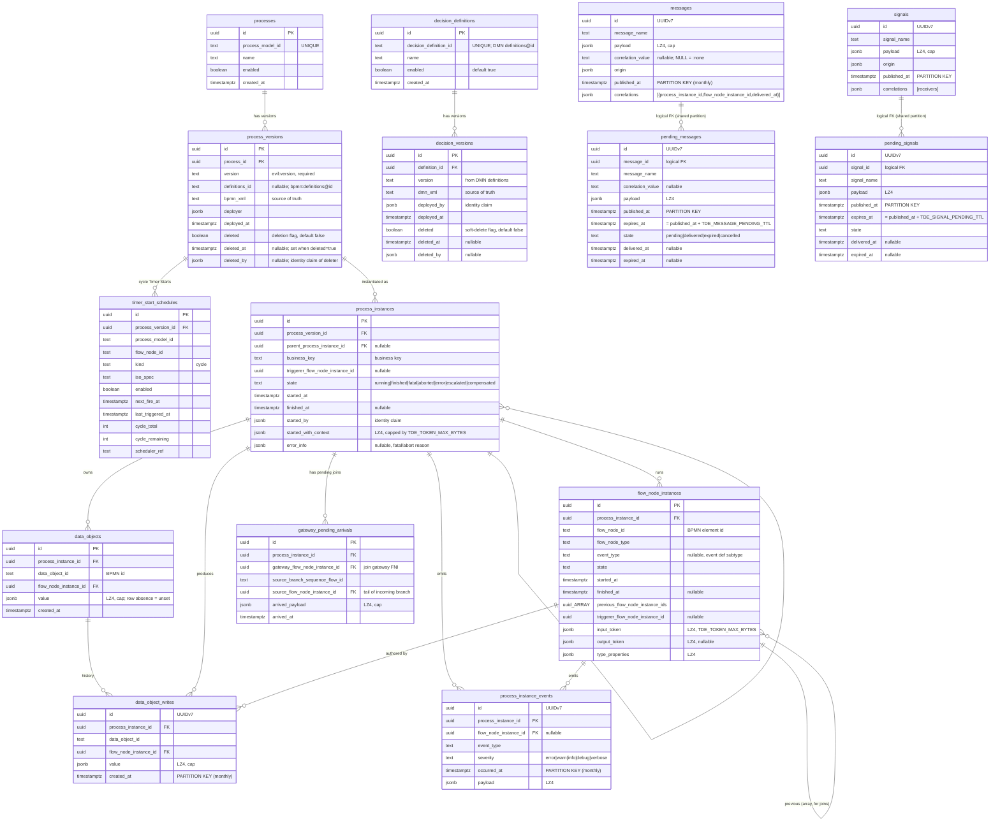

# Database schema

Tables as an ER diagram plus a one-paragraph narrative per table.
Column-level detail: [data-model.md](./architecture/data-model.md).
Operator retention, payload cap, and compression: [database.md](./guides/operations/database.md).

> **Shipped vs specified:** the current migration creates catalog, execution,
> data-object, message/signal, decision, and operational Timer Start tables
> (`timer_start_schedules`). There is **no** `pending_escalations` table.
> There are no `escalations`, `compensations`, or
> `engine_timers` tables. Escalation and compensation observability is
> EngineEventBus plus in-memory registries; PI-scoped catch/boundary timers
> persist in FNI `type_properties` plus Scheduler ETS. Production Timer Start
> persistence is `EvilEngine.Persistence.TimerStartScheduleAdapter`.

## 1. Legend

- **Solid lines** = real FK (enforced by Postgres).
- **Dashed lines** = logical FK only (the two tables share a partitioning
  scheme so a native multi-table FK isn't expressible cleanly; integrity is
  enforced at the application layer for `pending_messages` / `pending_signals`).
- **Tables tagged "PARTITIONED"** use `PARTITION BY RANGE (ts)`. Partitions
  are pre-created by `mix evil.partitions.ensure` on every engine boot
  ([configuration.md](./architecture/configuration.md)).
- **LZ4**: JSONB column declared `COMPRESSION lz4` (Postgres 14+).

## 2. Full schema (Mermaid)

> **Rendering note**: a few `_ARRAY` type names (e.g. `uuid_ARRAY`) are used in
> place of the strict Mermaid-ER `uuid[]` syntax because Mermaid ER does not
> accept bracketed type names. The authoritative column declarations in
> use `uuid[]` (Postgres array type).

## 3. Relationship narrative

| From | → To | Kind | Purpose |
|---|---|---|---|
| `processes` | `process_versions` | 1:N, real FK | Multiple deployed versions per process definition. |
| `decision_definitions` | `decision_versions` | 1:N, real FK | Multiple deployed versions per DMN decision definition. Mirrors BPMN `processes` ↔ `process_versions`. |
| `process_versions` | `process_instances` | 1:N, real FK | A PI is pinned to an immutable version for its lifetime. |
| `process_versions` | `timer_start_schedules` | 1:N, real FK CASCADE | Cycle Timer Start schedules for that version. Deleted on version delete / unregister. |
| `process_instances` | `process_instances` | self, nullable | Parent PI when started via Call Activity (§3). |
| `process_instances` | `flow_node_instances` | 1:N, real FK | Every PI's execution trace. |
| `process_instances` | `data_objects` | 1:N, real FK | PI-scoped DO snapshots (current value). |
| `process_instances` | `gateway_pending_arrivals` | 1:N, real FK | Pending parallel/inclusive join arrivals (replaces `active_tokens`). |
| `flow_node_instances` | `flow_node_instances` | self, nullable array | Previous FNI ids (`uuid[]`) to support joins — an FNI can have multiple predecessors at a parallel/inclusive join. |
| `data_objects` | `data_object_writes` | 1:N, real FK | Append-only write history per DO per PI. |
| `process_instances` | `process_instance_events` | 1:N, real FK | Table retained empty — built-in database EventSink removed. |
| `flow_node_instances` | `process_instance_events` | 1:N, real FK nullable | Schema leftover; table not populated. |
| `messages` | `pending_messages` | 1:N, **logical** FK | `(message_id, published_at)` pair. Native FK isn't declared because Postgres would require the two partitioned tables to share a native partition-aware reference (doable but schema-churn-heavy for a marginal safety gain). The engine enforces it in application code at publish + drain time. |
| `signals` | `pending_signals` | 1:N, **logical** FK | Same pattern as messages ↔ pending_messages. |

No FK exists from `messages` / `signals` into `process_instances`
— those tables are engine-wide audit with broadcast/fan-out semantics. The
per-delivery linkage lives inside the `correlations` JSONB array on each row.
This is deliberate and is what makes engine-audit retention independent of PI retention.

## 4. Per-table one-liners

### 4.1 Catalog

- **`processes`** — one row per deployed BPMN process definition (by `process_model_id`, which is the BPMN `bpmn:process@id` attribute). Carries the `enabled` master switch.
- **`process_versions`** — one row per deployed BPMN *version* of a process. `definitions_id` stores the `bpmn:definitions@id` attribute from the BPMN XML (nullable for legacy deploys). Deletion is a binary flag: `deleted BOOLEAN NOT NULL DEFAULT false`, paired with `deleted_at TIMESTAMPTZ NULL` (timestamp of deletion) and `deleted_by JSONB NULL` (identity claim of the deleter, same shape as `started_by` on `process_instances`). `WHERE NOT deleted` is the active-version predicate. Mirrors the sibling boolean `processes.enabled`. Stores the raw `bpmn_xml` as the **single persistent source of truth** — the parsed AST is only in-memory via `EvilEngine.BPMN.ModelCache`.
- **`decision_definitions`** — one row per deployed DMN decision definition (by `decision_definition_id`, the DMN `definitions@id` attribute). Carries its own `enabled` master switch. Mirrors the BPMN `processes` pattern. See [`dmn.md`](./architecture/dmn.md) §Persistence Layer.
- **`decision_versions`** — one row per deployed DMN *version* of a decision definition. Stores the raw `dmn_xml` as the persistent source of truth. Same soft-delete pattern as `process_versions`: `deleted` boolean + `deleted_at` + `deleted_by`. `WHERE NOT deleted` is the active-version predicate. See [`dmn.md`](./architecture/dmn.md) §Persistence Layer.
- **`timer_start_schedules`** — operational cycle Timer Start rows (kind `'cycle'` only). Unique `(process_version_id, flow_node_id)`. Production persistence: `EvilEngine.Persistence.TimerStartScheduleAdapter`. Not engine-audit; operator SQL must not DELETE these rows. Deleted on undeploy / unregister / version CASCADE.

### 4.2 Execution state

- **`process_instances`** — one row per Process Instance. Pinned to an immutable `process_version_id` for its lifetime so Resume always sees the originally-deployed BPMN. No `final_token` column (derived via the `finalTokens` GraphQL calc from End-Event FNIs' `output_token`).
- **`flow_node_instances`** — one row per executed Flow Node. Carries `input_token` (always set) + `output_token` (nullable, retained in v1 ) both LZ4-compressed and capped by `TDE_TOKEN_MAX_BYTES`. Array `previous_flow_node_instance_ids` supports parallel/inclusive joins.
- **`gateway_pending_arrivals`** — one row per (gateway-FNI, incoming-branch) awaiting siblings at a parallel/inclusive join. Atomically deleted when the gateway fires or when the enclosing scope is interrupted. Replaces the former `active_tokens` table. Not partitioned — working set is bounded by the count of currently-waiting joins across all running PIs.
- **`data_objects`** — current-value snapshot per (PI, DO). Upserted on every write; history goes into `data_object_writes`. Row absence means "unset" — distinct from a legitimately-written `jsonb 'null'`.

### 4.3 Audit / communication

- **`process_instance_events`** — **partitioned monthly** by `occurred_at`. The built-in database EventSink is gone; this table stays empty on a stock engine. Mix retention still deletes leftover rows with the PI tree. **Not required** for debugger BPMN-flow reconstruction (kernel tables). A plugin sink can write a custom log if a flat SQL event store is needed.
- **`messages`** — **partitioned monthly** by `published_at`. One row per published message (via API trigger or Message Throw event). `correlations` JSONB array records who received it (broadcast-within-key ).
- **`pending_messages`** — **partitioned monthly** by `published_at`. Messages published with zero matching subscriptions are held until `TDE_MESSAGE_PENDING_TTL` expires or a matching subscription registers (§3.5.4). Operational state (`state='pending'`) is NEVER retention-swept; terminal states (`delivered`/`expired`/`cancelled`) are retention-eligible.
- **`signals`** — **partitioned monthly** by `published_at`. Broadcast-to-all semantics (no correlation dimension). `correlations` JSONB array records every delivered subscription.
- **`pending_signals`** — **partitioned monthly** by `published_at`. Signals published with zero matching listeners held for `TDE_SIGNAL_PENDING_TTL`. Drained when any catching subscription registers within TTL; broadcast-to-all semantics preserved via the parent `signals.correlations` append. Same retention + delete-on-transition semantics as `pending_messages`.
- **`pending_escalations`** — **dropped (escalation D1).** Not created, not swept, no late-catch drain. Escalation observability is `Event.EscalationRaised` on EngineEventBus.
- **`data_object_writes`** — **partitioned** by `created_at`. Append-only history; atomically consistent with the `data_objects` snapshot update. Every row is DOA-originated (the `source` column was dropped since all writes come from `bpmn:dataOutputAssociation`). Always written regardless of sink config — this is kernel state, not an observability sink.

## 5. Partitioning summary

Six tables ship as `PARTITION BY RANGE (timestamp)`, pre-created by
`mix evil.partitions.ensure` on every engine boot. Composite primary keys
`(id, <timestamp>)` because the partition key must be in the PK.

| Table | Partition key |
|---|---|
| `process_instance_events` | `occurred_at` |
| `data_object_writes` | `created_at` |
| `messages` | `published_at` |
| `pending_messages` | `published_at` |
| `signals` | `published_at` |
| `pending_signals` | `published_at` |

There is no `pending_escalations` table. Operator housekeeping:
[database.md](./guides/operations/database.md).

## 6. Cross-reference quick index

| Element | Document |
|---|---|
| Column-level schema | [data-model.md](./architecture/data-model.md) |
| Retention, payload cap, compression | [database.md](./guides/operations/database.md) |
| Environment variables | [configuration.md](./architecture/configuration.md) |
| Architecture overview (DDD + runtime) | [`Architecture.md`](./Architecture.md) |
| Glossary of terms | [`Glossary.md`](./Glossary.md) |
