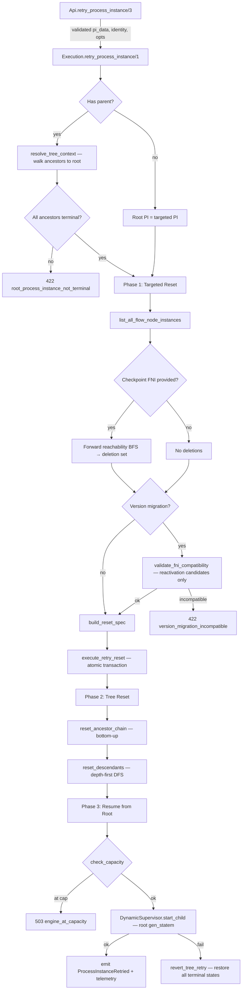

# Execution Runtime

---

## Overview

The execution runtime converts a parsed BPMN model into a running process instance. Each PI is an isolated `:gen_statem` process that orchestrates Flow Node Instances (FNIs) as supervised `Task` processes. The runtime lives in `core_execution` and communicates with the persistence layer through a behaviour-based adapter to preserve the Core → Peripheral dependency rule.

---

## Architecture

```
┌──────────────────────────────────────────────────┐
│              Public API (Execution)              │
│  start_process_instance / finish_user_task / …   │
├──────────────────────────────────────────────────┤
│            DynamicSupervisor + Registry          │
├──────────────────────────────────────────────────┤
│        ProcessInstance (:gen_statem)              │
│  ┌─────────────────┐  ┌──────────────────────┐   │
│  │ FniLifecycle     │  │ BoundaryOrchestrator │   │
│  │ Helpers          │  │ Resumption           │   │
│  └─────────────────┘  └──────────────────────┘   │
│  ┌──────────┐  ┌──────────┐  ┌──────────┐       │
│  │ FNI Task │  │ FNI Task │  │ FNI Task │  …    │
│  └──────────┘  └──────────┘  └──────────┘       │
│              Task.Supervisor (per PI)            │
├──────────────────────────────────────────────────┤
│  SequenceFlowResolver │ HandlerDispatch          │
│  FlowNodeHandler      │ FlowNodeResult           │
├──────────────────────────────────────────────────┤
│  Persistence Behaviour  →  Adapter (peripheral)  │
└──────────────────────────────────────────────────┘
```

### DynamicSupervisor + Registry

The execution Application module starts the Execution Supervisor, a `DynamicSupervisor` with `max_children: :infinity` (hardcoded in `application.ex`). `TDE_MAX_CONCURRENT_PIS` is **not** applied as a supervisor limit. It is a **soft pre-check** inside `Execution.start_process_instance/1` for **new public starts** only: when the active PI count is at or above the cap, that function returns `{:error, :engine_at_capacity, %{active, limit}}` (REST `POST /processes/{model_id}/start` maps this to **503**). **Resume bypasses the cap by design** so a PI tree comes back as a whole — see §Resume on Startup. Do not put `max_children` on the DynamicSupervisor and do not queue leftover PIs for a later resume pass — Do not put `max_children` on the PI DynamicSupervisor).

### Process Instance (`:gen_statem`)

**Path:** `apps/core_execution/lib/evil_engine/execution/process_instance.ex`

The PI module is decomposed into focused submodules:

| Module | Path | Responsibility |
|--------|------|----------------|
| `ProcessInstance` | `process_instance.ex` | `:gen_statem` shell: state machine, client API, message routing, FNI dispatch, cascade operations |
| `ProcessInstance.Helpers` | `process_instance/helpers.ex` | Pure utilities: ID generation, flow node lookup, key stringification, JSON safety, event type extraction |
| `FniLifecycle` | `fni_lifecycle.ex` | FNI state transitions: `finish/4` (happy-path), `transition_to_waiting/2`, `park_async/2`, `transition_to_fatal/4`, `transition_to_aborted/4`, `transition_to_interrupted/4`. Handlers own their own lifecycle persistence. |
| `FniLifecycle.LifecycleResult` | `fni_lifecycle/lifecycle_result.ex` | Return struct from `FniLifecycle.finish/4` carrying data object cache updates |
| `ProcessInstance.BoundaryOrchestrator` | `process_instance/boundary_orchestrator.ex` | Boundary event orchestration: catch handling, cycle fires, subscription dispatch, cancel/abort |
| `ProcessInstance.Resumption` | `process_instance/resumption.ex` | Resume-after-restart: identity rebuild, FNI state reconstruction, handler reactivation |

**Handler-owned lifecycle:** FNI handlers call `FniLifecycle.finish/4` to persist their state, evaluate Data Output Associations, and emit events atomically. The PI no longer performs FNI-level finish persistence — it receives the handler's `FlowNodeResult` (with `metadata.lifecycle` carrying `%LifecycleResult{}` cache updates), merges data object cache deltas, updates in-memory state, and dispatches successors. Exceptional paths (fatal, aborted, interrupted) remain PI-driven via `FniLifecycle.transition_to_*` functions. FNI creation (`persist_fni_create`, `emit_fni_started`) is still PI-owned.

**Event emission gating:** All `FniLifecycle` paths gate `FlowNodeInstanceFinished` emission on persistence success. The happy path (`persist_and_emit_finish/6`) emits inside the `{:ok, ...}` branch of the atomic transaction result. The exceptional paths (`transition_to_fatal`, `transition_to_aborted`, `transition_to_interrupted`) emit inside the `:ok` branch of the persistence result. On persistence failure, no event is emitted — consumers never see a state transition that was not persisted.

One Erlang process per running PI, registered in `EvilEngine.Execution.Registry` under its `process_instance_id`. State machine states:

| State | Meaning |
|-------|---------|
| `:running` | Normal execution — FNIs are being dispatched and completed |
| `:finished` | All paths reached End Events (terminal, PI process stops) |
| `:fatal` | An unrecoverable error occurred (terminal, PI process stops) |
| `:aborted` | PI was administratively aborted (terminal, PI process stops) |
| `:error` | An Error End Event was reached — modeled BPMN error outcome (terminal, PI process stops) |
| `:escalated` | An Escalation End Event reached the root of its scope with no matching boundary catch — modeled BPMN escalation outcome (terminal, PI process stops). **Not retryable.** |
| `:compensated` | A Compensation End Event was reached and all handlers completed — the PI finished after compensation (terminal, PI process stops). **Not retryable** — compensation is a successful business outcome, not a failure. |
| `:cancelled` | A Cancel End Event inside a Transaction subprocess fired — automatic LIFO compensation ran, then the child PI transitioned to `:cancelled`. **Not retryable** — cancellation is a handled business outcome. |

Preparation (model fetch, Start Event resolution, Task.Supervisor start) happens synchronously in `init/1`. If preparation fails, `start_link` returns `{:error, reason}` — the PI process never starts.

When the PI reaches a terminal state (`:finished`, `:fatal`, `:aborted`, `:error`, `:escalated`, `:compensated`, or `:cancelled`), the `:gen_statem` process stops with `:normal` exit reason. There is no lingering process in terminal state.

**FNI cleanup on PI termination:** Each terminal PI state cascades a matching FNI state to all remaining `active`/`waiting` FNIs:
- `transition_to_fatal` → `fatal_all_fnis` persists all `active`/`waiting` FNIs to `fatal` (with `error_code: "process_fatal"`) and emits `FlowNodeInstanceFinished` events
- `abort/3` → `abort_all_fnis` persists all `active`/`waiting` FNIs to `aborted` (with `reason: "process_aborted"`)
- `handle_fni_bpmn_error/4` → `error_all_remaining_fnis/2` persists all remaining `active`/`waiting` FNIs to `error` (with `error_code: "process_error"`) and emits `FlowNodeInstanceFinished` events. The PI finishes as `:error` — a modeled BPMN error outcome triggered by an Error End Event
- `handle_fni_terminate/3` → `interrupt_remaining_fnis/3` persists all remaining `active`/`waiting` FNIs to `interrupted` (with `reason: :terminated_by_end_event`) and emits `FlowNodeInstanceFinished` events. The PI finishes as `:finished` because termination is a normal BPMN completion path triggered by a Terminate End Event
- `handle_fni_cancel/3` → `interrupt_remaining_fnis/3` (reason `:cancelled_by_cancel_end`) + automatic LIFO compensation via `CompensationOrchestrator`, then PI finishes as `:cancelled`. Only valid inside a Transaction subprocess scope.

After any of these transitions, no FNI rows remain in `active` or `waiting` state in the database.

**Handler-driven cascade on cleanup:** After persisting each FNI's terminal state, `fatal_all_fnis` and `abort_all_fnis` resolve the FNI's handler via `HandlerDispatch.handler_for/1` and invoke the matching optional callback (`handle_fatal/1` or `handle_aborted/1`) if the handler implements it. This allows handlers that own external resources (e.g. Call Activity's child PI) to cascade the terminal state to those resources. The dispatch uses `invoke_optional_callback/3`, which safely skips handlers that do not implement the callback via `function_exported?/3`.

When a boundary event interrupts an FNI (`handle_fni_interrupted/3`), the handler Task pid is killed via `Process.exit(pid, :kill)` before invoking `handle_aborted/1`. This ensures the handler Task cannot process late-arriving child PI notifications (e.g. `{:child_pi_aborted, ...}`) that would trigger unintended cascade results. The `handle_aborted/1` callback then runs in the PI process to cascade to child PIs — since the handler Task is already dead, the child's `notify_parent(:aborted)` message is discarded, preventing upward abort cascade through the boundary path.

**Abort cascade (tree-wide kill switch):** When a PI is aborted (via API or the `cancel_user_task` path), it notifies its parent via `notify_parent(data, :aborted)`, sending `{:child_pi_aborted, self()}` to the handler Task. The handler Task (Call Activity or SubProcess) receives this in `await_child_completion` and returns `:abort_cascade` to the PI. The PI handles `{:fni_result, _, :abort_cascade}` by aborting itself (persisting, emitting state change, notifying its own parent, aborting all FNIs, then stopping). This creates a bidirectional cascade: the abort propagates downward via `handle_aborted/1` callbacks (existing mechanism) and upward via `notify_parent(:aborted)` → `:abort_cascade` (new mechanism). The result is that aborting any PI in a process tree aborts the entire tree — root, children, and grandchildren. Error Boundary Events do **not** catch aborts; the `:abort_cascade` result bypasses `BoundaryAwareHandler` and `BoundaryResolver` entirely.

**`force_fatal/2`:** A synchronous `gen_statem.call` handler for `{:force_fatal, reason}` that transitions a running PI to fatal. This is the internal API used by the cascade mechanism — when a Call Activity handler receives `handle_fatal/1`, it calls `ProcessInstance.force_fatal/2` on the child PI, which in turn runs `fatal_all_fnis` on the child (including further cascading to grandchildren). The public API is `Execution.fatal_process_instance/2`. Terminal-state safety nets (`finished/3`, `fatal/3`, `aborted/3`) catch-all `{:call, from}` and return `{:error, :process_*}`, so `force_fatal` on an already-terminal PI is a no-op.

#### State struct

**Path:** `apps/core_execution/lib/evil_engine/execution/process_instance/state.ex`

Holds the PI's in-memory runtime data: process model, identity, FNI state map (`flow_node_instance_states`), Task.Supervisor pid, and data object cache.

#### Facade

**Path:** `apps/core_execution/lib/evil_engine/execution/process_instance/facade.ex`

Typed API for FNIs to communicate back to their parent PI. Currently exposes `finish_user_task/4` and `cancel_user_task/4`.

### FNI Event Type Derivation

When an FNI is created, the PI extracts the event definition subtype from the BPMN model's `FlowNode.type_data.event_definition` struct and stores it as `event_type` on the DB row and in the in-memory state entry. This is a nullable string (`"message"`, `"timer"`, `"error"`, `"signal"`, `"escalation"`, `"conditional"`, `"compensation"`, `"terminate"`, `"cancel"`, `"link"`, or `nil`). Non-event flow nodes produce `nil`; `SendTask` and `ReceiveTask` produce `"message"` (BPMN message-task semantics). The value is derived once at creation time and is immutable — it survives model redeployment and is queryable in SQL/GraphQL without joins. The `event_type` is also carried on the `FlowNodeInstanceStarted` and `FlowNodeInstanceFinished` event bus events so downstream consumers can react to typed events without re-querying the DB.

### FNI Dispatch Cycle

1. PI calls `HandlerDispatch.handler_for/1` to resolve the handler module
2. `BoundaryAwareHandler.wrap_enter/4` wraps the handler's `handle_enter/3` inside a `Task` under the PI's `Task.Supervisor`. If the handler returns `{:error, reason}` on an activity type with attached error boundaries, the wrapper converts it to `{:boundary, ...}` before the PI sees the result.
3. The Task sends `{:fni_result, flow_node_instance_id, result}` back to the PI
4. PI processes the result:
   - `{:ok, result}` → FNI finished, dispatch successors using handler-provided `next_flow_node_ids`
   - `{:wait, result}` → FNI waiting (User Task, Manual Task with confirmation)
   - `{:terminate, result}` → FNI finished normally (like `{:ok, ...}`), then all remaining active/waiting FNIs are interrupted via `interrupt_remaining_fnis/2`. Used by Terminate End Events
   - `{:error, reason}` → FNI fatal, PI transitions to `:fatal`
   - `{:async, ref}` → FNI parked in `:waiting` with async marker (Service Task)
   - `{:async, flow_node_instance_id, continuation}` → FNI parked; handler Task stays alive running the continuation (Call Activity)
   - `{:boundary, boundary_node_id, payload, cancel_activity}` → boundary event triggered; if `cancel_activity` is `true`, host FNI is interrupted and sibling boundaries cancelled before dispatching the boundary's outgoing flows
5. After processing, PI checks if all FNIs have completed → terminates if so

### Flow Node Handler Behaviour

**Path:** `apps/core_execution/lib/evil_engine/execution/flow_node_handler.ex`

```elixir
@callback handle_enter(
            flow_node :: FlowNode.t(),
            token :: Token.t(),
            context :: HandlerContext.t()
          ) ::
            {:ok, FlowNodeResult.t()}
            | {:wait, FlowNodeResult.t()}
            | {:terminate, FlowNodeResult.t()}
            | {:error, reason :: term()}
            | {:async, String.t()}
            | {:async, String.t(), (-> term())}
            | {:async, String.t(), (-> term()), map()}
            | {:boundary, String.t(), term(), boolean()}

@callback handle_fatal(flow_node_instance_entry :: map()) :: :ok
@callback handle_aborted(flow_node_instance_entry :: map()) :: :ok

@optional_callbacks [handle_complete: 4, handle_cancel: 4, handle_fatal: 1, handle_aborted: 1]
```

`handle_fatal/1` and `handle_aborted/1` are optional callbacks invoked during PI cleanup when an FNI is being terminated. They receive the in-memory FNI state entry (containing `state`, `flow_node_id`, `pid`, `type_properties`, etc.). Handlers that own external resources must cascade the terminal state and handle the case where the resource is already stopped or unreachable (return `:ok` silently). Both `CallActivity` and `SubProcess` implement these callbacks to cascade to their child PIs.

### Handler Context

**Path:** `apps/core_execution/lib/evil_engine/execution/handler_context.ex`

The third argument to `handle_enter/3` carries runtime metadata for the
executing FNI. Handlers use it for sequence flow resolution, FEEL context
assembly, and child PI creation (Call Activity).

| Field | Type | Source |
|-------|------|--------|
| `flow_node_instance_id` | `String.t()` | Generated at dispatch time |
| `process_instance_id` | `String.t()` | From PI state |
| `process_version_id` | `String.t() \| nil` | From PI state — used by SubProcess handler to pass to child PI `start_opts` |
| `process_instance_pid` | `pid()` | `self()` of the PI GenStatem |
| `process_model` | `BpmnProcess.t()` | From `ModelCache` at PI start |
| `flow_node_this` | `map()` | `Context.flow_node_this(flow_node)` — string-keyed `{id, name, type}` |
| `context` | `map()` | `state.started_with_context` — immutable start payload (FEEL `context` binding) |
| `identity` | `map()` | `Map.from_struct(Identity)` — atom-keyed; converted to string keys by `from_handler_context/2` |
| `process` | `map()` | `%{id: …, name: …, version: …}` — atom-keyed; converted to string keys by `from_handler_context/2` |
| `process_instance` | `map()` | `%{id: …, started_at: …, started_by: …}` — atom-keyed; converted to camelCase string keys by `from_handler_context/2` |
| `data_objects` | `map()` | `state.data_object_cache` — data object ID → current value |
| `host_flow_node_instance_id` | `String.t() \| nil` | For subscription-model boundary FNIs: the FNI ID of the host activity this boundary is attached to. `nil` for all non-boundary FNIs. Set by the PI when dispatching boundary FNIs alongside their host |

**Important:** `identity`, `process`, and `process_instance` use atom keys on
`HandlerContext` for backward compatibility with Call Activity (which passes
`context.identity` to child PI creation). The conversion to string-keyed,
camelCase maps required by the FEEL NIF happens in `Context.from_handler_context/2`.

### Handler Dispatch

**Path:** `apps/core_execution/lib/evil_engine/execution/handler_dispatch.ex`

Two-tier dispatch: `handler_for/1` accepts either a `%FlowNode{}` struct (preferred) or a bare type atom (legacy fallback). For intermediate events and boundary events, a private `resolve_handler/1` function inspects the `event_definition` on the flow node's `type_data` and routes to the type-specific handler. For all other node types, it falls through to the static type-atom map. Returns `{:error, :unsupported_element}` for unknown types (Tier 3 encounter-time validation).

#### Static type-atom map

| BPMN Type | Handler Module |
|-----------|---------------|
| `:start_event` | `FlowNodes.StartEvent` |
| `:end_event` | `FlowNodes.EndEvent` |
| `:task` | `FlowNodes.Task` |
| `:service_task` | `FlowNodes.ServiceTask` |
| `:script_task` | `FlowNodes.ScriptTask` |
| `:business_rule_task` | `FlowNodes.BusinessRuleTask` |
| `:intermediate_catch_event` | `FlowNodes.IntermediateEvent` |
| `:intermediate_throw_event` | `FlowNodes.IntermediateEvent` |
| `:manual_task` | `FlowNodes.ManualTask` |
| `:user_task` | `FlowNodes.UserTask` |
| `:exclusive_gateway` | `FlowNodes.ExclusiveGateway` |
| `:parallel_gateway` | `FlowNodes.ParallelGateway` |
| `:event_based_gateway` | `FlowNodes.EventBasedGateway` |
| `:call_activity` | `FlowNodes.CallActivity` |
| `:sub_process` | `FlowNodes.SubProcess` |
| `:boundary_event` | `FlowNodes.BoundaryEvent` |

#### Event-definition-aware dispatch

When `handler_for/1` receives a `%FlowNode{}`, `resolve_handler/1` pattern-matches on the flow node type and event definition to select a type-specific handler:

| BPMN Type | Event Definition | Handler Module |
|-----------|-----------------|---------------|
| `:intermediate_throw_event` | `EventDefinition.Link` | `FlowNodes.LinkThrowEvent` |
| `:intermediate_catch_event` | `EventDefinition.Link` | `FlowNodes.LinkCatchEvent` |
| `:intermediate_catch_event` | `EventDefinition.Timer` | `FlowNodes.TimerCatchEvent` |
| `:boundary_event` | `EventDefinition.Timer` | `FlowNodes.TimerBoundaryEvent` |
| `:start_event` | `EventDefinition.Timer` | `FlowNodes.TimerStartEvent` |
| `:end_event` | `EventDefinition.Terminate` | `FlowNodes.TerminateEndEvent` |
| `:intermediate_throw_event` | `EventDefinition.None` / other | `FlowNodes.IntermediateEvent` (fallback) |
| `:intermediate_catch_event` | `EventDefinition.None` / other | `FlowNodes.IntermediateEvent` (fallback) |
| `:boundary_event` | other (incl. Error) | `FlowNodes.BoundaryEvent` (generic fallback) |
| `:end_event` | `EventDefinition.None` / other | `FlowNodes.EndEvent` (fallback via static map) |
| `:intermediate_catch_event` | `EventDefinition.Message` | `FlowNodes.MessageCatchEvent` |
| `:intermediate_throw_event` | `EventDefinition.Message` | `FlowNodes.MessageThrowEvent` |
| `:end_event` | `EventDefinition.Message` | `FlowNodes.MessageEndEvent` |
| `:start_event` | `EventDefinition.Message` | `FlowNodes.MessageStartEvent` |
| `:boundary_event` | `EventDefinition.Message` | `FlowNodes.MessageBoundaryEvent` |

#### Message and task handlers

| Flow Node Type | Handler Module | Pattern |
|----------------|----------------|---------|
| IntermediateCatchEvent (message) | `FlowNodes.MessageCatchEvent` | Async handler Task — registers subscription, blocks on `receive {:message_arrived, ...}` |
| IntermediateThrowEvent (message) | `FlowNodes.MessageThrowEvent` | Sync — publishes via `MessagePublisher`, proceeds |
| EndEvent (message) | `FlowNodes.MessageEndEvent` | Sync — publishes via `MessagePublisher`, finishes PI |
| StartEvent (message) | `FlowNodes.MessageStartEvent` | Triggered via `MessageStartHandler` callback from `MessagePublisher` |
| BoundaryEvent (message) | `FlowNodes.MessageBoundaryEvent` | Async handler Task — registers subscription, blocks on `receive` |
| SendTask | `FlowNodes.SendTask` | Sync — publishes via `MessagePublisher`, proceeds |
| ReceiveTask | `FlowNodes.ReceiveTask` | Async handler Task — registers subscription, blocks on `receive` |

#### Signal handlers

| Flow Node Type | Handler Module | Pattern |
|----------------|----------------|---------|
| IntermediateCatchEvent (signal) | `FlowNodes.SignalCatchEvent` | Async handler Task — registers with `SignalSubscriptions`, blocks on `receive {:signal_arrived, ...}` |
| IntermediateThrowEvent (signal) | `FlowNodes.SignalThrowEvent` | Sync — publishes via `SignalPublisher.publish_signal/1` (no payload), proceeds |
| EndEvent (signal) | `FlowNodes.SignalEndEvent` | Sync — publishes via `SignalPublisher`, finishes PI |
| StartEvent (signal) | `FlowNodes.SignalStartEvent` | Triggered via `SignalStartHandler` callback from `SignalPublisher` |
| BoundaryEvent (signal) | `FlowNodes.SignalBoundaryEvent` | Async handler Task — interrupting fires once; non-interrupting loops via `{:boundary_cycle_fire, ...}` |

#### Non-interrupting multi-fire (message and signal boundaries)

For `cancelActivity="false"`, `MessageBoundaryEvent` and `SignalBoundaryEvent`
handler Tasks loop: each arrival sends `{:boundary_cycle_fire, boundary_node_id,
payload, false}` to the PI (dispatches outgoing path without finishing the
boundary FNI), unregisters the consumed subscription, re-registers with
`MessageSubscriptions` / `SignalSubscriptions`, and blocks again until the host
completes and `cancel_boundary_fnis_for_host/2` kills the Task. Interrupting
boundaries fire once via `{:boundary, ...}`.

### Sequence Flow Resolver

**Path:** `apps/core_execution/lib/evil_engine/execution/sequence_flow_resolver.ex`

Utility called by individual handlers (not the PI) to determine outgoing flow targets. The PI dispatches from handler-provided `next_flow_node_ids` on `FlowNodeResult`. Gateway split handlers (Exclusive, and in later phases Inclusive) implement their own FEEL-based routing and do **not** use this resolver; non-gateway handlers and gateway-join handlers delegate here. Enforces encounter-time validation:

- **Implicit split** (non-gateway with >1 outgoing) → `{:error, :implicit_split, meta}`
- **Dead end** (non-End-Event with 0 outgoing) → `{:error, :dead_end, meta}`
- End Events with 0 outgoing → `{:ok, []}` (normal termination)

#### Conditions on non-Gateway-outgoing flows

`<bpmn:conditionExpression>` is **only honored on outgoing sequence flows of Split Gateways** (Exclusive in v1; Inclusive in Phase 4). For every other source element — Activities, Events, Gateway-joins — any `<conditionExpression>` on outgoing flows is **silently ignored**: the flow is treated as if no condition were present and is followed unconditionally. The implicit-split and dead-end detectors above continue to apply uniformly.

The Studio prevents this construct at modeling time. The engine tolerates imported or hand-edited BPMN files containing it but does not honor the conditions. An Activity that needs conditional branching must place an Exclusive (or Inclusive) Gateway as its successor and put the conditions on the Gateway's outgoing flows.

---

## Boundary Event Architecture

All boundary event types (error, timer, message, signal) are **pre-spawned alongside their host activity**. This ensures uniform debugger visibility, correct FNI chain continuity, and consistent WebSocket event emission.

### Pre-spawn Mechanism

When the PI dispatches a host activity FNI, it scans `flow_node.boundary_event_refs` and dispatches a separate FNI for each attached boundary event. Each boundary FNI receives `host_flow_node_instance_id` in its `HandlerContext`.

### Error Boundaries (wrapper-resolved, passive handler Task)

Error boundaries use `ErrorBoundaryEvent` as their handler module. This handler parks the FNI and blocks on `receive {:error_boundary_triggered, ...}` — a message that is **never actually sent**. The handler Task exists solely to make error boundary FNIs compatible with the standard `dispatch_boundary_fni` machinery.

Error routing stays entirely in the handler layer:

- **`BoundaryAwareHandler.wrap_enter/4`** intercepts `{:error, reason}` from activity handlers and checks for matching error boundaries via `BoundaryResolver.find_matching_error_boundary/4` (pass `Definitions` so catch-side `errorRef` resolves). On match, the error is converted to `{:boundary, boundary_node_id, error_info, cancel_activity}` before the PI sees it.
- **`SubProcess.handle_child_error/3`** resolves error boundaries for child PI errors in the async continuation.

The PI processes the resulting `{:boundary, ...}` through `handle_boundary_catch/5`, which finds the pre-spawned error boundary FNI (by `boundary_node_id`), kills the passive handler Task, and finishes the FNI in-place. This is the same `finish_boundary_fni` path used by subscription boundaries.

The wrapper only intercepts `{:error, ...}` on activity types (`:task`, `:service_task`, `:user_task`, `:manual_task`, `:script_task`, `:business_rule_task`, `:send_task`, `:receive_task`, `:call_activity`, `:sub_process`). Non-activity types (events, gateways) and non-error results pass through unchanged. A fast-path check skips `BoundaryResolver` entirely when the flow node has no attached error boundary events.

### Subscription Boundaries (self-triggered)

Timer, Message, and Signal boundary events subscribe to their own external triggers and manage their own lifecycle.

#### Handler Execution

The boundary handler (e.g., `TimerBoundaryEvent`) schedules its trigger (e.g., a timer) **before** building `type_properties` (so the `timer_ref` is persisted), then blocks on `receive` in the continuation. When triggered, it returns `{:boundary, flow_node_id, payload, cancel_activity}`.

### Boundary Fire Processing (`handle_boundary_catch/5`)

When the PI receives `{:boundary, ...}`:
   - Resolves the host FNI ID from `type_properties.host_flow_node_instance_id`
   - Finds and finishes the boundary FNI (subscription boundaries: by `flow_node_instance_id`; error boundaries: by looking up the pre-spawned FNI matching the `boundary_node_id`)
   - If interrupting (`cancel_activity: true`): cancels sibling boundary FNIs, interrupts the host FNI
   - `BoundaryOrchestrator` builds dispatch targets (outgoing sequence flow nodes) and returns them to the PI, which dispatches them via `dispatch_flow_node_instance/4` — the boundary node itself is **never** re-dispatched (doing so would cause an infinite loop for subscription-model handlers)

**Chain continuity:** `handle_boundary_catch/5` always uses the **boundary FNI ID** (not the host FNI ID) as the `source_fni_id` for `build_dispatch_targets` and `build_boundary_token`. This ensures downstream nodes chain from the boundary event, maintaining a complete FNI predecessor chain visible in the Debugger.

4. **Boundary fire (non-interrupting)**: Same as above but without interrupting the host or cancelling siblings. The host activity continues running.

5. **Host completion**: When a host activity FNI reaches a terminal state (`:finished`, `:fatal`, `:aborted`, `:error`), the PI interrupts all remaining boundary FNIs attached to that host via `cancel_boundary_fnis_for_host/2`. This kills the handler task (using the preserved PID), invokes `handle_aborted/1` on the handler to release resources (e.g., cancel armed timers), and transitions the boundary FNI to `:interrupted` with reason `"host_completed"`. The `:aborted` state is reserved exclusively for user/API-initiated abort.

6. **Stale result guard**: The PI checks that a result-producing FNI is still present in `fni_states` and not in a terminal state before processing. Late-arriving results from already-cancelled boundary FNIs are silently dropped.

7. **Task PID preservation**: When a handler returns `{:async, ..., type_properties}`, the PI preserves the task PID if the task is still alive. This allows `cancel_boundary_fnis_for_host/2` to `Process.exit(pid, :kill)` the handler task during cleanup. Timer boundary FNIs also skip Registry registration (they use handler-owned resume, not Registry-based rehydration).

#### Cycle handling on timer boundary events

`time_cycle` is supported on both interrupting and non-interrupting timer boundary events:

- **Interrupting cycle** (`cancel_activity: true`): Fires once — the first cycle fire time. Semantically identical to a `time_duration` boundary. After the first fire, the host is interrupted and sibling boundaries are cancelled. The cycle nature has no additional effect because interruption is terminal.

- **Non-interrupting cycle** (`cancel_activity: false`): The handler Task loops, firing the boundary on each cycle iteration. Intermediate fires are sent to the PI as `{:boundary_cycle_fire, boundary_node_id, payload, cancel_activity}` (a distinct message type that dispatches the boundary's outgoing path **without** finishing the boundary FNI). The final fire (repetitions exhausted) uses the normal `{:boundary, ...}` result and finishes the FNI. For infinite cycles (`R/...`), the Task loops indefinitely until killed by `cancel_boundary_fnis_for_host` when the host activity completes.

**Resume**: Non-interrupting cycle remaining count and ISO 8601 `cycle_interval` are persisted on enter and after each re-arm (`is_cycle`, `cycle_repetitions`, `cycle_interval`). `handle_resume/3` restores the cycle receive loop (not a one-shot) and delivers an overdue tick immediately. Interrupting cycles remain one-shot (first fire).

---

## Flow Node Handlers

All handlers live under `apps/core_execution/lib/evil_engine/execution/flow_nodes/`.

Each handler calls `SequenceFlowResolver.resolve/2` internally (or implements its own routing for gateways) and returns `next_flow_node_ids` on `FlowNodeResult`. The PI is a pure dispatcher that follows whatever routing the handler decided.

| Handler | Behaviour |
|---------|-----------|
| `StartEvent` | Pass-through — forwards input payload unchanged |
| `EndEvent` | Pass-through — stores `end_event_id` and `end_event_name` in `type_properties` for `FinalToken` decoration |
| `TerminateEndEvent` | Returns `{:terminate, FlowNodeResult}`. The PI finishes this FNI normally (same as `{:ok, ...}`), then calls `interrupt_remaining_fnis/2` to interrupt all other active/waiting FNIs with state `:interrupted` and reason `:terminated_by_end_event`. Each interrupted FNI receives `handle_aborted/1` for resource cleanup (timer cancellation, child PI abort). The PI then finishes normally via `maybe_finish_or_continue` — the terminate token is included in `build_final_tokens/1` |
| `ErrorEndEvent` | Resolves `error_code`/`error_message` from inline `evil:errorCode`/`evil:errorMessage` or global `<bpmn:error>` via `errorRef` (priority: inline > global > nil catch-all). Returns `{:bpmn_error, error_info, %FlowNodeResult{}}`. The PI records the FNI in `:error` state via `FniLifecycle.finish_as_error/4`, transitions all remaining active/waiting sibling FNIs to `:error` via `error_all_remaining_fnis/2` (symmetric with `fatal_all_fnis` for crashes), transitions the PI to `:error` state, and notifies the parent with `{:child_pi_bpmn_error, pid, error_info, final_tokens}` for boundary matching. In standalone processes (no parent), the PI simply finishes in `:error` state |
| `EscalationEndEvent` | Resolves `escalation_code`/`escalation_name` via `escalationRef` → global `<bpmn:escalation>` (no inline override — unlike Error End Event, Escalation End Event has no inline extension). Returns `{:escalation_end, escalation_info, %FlowNodeResult{}}`. The PI records the FNI in `:finished` state, interrupts all remaining sibling FNIs (`:interrupted`, reason `:escalation_end_event`), transitions to `:escalated` state, and notifies the parent with `{:child_pi_escalation, pid, escalation_info}`. In standalone processes (no parent), the PI finishes in `:escalated` and emits `[:evil_engine, :escalation, :uncaught]` telemetry. **Not retryable.** |
| `EscalationIntermediateThrowEvent` | Resolves `escalation_code`/`escalation_name` (same as End Event). Returns `{:escalation_throw, escalation_info, %FlowNodeResult{next_flow_node_ids: [outgoing]}}`. The PI finishes the FNI in `:finished` state and dispatches the outgoing token — the PI stays `:running`. Propagates to parent via `{:child_pi_escalation_passthrough, pid, escalation_info}` (if parent exists) or emits `[:evil_engine, :escalation, :uncaught]` (if root-of-root). **The token continues unconditionally past the throw** — the escalation propagation is a side-effect, not a routing decision. |
| `EscalationBoundaryEvent` | Mirrors `ErrorBoundaryEvent`. Pre-spawned by the PI, parks the FNI in `:waiting`. When the parent handler (Call Activity / SubProcess) receives an escalation and `EscalationResolver` finds a matching boundary, the handler sends the `{:fni_result, ..., {:boundary, boundary_id, escalation_info, cancel_activity}}` message to the PI, which routes through `BoundaryOrchestrator.handle_boundary_catch/5`. |
| `Task` | Pass-through |
| `ServiceTask` | Full data pipeline: `in_mappings` → `payload_contract` → plugin dispatch via `ServiceTaskDispatch`. Always async: `handle_enter/3` returns `{:async, ref}` only. Output pipeline (`out_mappings` → `result_contract` → `PayloadCap`) runs in `handle_complete/4` when the plugin calls `finish_async_service_task`. Input pipeline and dispatch failures within `handle_enter` are still caught by `BoundaryAwareHandler.wrap_enter/4`. All contract/mapping failures → fatal |
| `BusinessRuleTask` | Full data pipeline: `in_mappings` → `payload_contract` → mode dispatch → `out_mappings` → `result_contract` → `PayloadCap`. Two modes via `implementation` attribute: `"feel"` (inline FEEL, same as ScriptTask inline mode), `"dmn"` (resolve via `DecisionResolver` → `DMN.ModelCache` → `DMN.Evaluator.evaluate/4`, wrapped in a `Task` with configurable timeout `:dmn_evaluation_timeout_ms`; stores full `EvaluationResult` trace in `type_properties` for auditing/debugger). For multi-decision DMN models, `evil:decisionElementId` specifies which `<decision>` element to evaluate as the DRG root; when omitted the evaluator auto-resolves single-decision models. Plugin delegation was removed — BRTs exclusively evaluate business rules. Always synchronous |
| `IntermediateEvent` | Pass-through — handles only untyped (None) intermediate events |
| `LinkThrowEvent` | Resolves matching Link Catch by `link_name` in the same process, routes token directly (bypasses `SequenceFlowResolver`). Errors on zero matches (`:no_matching_link_catch`) or multiple matches (`:ambiguous_link_catch`) |
| `LinkCatchEvent` | Pass-through via `SequenceFlowResolver` — landing pad for Link Throw events |
| `ManualTask` | Returns `{:wait, ...}` when `require_confirmation` is true, otherwise pass-through |
| `UserTask` | Input pipeline: `in_mappings` → `payload_contract` → `{:wait, ...}`. Output pipeline on finish: `out_mappings` → `result_contract` → `PayloadCap`. Input failures → fatal. Output contract violations → retryable (422, stays `:waiting`). Resolves assignees from `evil:assignees` extension |
| `ExclusiveGateway` | Owns routing: evaluates FEEL conditions on outgoing flows, enforces exactly-one-truthy (deliberate divergence from BPMN 2.0 "first truthy wins"). An unmarked non-default outgoing flow on a split (`outgoing > 1`) is a **runtime fatal** `:exclusive_gateway_unconditional_flow` **before** FEEL evaluation. A single unmarked outgoing is pass-through; a single outgoing that carries a condition is still evaluated (false + no default → `:no_matching_condition`). The diagram still deploys; Studio lints warning (`bpmn-development`) / error (`bpmn-production-ready`). Mixed gateways (both split and join) rejected at runtime. Join is pure pass-through |
| `ParallelGateway` | Fork: resolves all outgoing sequence flows via `SequenceFlowResolver` (conditions ignored). Join: handler-owned async Task with PI routing (see §Parallel Gateway below). Mixed gateways rejected at runtime |
| `InclusiveGateway` | Fork: evaluates all outgoing conditional FEEL expressions; activates every truthy path plus unconditional non-default flows (OR-split). If zero truthy: default path, or fatal `:no_matching_condition`. Join: handler-owned async Task with PI routing and **structural backward-cone** dead-path elimination (see §Inclusive Gateway below). Resume re-evaluates DPE via `evaluate_parked_inclusive_joins/1`. Mixed gateways rejected at runtime |
| `ComplexGateway` | Opinionated, deterministic. Split: inclusive-style fork on truthy conditions; an unmarked non-default outgoing flow is a **runtime fatal** `:complex_gateway_unconditional_flow` (WIP diagrams may still deploy; Studio lints warning/error by ruleset). Zero-truthy → default, else fatal `:complex_split_no_matching_condition`. Join: single-fire **threshold** join driven by a FEEL `activationCondition` with `activatedCount`/`incomingCount` bindings; fires once when the condition becomes true. Resume re-evaluates the parked join. Twist 1: all branches arrived-or-dead but condition still false → fatal `:complex_join_condition_unmet`. Twist 2: on fire, every still-active/waiting FNI in the join's paired SESE region is cancelled (`:cancelled_by_complex_join`). Mixed gateways, join missing `activationCondition`, and SESE region violations stay deploy-time (see §Complex Gateway below) |
| `CallActivity` | Owns full child PI lifecycle: version resolution via `CalledElementResolver` (`resolve_latest_version/1` when unpinned, `resolve_specific_version/2` when `<evil:calledProcessVersion>` is set), child spawn, monitoring, result/error handling, boundary resolution via `BoundaryResolver`. Child `start_opts` inherit `root_process_instance_id` from `HandlerContext` (SP-13). Supports `in_mappings` (child start payload), `out_mappings` (parent result transformation), `evil:startEventId` (selects the target Start Event in the child process — required when the child has multiple untyped Start Events), and optional `evil:calledProcessVersion` (child `evil:version` string pin; omit = latest enabled at enter time; the word `latest` is a literal version name). Returns `{:async, flow_node_instance_id, continuation}` to park the FNI while the handler Task monitors the child. Implements `handle_fatal/1` (cascades `force_fatal` to child PI) and `handle_aborted/1` (cascades `abort` to child PI). The cascade is recursive: if the child has its own Call Activities, they cascade further |
| `SubProcess` | Embedded subprocess execution following the same async-continuation pattern as Call Activity. Validates subprocess contents at **runtime** (exactly one None Start Event, no typed start events, at least one End Event) — allowing WIP diagrams to be deployed. Builds a synthetic `%Process{}` from `FlowNodeData.SubProcess` via `ModelCache.fetch_subprocess_model/2`, starts a child PI under the same `process_version_id` with `subprocess_node_id` in `start_opts`, monitors completion. **Lane inheritance:** the synthetic process inherits the parent's lane that contains the subprocess shell — all inner FNIs are assigned to that lane. If the parent has no lanes, the synthetic process has none either. Supports `in_mappings`, `out_mappings`, `payload_contract`, `result_contract` (same data pipeline as Call Activity). Error bubbling uses `BoundaryResolver` on the subprocess shell. Emits `SubProcessChildStarted` event. Implements `handle_fatal/1` and `handle_aborted/1` for child PI cascade. Resume via `handle_resume/4` mirrors Call Activity |
| `TimerCatchEvent` | Handler-centric timer lifecycle: resolves timer spec (FEEL), schedules via `Scheduler`, blocks handler Task on `receive {:timer_fired, ...}`, then completes. Implements `handle_fatal/1`, `handle_aborted/1` (cancel armed timer), and `handle_resume/3` (re-schedule or immediate-fire based on persisted `fire_at`). Rejects `time_cycle` (fatal). Returns `{:async, fni_id, continuation, type_properties}` |
| `TimerBoundaryEvent` | Subscription-model boundary handler: resolves timer spec, schedules via `Scheduler` (before building `type_properties` so `timer_ref` is persisted), blocks on `receive {:timer_fired, ...}`, then returns `{:boundary, flow_node_id, payload, cancel_activity}`. Supports `time_duration`, `time_date`, and `time_cycle`. Interrupting cycles fire once (first cycle fire, reuses one-shot path). Non-interrupting cycles loop: intermediate fires sent as `{:boundary_cycle_fire, ...}`, final fire as `{:boundary, ...}`. Cycle remaining count and ISO 8601 `cycle_interval` are persisted on enter and after each re-arm (`is_cycle`, `cycle_repetitions`, `cycle_interval`); `handle_resume/3` restores the cycle receive loop (not a one-shot) and delivers an overdue tick immediately. Implements `handle_fatal/1`, `handle_aborted/1` (cancel armed timer). Dispatched by PI alongside host activity via the subscription-model lifecycle |
| `BoundaryEvent` | Generic fallback for boundary event types without a dedicated handler (currently: error boundaries). Instant pass-through — triggered by the PI when a host activity handler returns `{:boundary, ...}`. Forwards the payload along its outgoing flows |
| `MessageCatchEvent` | Subscription-model handler: registers with `MessageSubscriptions`, blocks handler Task on `receive {:message_arrived, ...}`, applies `outputMapping` to shape the output token, then completes. Implements `handle_aborted/1` (deregister subscription) and `handle_resume/3` (re-register + re-block) |
| `MessageThrowEvent` | Sync throw handler: applies `inputMapping`, publishes via `MessagePublisher.publish_message/1`, forwards the token along outgoing flows |
| `MessageEndEvent` | Sync throw handler: applies `inputMapping`, publishes via `MessagePublisher`, then finishes as a normal End Event (token included in `build_final_tokens/1`) |
| `MessageStartEvent` | Pass-through when PI is started manually with `startEventId`. When started by `MessagePublisher` via `MessageStartHandler`, receives the message payload as the start token |
| `MessageBoundaryEvent` | Subscription-model boundary handler: registers with `MessageSubscriptions`, blocks on `receive {:message_arrived, ...}`. Interrupting: fires once, returns `{:boundary, ...}`. Non-interrupting: loops — each message sends `{:boundary_cycle_fire, ...}` to the PI, re-registers, and blocks again until the host completes and kills the Task. Shares the subscription registry with Intermediate Catch and Receive Task |
| `SendTask` | Sync: applies `inputMapping` → `payloadContract` → publish via `MessagePublisher`; outgoing token is the published body. `outputMapping` in XML is ignored |
| `ReceiveTask` | Async subscription handler: registers with `MessageSubscriptions`, blocks on `receive {:message_arrived, ...}`, then `resultContract` → `outputMapping`. `inputMapping` in XML is ignored |
| `SignalCatchEvent` | Subscription-model handler: registers with `SignalSubscriptions`, blocks handler Task on `receive {:signal_arrived, ...}`, applies `outputMapping` to token (signals carry no payload). Implements `handle_aborted/1` (deregister subscription) and `handle_resume/3` (re-register + re-block) |
| `SignalThrowEvent` | Sync throw handler: applies `inputMapping`, publishes via `SignalPublisher.publish_signal/1` (no payload, broadcast-all), forwards the token along outgoing flows |
| `SignalEndEvent` | Sync throw handler: applies `inputMapping`, publishes via `SignalPublisher`, then finishes as a normal End Event |
| `SignalStartEvent` | Pass-through when PI is started manually. When started by `SignalPublisher` via `SignalStartHandler`, receives empty payload |
| `SignalBoundaryEvent` | Subscription-model boundary handler: registers with `SignalSubscriptions`, blocks on `receive {:signal_arrived, ...}`. Interrupting: fires once, returns `{:boundary, ...}`. Non-interrupting: loops — each signal sends `{:boundary_cycle_fire, ...}` to the PI, re-registers, and blocks again until the host completes and kills the Task. No payload; output mappings transform the existing token |
| `ConditionalCatchEvent` | Evaluates the `condition_expression` FEEL expression against the current PI state. If the condition is already true, completes immediately with `{:ok, %FlowNodeResult{}}`. If false, parks as async-waiting (`{:async, fni_id, continuation, type_properties}`) and blocks the handler Task on `receive {:condition_met, fni_id}`. The PI's `evaluate_conditional_waiters/2` re-evaluates on every state mutation and sends `{:condition_met, fni_id}` when the condition becomes true. Implements `handle_resume/3` (re-evaluate; immediate-complete or re-park). Exports `evaluate_condition/3` for the PI's re-evaluation loop |
| `ConditionalBoundaryEvent` | Subscription-model boundary handler: evaluates the `condition_expression` FEEL expression. If already true, fires immediately with `{:boundary, flow_node_id, %{}, cancel_activity}`. If false, parks as async-waiting and blocks on `receive {:condition_met, fni_id}`. Interrupting: fires once, cancels host. Non-interrupting: fires at most once (unlike timer/message/signal non-interrupting, conditional boundaries do not loop). The waiter is removed from `conditional_waiters` after the single fire. Implements `handle_resume/3`. Exports `evaluate_condition/3` |

### Parallel Gateway

**Path:** `apps/core_execution/lib/evil_engine/execution/flow_nodes/parallel_gateway.ex`

The Parallel Gateway implements BPMN 2.0 AND-split (fork) and AND-join (merge) semantics. Fork routing lives in the handler; join synchronization is owned by the handler as a stateful async Task, with the PI acting as a lightweight router.

#### Fork semantics (diverging)

On a diverging gateway (single incoming flow, multiple outgoing flows), `handle_enter/3` resolves all outgoing sequence flows via `SequenceFlowResolver.resolve/2` (condition expressions are ignored; all paths are taken). The handler returns `{:ok, %FlowNodeResult{next_flow_node_ids: [...]}}` with every target node ID. The PI creates one FNI per target and dispatches them concurrently.

#### Join semantics (converging) — handler-owned state

Converging parallel gateways (`incoming_count > 1`, `outgoing_count <= 1`) are dispatched as stateful async Tasks. The PI detects join topology in `dispatch_flow_node_instance/4` and routes to `dispatch_parallel_join/4`:

1. **First arriving token** — `dispatch_join_first_token/7` creates and persists the join FNI, spawns the handler Task. `handle_enter/3` persists the first GPA row and returns `{:async, fni_id, continuation, %{join_gateway: true}}`. The continuation enters a `receive` loop waiting for more tokens.
2. **Subsequent tokens** — The PI calls `route_token_to_join_handler/6`, sending `{:join_token_arrived, token, previous_fni_ids, incoming_flow_id}` to the handler Task's PID.
3. **Handler accumulation** — The handler's `join_receive_loop/6` receives each token, persists a GPA row, accumulates `branch_payloads` and `previous_fni_ids`, and increments `arrived`.
4. **Wait-for-all** — When `arrived >= required`, the handler calls `fire_join/4`: deletes all GPA rows, merges payloads using last-wins per key (`Enum.reduce(all_payloads, %{}, &Map.merge(&2, &1))`), resolves outgoing flows, calls `FniLifecycle.finish/4`, and returns `{:ok, %FlowNodeResult{}}`.

The PI's in-memory `join_routing` map (keyed by BPMN `flow_node_id`) holds a lightweight routing entry: `%{fni_id:, gateway_type:, required:, arrived_via_flow_ids:}`. Token accumulation, payload merging, and GPA persistence are fully owned by the handler — the PI only routes messages.

#### `gateway_pending_arrivals` persistence

Each branch arrival is persisted to the `gateway_pending_arrivals` table by the handler Task (best-effort; persistence failure is logged but does not block execution). Rows record `process_instance_id`, `gateway_flow_node_instance_id`, `source_branch_sequence_flow_id`, `source_flow_node_instance_id`, `arrived_payload`, and `arrived_at`.

When the join fires, the handler calls `delete_gateway_pending_arrivals/1` to remove all rows for its FNI ID. This gives crash-safe join state: after an engine restart, persisted arrivals reconstruct how many branches have already reported.

Persistence callbacks: `create_gateway_pending_arrival/1`, `list_gateway_pending_arrivals/1`, `delete_gateway_pending_arrivals_for_gateway/1` on the `Persistence` behaviour (implemented in `ExecutionAdapter`).

#### Resume behavior

`ResumeRunner` loads `gateway_pending_arrivals` alongside FNIs and passes them as `pending_arrivals` in resume opts. `ProcessInstance.Resumption.rebuild_join_routing/2`:

1. Groups persisted rows by `gateway_flow_node_instance_id`
2. Looks up each gateway FNI in `flow_node_instance_states` to resolve the BPMN `flow_node_id`
3. Counts incoming sequence flows from the process model to determine `required`
4. Rebuilds the lightweight `join_routing` entry (no payloads — those are passed to the handler)

Join gateway FNIs (identified via `join_fni_ids/1` from `join_routing`) are reactivated via `reactivate_join_gateway_fni/5`, which calls `handle_resume/4` on the handler module with the pre-grouped persisted arrivals. The handler reconstructs its internal `branch_payloads` from persisted arrival rows, then either fires immediately (if `arrived >= required`) or re-enters the receive loop via `{:async, ...}`.

#### Mixed gateway rejection

Gateways with both `incoming_count > 1` **and** `outgoing_count > 1` are rejected at runtime by `ParallelGateway.handle_enter/3` with `{:error, %{reason: :mixed_gateway, ...}}`. The PI fatals the FNI. BPMN requires separate split and join gateway nodes for this topology (same constraint as Exclusive Gateway).

#### Abort/fatal cleanup

When a PI transitions to `:fatal` or `:aborted`, `cleanup_all_pending_arrivals/1` iterates all `join_routing` entries and calls `delete_gateway_pending_arrivals/1` for each gateway FNI ID. This removes orphaned `gateway_pending_arrivals` rows for joins that never completed. The handler's `handle_fatal/1` and `handle_aborted/1` callbacks are also invoked for handler-level cleanup.

#### Retry guard

Checkpoint retry at a parallel or inclusive gateway FNI is rejected. `Execution.retry_process_instance/1` calls `join_gateway_fni?/2`, which matches `flow_node_type in ["parallel_gateway", "inclusive_gateway"]`, and returns `{:error, :retry_checkpoint_is_join_gateway}` (HTTP 422, error code `retry_checkpoint_is_join_gateway`). Join arrival state is ambiguous at a checkpoint; retry at the fork or an upstream activity instead.

### Inclusive Gateway

**Path:** `apps/core_execution/lib/evil_engine/execution/flow_nodes/inclusive_gateway.ex`

The Inclusive Gateway implements BPMN 2.0 OR-split (fork) and OR-join (merge with dead-path elimination) semantics. This is the key distinction from Parallel Gateways (AND-split/join) and Exclusive Gateways (XOR-split/join). The split handler evaluates all conditions and activates every truthy path; the join fires when all reachable paths have arrived and no further tokens can arrive.

#### Fork semantics (diverging)

On a diverging gateway (single incoming, multiple outgoing), `handle_enter/3` classifies outgoing flows into three categories:

1. **Conditional flows** — have a `condition_expression` and are not the default flow. All conditions are evaluated via FEEL.
2. **Unconditional flows** — no condition and not the default flow. Always activated alongside truthy conditionals.
3. **Default flow** — marked `is_default: true`. Only used as a fallback.

Routing rules:
- **1+ truthy conditions** → activate all truthy paths + all unconditional non-default flows (token fork).
- **Zero truthy + default exists** → activate default path only (unconditional flows are NOT activated).
- **Zero truthy + no default** → fatal `:no_matching_condition`.
- **FEEL error during evaluation** → fatal `:expression_evaluation_failed`.

This differs from `ExclusiveGateway` which enforces exactly-one-truthy (multi-truthy is ambiguous) and from `ParallelGateway` which unconditionally activates all outgoing flows.

#### Join semantics (converging) — handler-owned with dead-path elimination

Converging inclusive gateways (`incoming_count > 1`, `outgoing_count <= 1`) are handled as stateful async Tasks, following the same pattern as Parallel Gateway but with an additional `{:fire}` message for dead-path elimination:

**Phase 1 — Deploy-time analysis (`InclusiveJoinAnalysis`)**

`EvilEngine.BPMN.InclusiveJoinAnalysis` (in `apps/core_bpmn/`) pre-computes, for each incoming flow of each inclusive join, the set of upstream flow node IDs reachable via backward BFS through the process graph (excluding the join itself). The analysis is stored on `Model.Process.inclusive_join_analyses` and populated by `InclusiveJoinAnalysis.enrich_process/1`, called in `Helpers.fetch_process_model/2` when the model is loaded from `ModelCache`. This means the analysis is computed once per model load (not per PI start or per deploy).

**Phase 2 — Runtime evaluation (`InclusiveJoinEvaluator`)**

`EvilEngine.Execution.InclusiveJoinEvaluator.should_fire?/4` determines whether a parked join should fire. For each incoming flow of the join:

1. If a token has arrived via this flow → **arrived** (skip).
2. If any active or waiting FNI has a `flow_node_id` in the upstream reachability set for this flow → **waiting** (return false — more tokens may arrive).
3. Otherwise → **dead** (no active upstream; this path will never deliver a token).

The join fires when **all flows are either arrived or dead**, AND **at least one token has arrived**. If zero tokens arrived (all paths are dead), the join does not fire — the PI will finish without the join producing an output.

This is **structural backward-cone DPE**, not Camunda-style token-set / path-activation tracking. Each incoming flow's "still live?" test is: any `:active`/`:waiting` FNI whose `flow_node_id` lies in the pre-computed backward reachability set. Well-structured SESE split/join pairs match expected OR-join behaviour. Known gaps versus a token-set model: loops that re-enter the cone, unstructured graphs, and Link Throw/Catch edges that jump outside the backward BFS.

A runtime BFS fallback exists for models without pre-computed analysis data (backward compatibility).

#### PI-level routing

The PI detects inclusive join topology in `dispatch_flow_node_instance/4` and routes to `dispatch_inclusive_join/4`:

1. **First arriving token** — `dispatch_join_first_token/7` creates and persists the join FNI, spawns the handler Task. The handler persists the first GPA and returns `{:async, fni_id, continuation, %{join_gateway: true}}` to enter the `inclusive_join_receive_loop`.
2. **Subsequent tokens** — The PI updates `arrived_via_flow_ids` in `join_routing` and calls `route_token_to_join_handler/6` to send `{:join_token_arrived, ...}` to the handler Task. Duplicate arrivals (same flow ID arriving twice) are rejected as fatal (`:duplicate_join_arrival`).
3. **Dead-path re-evaluation** — `evaluate_parked_inclusive_joins/1` is called in `maybe_finish_or_continue/1` after every FNI state change. For each inclusive join in `join_routing`, it calls `FlowNodes.InclusiveGateway.should_fire?/4`. If true, it sends `{:fire}` to the handler Task's PID.
4. **Handler reaction** — The handler's `inclusive_join_receive_loop` handles both `{:join_token_arrived, ...}` (accumulates) and `{:fire}` (fires the join). On `{:fire}`, it deletes GPAs, merges payloads, and returns `{:ok, %FlowNodeResult{}}`.

#### `join_routing` entry shape

```elixir
%{
  fni_id: String.t(),
  gateway_type: :inclusive_gateway,
  required: pos_integer(),
  arrived_via_flow_ids: MapSet.t(String.t())
}
```

The `arrived_via_flow_ids` field tracks which specific incoming flows have delivered tokens, enabling both PI-level duplicate detection and dead-path evaluation via `InclusiveJoinEvaluator.should_fire?/4`.

#### Token merge at join

Same strategy as Parallel Gateway: last-wins per key via `Enum.reduce(all_payloads, %{}, &Map.merge(&2, &1))`. All arrived branch payloads are merged; dead branches contribute nothing. If branches produce overlapping keys, the value from the branch that arrived last wins.

#### `gateway_pending_arrivals` persistence

Same mechanism as Parallel Gateway. Each branch arrival is persisted to the `gateway_pending_arrivals` table by the handler Task. On join fire, the handler deletes all rows. On resume, arrivals are passed to `handle_resume/4` for reconstruction.

#### Resume behavior

`Resumption.rebuild_join_routing/2` reconstructs both parallel and inclusive join routing entries from persisted `gateway_pending_arrivals`. For inclusive gateways, it additionally rebuilds `arrived_via_flow_ids` from persisted `source_branch_sequence_flow_id` values and sets `gateway_type: :inclusive_gateway`. The handler's `handle_resume/4` receives the pre-grouped persisted arrivals, reconstructs `branch_payloads`, and re-enters the `inclusive_join_receive_loop` via `{:async, ...}`. After resume, `evaluate_parked_inclusive_joins/1` re-runs DPE so a join whose remaining paths died during downtime can still fire.

#### Mixed gateway rejection

Same as Parallel Gateway: `incoming_count > 1` AND `outgoing_count > 1` → fatal `:mixed_gateway`.

#### Abort/fatal cleanup

Same as Parallel Gateway: `cleanup_all_pending_arrivals/1` removes `gateway_pending_arrivals` rows for all active `join_routing` entries. Handler `handle_fatal/1` and `handle_aborted/1` callbacks are invoked for handler-level cleanup.

#### Retry guard

Same as Parallel Gateway: checkpoint retry at an inclusive gateway FNI is rejected with `:retry_checkpoint_is_join_gateway`.

### Complex Gateway

**Path:** `apps/core_execution/lib/evil_engine/execution/flow_nodes/complex_gateway.ex`, `apps/core_execution/lib/evil_engine/execution/complex_join_evaluator.ex`

The Complex Gateway is ThomasTheDaemonEngine's opinionated, deterministic take on the BPMN 2.0 Complex Gateway. Rather than the spec's under-specified "define your own activation semantics" escape hatch, the engine gives it a precise contract: a **conditional inclusive-style split** with no unconditional fall-through, and a **single-fire threshold join** driven by a FEEL `activationCondition`. Phase 5.1 delivers the split, the threshold join, and the dead-path-exhaustion error ("Twist 1"). Phase 5.2 adds SESE-scoped cancellation of losing branches ("Twist 2").

> **Not standard BPMN.** The Complex Gateway's semantics here are engine-specific. Models that rely on them are not portable to other BPMN engines. See the Inclusive vs Complex comparison below.

#### Split semantics (diverging: 1 incoming, N outgoing)

`handle_enter/3` evaluates all outgoing conditional flows via FEEL and applies these routing rules:

- **1+ truthy conditions** → activate every truthy flow (token fork). Unlike the Inclusive Gateway, unconditional non-default flows do **not** ride along — entering the split with such a flow is a **runtime fatal** `:complex_gateway_unconditional_flow` (the diagram still deploys; Studio lints it).
- **Zero truthy + default exists** → activate the default flow only.
- **Zero truthy + no default** → fatal `:complex_split_no_matching_condition`.
- **FEEL error during evaluation** → fatal `:complex_split_condition_failed`.

**Runtime rule (not deploy):** every outgoing flow of a Complex Split must carry a `conditionExpression` OR be the gateway's `default` flow. An unconditional, non-default outgoing flow fatals `:complex_gateway_unconditional_flow` when the split is entered. `Validator.check_complex_gateways/1` does **not** reject this at deploy (WIP diagrams may deploy). Mixed Complex, join missing `activationCondition`, and SESE region violations remain deploy-time. This is the defining behavioral difference from the Inclusive Gateway, which silently activates unconditional flows.

#### Join semantics (converging: N incoming, 1 outgoing) — threshold join

The Complex Join is a stateful async Task following the same pattern as the Inclusive Join, but its fire decision is driven by a FEEL `activationCondition` rather than pure dead-path elimination.

**FEEL bindings for the condition** — the standard bindings (`token` = merged branch payloads accumulated so far, `context`, `dataObjects`, `process`, `processInstance`, `identity`) plus two gateway-scoped bindings injected via `Expressions.Context.put_gateway_bindings/3`:

- **`activatedCount`** — the number of incoming branches that have delivered a token (`MapSet.size(arrived_via_flow_ids)`).
- **`incomingCount`** — the total number of incoming sequence flows into the join.

**Fire/error/wait decision (`ComplexJoinEvaluator.evaluate/3`)** — evaluated on every token arrival and on every FNI state change in the PI (mirrors `evaluate_parked_inclusive_joins`):

1. Evaluate `activationCondition` with the current bindings.
   - **true** → **FIRE** (§Fire behavior below).
   - **false** → step 2.
2. Compute branch resolution: a branch is *arrived* (its flow id is in `arrived_via_flow_ids`) or *dead* (no live upstream FNI, reusing `InclusiveJoinEvaluator.all_incoming_resolved?/2` reachability). If **all incoming branches are arrived-or-dead** → **ERROR** (Twist 1): fatal `:complex_join_condition_unmet` with a message of the form "all branches have finished but the gateway's activation condition '<expr>' was not met (activatedCount=<n>, incomingCount=<m>)".
3. Otherwise → **WAIT** (more tokens may still arrive).

A blank `activationCondition` is rejected at deploy (see validator rule `:complex_gateway_join_missing_activation_condition`); a FEEL evaluation failure at runtime is fatal `:complex_join_condition_failed`.

#### Fire behavior

- Merge accumulated branch payloads (last-wins per key via `Map.merge/2`, consistent with inclusive/parallel joins).
- Resolve the single outgoing flow via `SequenceFlowResolver.resolve/2`, finish the join FNI via `FniLifecycle.finish/4`, delete `gateway_pending_arrivals` rows.
- Mark the `join_routing` entry `fired: true`, then immediately run **scoped cancellation** over the paired SESE region (`interrupt_region_fnis/3`, see §SESE region & scoped cancellation below).
- **Straggler tokens:** because cancellation interrupts every still-live in-region branch, a token can only reach an already-fired join if the branch completed in the same PI-message batch, just before cancellation ran. Such a straggler is **silently absorbed** (debug-logged, no state change) — the join outcome is already decided. (Phase 5.1 instead fatalled the arriving FNI with `:complex_join_already_fired`; Phase 5.2 replaced that interim behavior.)

#### PI-level routing

The PI detects complex-join topology in `join_gateway_check/2` (which now includes `:complex_gateway`) and routes to `dispatch_complex_join/4`:

1. **First arriving token** — reuses `dispatch_join_first_token/7` (parameterized by `gateway_type`). The routing entry is seeded with the join's `activation_condition` and `fired: false` via `augment_complex_join_routing/3`.
2. **Subsequent tokens** — `route_subsequent_complex_token/6` updates `arrived_via_flow_ids` and re-evaluates. Duplicate arrivals (same flow id twice) → fatal `:duplicate_join_arrival`.
3. **Re-evaluation** — `evaluate_parked_complex_joins/1` runs after every FNI state change; for each parked complex join it calls `ComplexJoinEvaluator.evaluate/3`. On `:fire` it sends `{:fire}` to the handler Task, sets `fired: true`, and runs `interrupt_region_fnis/3` to cancel the losing in-region branches; on `{:error, info}` it records the join FNI as fatal; on `:wait` it does nothing.

#### `join_routing` entry shape

```elixir
%{
  fni_id: String.t(),
  gateway_type: :complex_gateway,
  required: pos_integer(),
  arrived_via_flow_ids: MapSet.t(String.t()),
  activation_condition: String.t(),
  merged_payload: map(),
  fired: boolean()
}
```

#### Mixed gateway rejection

A Complex Gateway with **both** `incoming_count > 1` AND `outgoing_count > 1` is a mixed gateway. It is rejected at **deploy** (`:complex_gateway_mixed`) and, defensively, at **runtime** (`:mixed_gateway`). A Complex Gateway must be either a split (one in, many out) or a join (many in, one out).

#### SESE region & scoped cancellation (Twist 2)

**Path:** `apps/core_bpmn/lib/evil_engine/bpmn/complex_region_analysis.ex` (deploy-time analysis), `interrupt_region_fnis/3` in `process_instance.ex` (runtime cancellation).

When a Complex Join fires, the winning threshold has been reached but slower sibling branches may still be running. Twist 2 makes the fire a **scoped mini-terminate**: every still-active or waiting Flow Node Instance inside the join's Single-Entry/Single-Exit (SESE) region is cancelled. This bounds the "cancel the losers" behavior to a well-defined block and never leaks outside it.

**Pairing (`S = idom_complex(J)`, CG-D10).** Each Complex Join `J` pairs to exactly one Complex Split `S` — the **nearest enclosing Complex Split that dominates `J`** (the immediate dominator of `J` restricted to Complex Split nodes). This is computed at deploy time by `ComplexRegionAnalysis`:

1. Build the flow graph over the process's `sequence_flows` (forward/backward adjacency indexes).
2. Compute dominators from a virtual entry via iterative dataflow (`compute_dominators/3`).
3. For each Complex Join, pick the nearest dominating Complex Split.
4. `region_node_ids = forward_reachable(S) ∩ backward_reachable(J) \ {S, J}` (reuses the inclusive-analysis reachability BFS with a forward twin).
5. Verify SESE well-formedness.

Because the pairing always selects the *innermost* enclosing split, nested complex regions are **strictly contained** (laminar): any two regions are either disjoint or one is fully nested inside the other — never partially overlapping.

**Deploy-time well-formedness (`Validator.check_complex_gateways/1` → `ComplexRegionAnalysis.region_violations/1`):**

| Violation | Code | Trigger |
|---|---|---|
| Unpaired join | `:complex_join_no_paired_split` | No Complex Split dominates the join (0 candidates) |
| Cross-boundary edge | `:complex_region_cross_boundary` | A sequence flow leaves the region other than via `S → region` or `region → J` (breaks single-entry/single-exit) |
| Overlapping regions | `:complex_region_overlap` | Two regions partially overlap (only strict containment or disjointness allowed) |

A join that fails any of these is excluded from `complex_region_analyses`, and the deploy is rejected.

**Runtime cancellation (`interrupt_region_fnis/3`).** On fire, the PI:

1. Looks up the paired region's `region_node_ids` from the enriched process model (`complex_region_node_ids/2`).
2. Filters `flow_node_instance_states` to entries that are `:active` or `:waiting` and whose `flow_node_id ∈ region` (excluding the join FNI itself).
3. For each: kills the FNI process (`Process.exit(pid, :kill)`), invokes the handler's `handle_aborted/1` callback for **local** cleanup (its own message/signal subscriptions, timers, recursive child-PI aborts for Call Activities / SubProcesses), unregisters any conditional waiter, and persists the FNI as `:interrupted` with reason `:cancelled_by_complex_join`.

Unlike `interrupt_remaining_fnis/2` (used by Terminate/Error End Events), this is **scoped to the region** — it does NOT purge the whole PI's subscriptions. Branches outside the region (including an enclosing region's other branches) are untouched. In a nested layout, an inner join firing cancels only the inner region; the outer region's parallel branches keep running.

**Deploy enrichment.** `ComplexRegionAnalysis.enrich_process/1` is chained after `InclusiveJoinAnalysis.enrich_process/1` in `Helpers.fetch_process_model/2,3` (top-level process and embedded subprocess scopes), populating `Model.Process.complex_region_analyses` keyed by join id.

**Resume.** On rehydration, `Resumption.reactivate_join_gateway_fni/5` reactivates `:complex_gateway` join FNIs, reconstructing the routing entry (`activation_condition`, `merged_payload` rebuilt from persisted `gateway_pending_arrivals`, `fired: false`) so the resumed PI re-evaluates the join and can still fire + cancel correctly after an engine restart.

#### Inclusive vs Complex Gateway

Both gateways look similar (conditional multi-path routing) but behave differently by design. This table makes the distinction unambiguous:

| Aspect | Inclusive Gateway | Complex Gateway |
|---|---|---|
| Split — unconditional non-default flow | Silently activated alongside truthy conditionals | **Runtime fatal** (`:complex_gateway_unconditional_flow`) when the split is entered — every outgoing flow must be conditional or default. Still deploys; Studio lints warning/error by ruleset |
| Split — zero truthy, default present | Default flow only | Default flow only (same) |
| Split — zero truthy, no default | Fatal `:no_matching_condition` | Fatal `:complex_split_no_matching_condition` |
| Join — fire trigger | Dead-path elimination: fires when all reachable paths arrived-or-dead **and** ≥1 arrived | FEEL `activationCondition` becomes true (threshold join) |
| Join — condition inputs | n/a (structural reachability only) | `activatedCount`, `incomingCount` + standard FEEL bindings |
| Join — all branches resolved, threshold never met | Fires with whatever arrived (or finishes silently if zero arrived) | **Fatal** `:complex_join_condition_unmet` (Twist 1) |
| Join — re-fire | Fires once per activation | Single-fire only; on fire the losing branches are cancelled, so stragglers are absorbed silently |
| Losing-branch cancellation on fire | None | SESE-scoped cancellation (Twist 2): every `:active`/`:waiting` FNI inside the paired region is interrupted (`:cancelled_by_complex_join`) |
| Split↔Join pairing | No pairing | Strict 1:1: join pairs to `idom_complex(J)`; unpaired / non-SESE / overlapping regions → deploy error |
| BPMN portability | Standard BPMN 2.0 | Engine-specific semantics |

**When to use which:**

- Use an **Inclusive Gateway** for standard OR-split/OR-join: activate every matching path (plus any always-on unconditional paths), then merge whenever all live paths have arrived. This is portable, spec-compliant, and the right default.
- Use a **Complex Gateway** when you need a **quorum / threshold** merge ("proceed as soon as 2 of 3 approvals arrive"), want to **forbid accidental unconditional fan-out** at the split, or want the winning path to **cancel the losing branches** within a bounded SESE region (Twist 2). It trades portability for deterministic, opinionated control.

### Event-Based Gateway

**Path:** `apps/core_execution/lib/evil_engine/execution/flow_nodes/event_based_gateway.ex`

The Event-Based Gateway (EBG) implements BPMN 2.0 "exclusive event-based" semantics: it forks execution along all outgoing sequence flows simultaneously, and the first successor Intermediate Catch Event (or Receive Task) to fire wins — all siblings are cancelled.

#### Handler semantics

`handle_enter/3` resolves all outgoing sequence flows via `SequenceFlowResolver.resolve/2` (condition expressions are ignored; all paths are taken). Returns `{:ok, %FlowNodeResult{next_flow_node_ids: [...]}}` with all target node IDs. The PI dispatches all successor FNIs in parallel.

The gateway is **diverging-only**: if `incoming_count > 1`, the handler rejects with `{:error, :event_based_gateway_converging_not_supported}`.

#### First-wins cancellation (`EventBasedGatewayOrchestrator`)

**Path:** `apps/core_execution/lib/evil_engine/execution/process_instance/event_based_gateway_orchestrator.ex`

When any successor FNI completes (returns `{:ok, ...}` to the PI), the PI's `handle_fni_ok` callback invokes `EventBasedGatewayOrchestrator.cancel_sibling_catch_flow_node_instances/2`. This module:

1. Identifies sibling catch FNIs by matching `previous_flow_node_instance_ids` — all FNIs that share the same EBG FNI ID as their predecessor.
2. **Waiting siblings** are interrupted immediately: handler Task is shut down, `handle_aborted/1` runs (timer cancel / subscription deregister), the FNI is persisted as `:interrupted` with `type_properties.reason == "event_based_gateway_sibling_cancelled"`, and `FlowNodeInstanceFinished` is emitted with `terminal_state: :interrupted`.
3. **Active siblings** (handler still in `handle_enter/3`, often mid-persist) are **not** killed. They are stamped with `type_properties.ebg_pending_cancel: true` and left `:active`. Continuation-async handlers wait for an `{:async_gate, :continue | :cancel}` from the PI after parking; a pending loser gets `:cancel` and never runs `FniLifecycle.finish`. When that FNI later reports `{:async}`, `{:wait}`, or `{:ok}`, `interrupt_pending_loser/2` persists `:interrupted`. Killing an `:active` Task races the enter-path persist and can stall the PI — Event-Based Gateway: do not kill siblings that are still `:active`).
4. **Deferred successor dispatch:** while any sibling is still `:active` with `ebg_pending_cancel`, `dispatch_successors/5` does **not** spawn the winning catch's outgoing targets. The continuation is stored on `State.event_based_gateway_deferred_dispatch` and flushed from `interrupt_pending_loser/2`. Otherwise a `PT0S` timer winner can dispatch an Error End Event or a fatal ScriptTask while the loser is still entering; `error_all_remaining_fnis` / `fatal_all_fnis` then re-terminates that sibling as `:error`/`:fatal` instead of `:interrupted` (EventBasedGatewayTest flake).
5. After an async/wait park (including a pending-loser interrupt and deferred-dispatch flush), the PI runs `maybe_finish_or_continue/1` so a tree whose only remaining live FNI was that loser can reach `:finished`.

**Race safety:** The PI is a `gen_statem`; all FNI results arrive as messages processed sequentially. A stale result guard in `handle_fni_ok` drops results for FNIs that are no longer `:active`/`:waiting`, preventing double-completion. Pending-cancel stamps cover the window where a `PT0S` timer (or other already-due catch) completes before a sibling has left `:active`. The EBG FNI itself transitions to `:finished` before any successor is dispatched, so it never races with its own children.

#### Allowed successor types

The EBG can precede any catch event type (Message, Signal, Timer, Conditional) and Receive Tasks. The validator does not restrict successor types — the handler resolves all outgoing flows unconditionally. The only deploy-time validation rule is V-EBG-1: Receive Tasks following an EBG must not have boundary events (boundary events on EBG targets create ambiguous cancellation semantics).

#### Retry at interrupted EBG siblings

Interrupted EBG-sibling FNIs (identified by `type_properties.reason == "event_based_gateway_sibling_cancelled"`) are **not valid retry checkpoints**. `Execution.retry_process_instance/1` rejects checkpoint attempts targeting these FNIs with `{:error, :retry_checkpoint_is_ebg_loser}` (HTTP 422, error code `retry_checkpoint_is_ebg_loser`). Retrying at the gateway itself or upstream is the correct approach. EBG losers use state `:interrupted` (not `:aborted`) — the guard checks both states for backward compatibility with pre-existing DB rows.

#### Resume after engine restart

Waiting catch FNIs (timer, message, signal, conditional) following an EBG are rehydrated by `ProcessInstance.Resumption` using the standard handler-specific resume logic (timer re-registration, subscription re-registration, condition re-evaluation). The EBG FNI itself is `:finished` and not re-dispatched. The first-wins semantics apply identically after resume.

### Conditional Events

**Paths:**

- `apps/core_execution/lib/evil_engine/execution/flow_nodes/conditional_catch_event.ex`
- `apps/core_execution/lib/evil_engine/execution/flow_nodes/conditional_boundary_event.ex`

Conditional Events evaluate a FEEL expression (`condition_expression` from `EventDefinition.Conditional`) against the current PI state. Unlike timer, message, and signal events that wait for an external trigger, conditional events are re-evaluated by the PI itself whenever the PI's state mutates (FNI completion, Data Object write, token update).

#### Re-evaluation mechanism (`conditional_waiters`)

The PI maintains a `conditional_waiters` map in its `State` struct:

```elixir
%{flow_node_instance_id => %{
    flow_node_id: String.t(),
    flow_node: %FlowNode{},
    handler_module: module(),
    position: :intermediate_catch | :boundary,
    cancel_activity: boolean() | nil,
    host_fni_id: String.t() | nil,
    token_payload: map(),
    fired: boolean()
  }}
```

**Registration:** When a conditional handler returns `{:wait, %FlowNodeResult{metadata: %{awaiting_condition: true}}}`, the PI's `handle_fni_wait/3` persists the FNI as `:waiting` via `FniLifecycle.transition_to_waiting_by_id/2`, then calls `maybe_register_conditional_waiter_from_wait/3`. This function registers the waiter in the map and **immediately** performs a single evaluation via `evaluate_single_conditional_waiter/3`. The immediate evaluation prevents a race condition where a state change between handler return and waiter registration would be missed — Inclusive joins and conditional waiters re-evaluate on state change).

**Evaluation trigger:** `evaluate_conditional_waiters/1` is called in `maybe_finish_or_continue/1` after every FNI state change — the same hook point used by `evaluate_parked_inclusive_joins/1`, immediately after it. For each registered waiter, the PI calls the handler's `evaluate_condition/3` (a pure function that builds a FEEL context from the flow node, token snapshot, and current PI state). On `{:fire, true}`, the PI removes the waiter and calls `fire_conditional_waiter/3`, which completes the FNI directly from the PI GenServer context (no message-passing to handler Tasks).

**Cleanup:** Waiters are removed from the map when:
- The condition fires (removed in `evaluate_single_conditional_waiter/3` before completion)
- The FNI is aborted, fataled, or interrupted (cascade cleanup in `unregister_conditional_waiter/2`)
- The PI terminates (GenServer state discarded)

#### Catch event semantics

`ConditionalCatchEvent.handle_enter/3` always returns `{:wait, %FlowNodeResult{metadata: %{awaiting_condition: true}}}` — it never evaluates the condition in the handler. The handler Task exits immediately after returning the result. The PI:
1. Persists the FNI as `:waiting` via `FniLifecycle.transition_to_waiting_by_id/2`
2. Registers the conditional waiter
3. Evaluates immediately — if `{:fire, true}`, calls `complete_condition/3` on the handler module (which resolves outgoing flows, persists via `FniLifecycle.finish/4`, and returns `{:ok, %FlowNodeResult{}}`), then processes the result through `handle_fni_ok/3`

The handler also exports `evaluate_condition/3` (pure FEEL evaluation against PI state) and `complete_condition/3` (persistence + outgoing resolution). All DB writes happen from the PI GenServer, avoiding Ecto sandbox contention with concurrent handler Tasks.

#### Boundary event semantics

`ConditionalBoundaryEvent.handle_enter/3` evaluates the condition once on entry via `do_evaluate_condition/4`:
- **Condition true:** Returns `{:boundary, flow_node_id, %{}, cancel_activity}` — the PI processes the boundary immediately through the standard boundary path.
- **Condition false:** Returns `{:wait, %FlowNodeResult{type_properties: %{awaiting_condition: true, host_flow_node_instance_id: ...}}}`. The PI registers the waiter. On later `{:fire, true}`, the PI calls `apply_boundary_catch_or_cycle_fire/6` directly (no handler Task involvement).

**Non-interrupting conditional boundaries fire at most once** — unlike timer/message/signal non-interrupting boundaries that can loop, a conditional boundary does not re-register after firing. The waiter is deleted from `conditional_waiters` on fire. This matches the BPMN 2.0 spec: once the condition becomes true, the boundary fires; it does not watch for subsequent false→true transitions.

#### Resume

`ProcessInstance.Resumption` includes explicit `event_type: "conditional"` clauses for both catch and boundary FNIs. The resume path calls the handler's `handle_resume/3`:
- **Catch:** Always returns `{:wait, ...}` (same as `handle_enter`). PI re-registers waiter and evaluates immediately.
- **Boundary (condition true):** Returns `{:boundary, ...}` — PI processes immediately.
- **Boundary (condition false):** Returns `{:wait, ...}` — PI re-registers waiter.

#### EBG integration

Conditional catch events are valid successors of an Event-Based Gateway. When placed after an EBG, the conditional catch FNI participates in the first-wins race: if the condition fires first, sibling FNIs (timer, message, signal, other conditionals) are cancelled via `EventBasedGatewayOrchestrator`. If a sibling fires first, the conditional catch FNI is interrupted (state `:interrupted`, reason `"event_based_gateway_sibling_cancelled"`) and its waiter is unregistered.

#### Embedded SubProcess integration

Conditional events inside an embedded subprocess evaluate against the **child PI's state** (child's token, child's data objects, child's context). They do not see the parent PI's state — each PI maintains its own `conditional_waiters` map and `data_object_cache`.

### Child Lifecycle (shared infrastructure)

**Path:** `apps/core_execution/lib/evil_engine/execution/flow_nodes/child_lifecycle.ex`

`ChildLifecycle` is a pure helper module (no behaviour, no state) that contains all shared child-PI lifecycle logic used by both `SubProcess` and `CallActivity` handlers. It was extracted to eliminate ~600 lines of duplicated code and to provide a single extension point for future subprocess-like handlers (e.g. Transaction SubProcess).

#### Responsibilities

| Function cluster | Purpose |
|---|---|
| `await_child_completion/7` | Blocking receive loop for child PI messages (finished, fatal, BPMN error, escalation, abort cascade) with optional `extra_message_handler` for handler-specific messages |
| `apply_out_mappings_to_result/5`, `apply_result/5` | Aggregate end-event tokens, apply output mappings, validate result contract, resolve outgoing flows |
| `handle_child_error/3`, `handle_child_bpmn_error/4`, `propagate_bpmn_error/4` | Error boundary resolution via `BoundaryResolver`, BPMN error propagation |
| Escalation cluster (6 functions) | Interrupting/non-interrupting boundary resolution, passthrough, propagation |
| `resume_existing_child/5` | State-based resume dispatch after engine restart (parameterized via `extra_terminal_states` for future Transaction support) |
| `monitor_and_wait/8`, `start_child_from_persistence/7` | Re-monitor running children or restart from DB |
| `cascade_to_child/2` | Fatal/abort cascade to child PI |
| `set_child_notify_pid/2` | Re-points the child's `notify_pid` to the current handler Task. Wraps `ProcessInstance.update_notify_pid/2` and `catch`es `:exit` if the child already stopped |
| `dispatch_enter_result/7`, `dispatch_await_result/7` | Route child completion outcomes to the appropriate PI response tuple |

#### Parameterization points

`ChildLifecycle` functions accept keyword options to accommodate type-specific differences:

- **`child_label`** — customizes error messages (e.g. `"SubProcess"` vs `"Call Activity"`)
- **`extra_terminal_states`** — allows handlers to process additional terminal child states (reserved for Transaction's `"cancelled"` state)
- **`extra_message_handler`** — allows handlers to intercept custom messages in the `await_child_completion` receive loop (reserved for Transaction's `{:child_pi_cancelled, ...}`)
- **`fresh_lifecycle_fn`** — callback for handler-specific resume-from-scratch logic
- **`extra_resume_opts`** — additional options merged into child resume opts

#### Design constraint

`ChildLifecycle` must remain a stateless helper. It never holds references to child processes, never manages OTP supervision, and never accesses persistence directly (all DB operations go through the `PersistenceAdapter` passed in by the caller). Handlers own the orchestration; `ChildLifecycle` provides the building blocks.

### SubProcess Handler

**Path:** `apps/core_execution/lib/evil_engine/execution/flow_nodes/sub_process.ex`

Embedded SubProcesses (`<bpmn:subProcess>` with `triggeredByEvent="false"`) execute as **child Process Instances** — the same async-continuation model as Call Activity. The handler parks the shell FNI as `:waiting`, spawns a child PI for the inner scope, monitors it, and completes the shell when the child finishes. Shared child-PI lifecycle logic (await, result processing, error/escalation handling, resume, cascade) is delegated to [`ChildLifecycle`](#child-lifecycle-shared-infrastructure).

#### Synthetic process model

The child PI does not reference a separately deployed process definition. At start and resume time, `Helpers.fetch_process_model/2` delegates to `ModelCache.fetch_subprocess_model/2`, which:

1. Loads the parent's cached `%Definitions{}` from ETS (keyed by `process_version_id`)
2. Locates the `%FlowNode{type: :sub_process}` with the given `subprocess_node_id` (recursive search through nested subprocesses)
3. Builds a synthetic `%Process{}` via `build_synthetic_process/2` with composite ID `"#{parent_process_id}__subprocess__#{subprocess_node_id}"`

The synthetic process carries the inner `flow_nodes`, `sequence_flows`, `data_objects`, and `data_object_references` from `FlowNodeData.SubProcess`. **Lane inheritance:** if the parent process has a lane whose `flow_node_refs` includes the subprocess shell node, the synthetic process receives a single inherited lane covering all inner flow nodes; otherwise it has no lanes.

**Data object isolation:** inner data objects belong to the synthetic process scope only. Parent-scope data objects are not visible inside the subprocess (and vice versa) — each PI maintains its own `data_object_cache`.

#### `handle_enter/3`

```elixir
@spec handle_enter(FlowNode.t(), Token.t(), HandlerContext.t()) ::
        {:async, String.t(), (-> term()), map()} | {:error, term()}
```

Entry sequence:

1. **Event subprocess guard** — `guard_event_subprocess/1` returns `{:error, :event_subprocess_not_supported}` for `triggered_by_event: true`. This is a **defensive** guard for the token-entry path only: an Event Subprocess has no incoming sequence flow, so it is never reached through `handle_enter/3`. Its shell FNI is created and dispatched by the scope PI's trigger machinery through the dedicated `FlowNodes.EventSubprocess` handler instead — see [§Event Subprocess Handler](#event-subprocess-handler)
2. **Runtime structural validation** — exactly one None Start Event, no typed Start Events, at least one End Event (`validate_subprocess_contents/2`). Deploy-time validator allows WIP inner diagrams; these rules fire here
3. **Input pipeline** — `MappingHelper.apply_in_mappings/3` then `payload_contract` validation
4. **Child spawn** — `Execution.start_process_instance/1` with `process_version_id` inherited from the parent (no separate deployment), plus `subprocess_node_id`, `parent_process_instance_id`, `root_process_instance_id`, and `triggerer_flow_node_instance_id`
5. **Async park** — returns `{:async, flow_node_instance_id, continuation, type_properties}`; the continuation runs `run_child_lifecycle/7`

On successful child start, the handler sends `{:subprocess_child_started, ...}` to the parent PI, which emits `SubProcessChildStarted` on `EngineEventBus`.

#### Child completion

The handler Task blocks on `await_child_completion/3`, receiving `{:child_pi_finished, ...}`, `{:child_pi_fatal, ...}`, or `{:child_pi_bpmn_error, ...}` from the child PI.

When the child finishes normally, `apply_out_mappings_to_result/5` aggregates End Event tokens, applies `out_mappings`, validates `result_contract`, and returns `{:ok, %FlowNodeResult{}}` to the parent PI.

#### Error bubbling

BPMN errors from the child PI (`{:child_pi_bpmn_error, ...}`) are routed through `handle_child_error/3` → `BoundaryResolver.find_matching_error_boundary/4` on the **subprocess shell** node. A matching error boundary on the shell returns `{:boundary, boundary_node_id, error_info, cancel_activity}`; no match propagates `{:error, error_info}` and fatals the parent.

`handle_enter/3`-level failures (validation, input mapping, payload contract) are additionally caught by `BoundaryAwareHandler.wrap_enter/4` when error boundaries are attached to the shell.

#### Terminate End Events (scoped)

A Terminate End Event inside the subprocess child PI calls `interrupt_remaining_fnis/2` **within that child PI only**. The parent PI and sibling FNIs outside the subprocess are unaffected — termination scope is the child process instance, not the parent tree.

#### Cascade callbacks

`handle_fatal/1` and `handle_aborted/1` cascade to the child PI via `ProcessInstance.force_fatal/2` / `ProcessInstance.abort/3` when the child is still running (same pattern as Call Activity).

#### `handle_resume/4`

```elixir
@spec handle_resume(FlowNode.t(), map(), HandlerContext.t(), String.t() | nil) ::
        {:ok, FlowNodeResult.t()} | {:boundary, String.t(), term()} | {:error, term()}
```

Invoked from `ProcessInstance.Resumption.reactivate_sub_process_fni/4` for `:waiting` SubProcess FNIs. Reads `child_process_instance_id` from persisted `type_properties`.

| Child state | Resume behaviour |
|-------------|------------------|
| Running (found in Registry) | Re-attaches notify PID, re-monitors via `monitor_and_wait/5`, completes with out-mappings when child finishes |
| Not found | Re-runs full lifecycle (`run_fresh_lifecycle/4`) — re-validates inner structure, re-applies input pipeline, spawns a new child PI |

Synthetic model resolution uses the same `fetch_subprocess_model/2` path as initial start (rebuilt from the parent's cached `%Definitions{}`, not a separately persisted artifact).

### Event Subprocess Handler

**Path:** `apps/core_execution/lib/evil_engine/execution/flow_nodes/event_subprocess.ex`

An **Event Subprocess (ESP)** is a `<bpmn:subProcess>` with `triggeredByEvent="true"` placed inside a process (top-level) or an embedded subprocess. It has **no incoming or outgoing sequence flows** and is therefore never token-entered. It lies **dormant** until its single **typed** start event (Message, Signal, Timer, Error, Escalation, or Conditional — validator-enforced) is triggered by an event occurring within its enclosing **scope**. On trigger the scope PI spawns a **child PI** running the ESP's inner flow — the same child-PI execution model as an embedded subprocess (synthetic model via `ModelCache.fetch_subprocess_model/2`, same `process_version_id`, no separate deployment).

This module has a dual structure:

- **§A — Handler callbacks** (`handle_enter/3`, `handle_resume/4`, `handle_fatal/1`, `handle_aborted/1`): own the ESP shell FNI lifecycle (child PI spawn, await, cascade).
- **§B — Scope-level trigger API** (`register_triggers/1`, `teardown_triggers/1`, `resolve_trigger/3`, `resolve_reactive_trigger/3`, `rearm_timer/3`, `resolve_error_catch/3`, `resolve_bpmn_error_catch/2`, `resolve_escalation_catch/2`, `evaluate_conditionals/1`, `passthrough_start_event/2`, `maybe_emit_triggered/4`): all ESP trigger detection, resolution, and lifecycle management. These functions operate on the scope PI's `State` and return `trigger_action()` tuples that the PI executes through thin delegation functions (see [§PI thin delegation](#pi-thin-delegation)).

#### Execution model (ESP-D1, ESP-D12)

A running ESP instance is represented in the scope PI as a **shell FNI** (`flow_node_id` = ESP shell node id, `type: :sub_process`) that owns the child PI's `child_process_instance_id` and participates in the scope's `active_count`. `handle_enter/3` resolves the single start event, pre-generates the `child_process_instance_id`, parks the shell FNI as async-waiting via `FniLifecycle.park_async` (persisting `child_process_instance_id` and `is_event_subprocess: true`), and runs `run_child_lifecycle/6` in the continuation. The child is started through `Execution.start_process_instance/1` with `subprocess_node_id`, the mandatory `parent_process_instance_id` (= the scope PI id — the core isolation guard rejects a `subprocess_node_id` spawn without a parent, `:orphan_subprocess_start`), the inherited `root_process_instance_id`, `start_event_id`, and `esp_start_passthrough: true`. The trigger payload passes straight through — **no data mappings** on the ESP shell (ESP-D decision D). On child completion the shell FNI finishes with `next_flow_node_ids: []` (no outgoing flow).

`esp_start_passthrough: true` converts a Timer / Conditional / Escalation ESP start event into an `EventDefinition.None` start for the child's **initial dispatch**, so the child does not re-arm the timer, re-evaluate the condition, or re-throw the escalation that triggered it.

#### Scope-level trigger API (§B)

All ESP trigger detection, resolution, and lifecycle management lives in `FlowNodes.EventSubprocess` (§B of the module). The PI aliases this module as `EspScope` and delegates through thin functions (see [§PI thin delegation](#pi-thin-delegation) below). The §B functions operate on the scope PI's `State`, returning `trigger_action()` tuples that the PI pattern-matches and executes.

**`trigger_action()` type:**

```elixir
@type trigger_action ::
  {:fire_interrupting, FlowNode.t(), map()}
  | {:fire_non_interrupting, FlowNode.t(), map()}
  | :noop
```

**Scope-level API functions:**

| Function | Signature | Purpose |
|----------|-----------|---------|
| `register_triggers/1` | `(State.t()) :: State.t()` | Scans flow nodes for ESPs, registers dormant triggers (message/signal subscriptions, timer arms, conditional waiters). Called from PI `init` and `Resumption.resume` |
| `teardown_triggers/1` | `(State.t()) :: State.t()` | Cancels all dormant ESP triggers (timers, subscriptions). Called during interrupting fire |
| `resolve_trigger/3` | `(State.t(), subprocess_node_id, payload) :: trigger_action()` | Resolves a pre-registered trigger (message/signal/timer) into a fire action or `:noop` |
| `resolve_reactive_trigger/3` | `(State.t(), EventSubprocessTrigger.t(), payload) :: trigger_action()` | Resolves a reactive trigger (error/escalation found by `EventSubprocessResolver`) into a fire action |
| `rearm_timer/3` | `(State.t(), subprocess_node_id, metadata) :: State.t()` | Re-arms a non-interrupting cyclic timer trigger after a tick |
| `resolve_error_catch/3` | `(State.t(), flow_node_instance_id, reason) :: {:caught, State.t(), trigger_action()} \| :not_caught` | Checks if a handler `{:error, reason}` is catchable by an ESP error start |
| `resolve_bpmn_error_catch/2` | `(State.t(), error_info) :: {:ok, trigger_action()} \| :none` | Checks if a BPMN error (from Error End Event) is catchable by an ESP error start |
| `resolve_escalation_catch/2` | `(State.t(), escalation_info) :: {:ok, trigger_action()} \| :none` | Checks if an escalation is catchable by an ESP escalation start |
| `evaluate_conditionals/1` | `(State.t()) :: {State.t(), [trigger_action()]}` | Re-evaluates all conditional ESP triggers; returns a list of fire actions for those that transitioned `false → true` |
| `passthrough_start_event/2` | `(FlowNode.t(), boolean()) :: FlowNode.t()` | Converts a Timer/Conditional/Escalation ESP start into `EventDefinition.None` for the child's initial dispatch |
| `maybe_emit_triggered/4` | `(State.t(), subprocess_node_id, child_process_instance_id, is_event_subprocess) :: :ok` | Emits `EventSubprocessTriggered` for ESP child spawns |

**Trigger registration and routing (unchanged mechanism):**

| Trigger kind | Registration (inside `register_triggers/1`) | Fires via |
|--------------|----------------------------------------------|-----------|
| Message | `MessageSubscriptions.register` with kind `:event_subprocess_start` (correlation evaluated at scope activation) | PI `:info` `{:event_subprocess_message, subprocess_node_id, payload}` |
| Signal | `SignalSubscriptions.register` with kind `:event_subprocess_start` | PI `:info` `{:event_subprocess_signal, subprocess_node_id}` |
| Timer | `Scheduler` arm relative to scope activation | PI `:info` `{:timer_fired, ref, %{kind: :event_subprocess_start, subprocess_node_id: ...}}` |
| Conditional | scope-PI conditional waiter (edge-triggered, kind `:event_subprocess_start`) | re-evaluated on every scope FNI state change via `evaluate_conditionals/1` |
| Error / Escalation | **not** pre-registered (reactive) | resolved at raise time via `resolve_error_catch/3`, `resolve_bpmn_error_catch/2`, `resolve_escalation_catch/2` (which delegate to `EventSubprocessResolver`) |

Each PI `:info` clause calls `EspScope.resolve_trigger/3` or `EspScope.rearm_timer/3`, receives a `trigger_action()`, and passes it to `execute_esp_action/2`. Message/signal/timer/conditional triggers lie **dormant** until fired; on scope-PI finish they are cleaned up with the rest of the subscriptions.

#### PI thin delegation

The PI module (`ProcessInstance`) aliases `FlowNodes.EventSubprocess` as `EspScope` and keeps three thin private functions that pattern-match on `trigger_action()` tuples:

- **`execute_esp_action/2`** — dispatches `{:fire_interrupting, ...}` (calls `interrupt_remaining_fnis` + `EspScope.teardown_triggers` + `dispatch_esp_shell`), `{:fire_non_interrupting, ...}` (calls `dispatch_esp_shell`), or `:noop` (identity).
- **`dispatch_esp_shell/3`** — creates a token and calls `dispatch_flow_node_instance` for the ESP shell node.
- **`execute_esp_conditionals/1`** — calls `EspScope.evaluate_conditionals/1` and reduces over the returned action list via `execute_esp_action/2`.

This separation keeps the PI free of trigger-detection logic while preserving its authority over FNI dispatch, interruption, and state-machine transitions.

#### Lane-neutrality (ESP-D9)

ESP triggering is **never lane-gated**. The ESP shell FNI's lane is derived from the BPMN model (nil if the shell is not placed inside any lane). Activities *inside* the ESP's inner scope may carry their own lane assignments per ESP-D9, but the trigger itself fires regardless of the caller's lane claims.

#### Interrupting vs non-interrupting (ESP-D3, ESP-D4)

`isInterrupting` is a standard BPMN attribute on the ESP start event (modeler-controlled only; no `evil:*` override, no property-pane toggle). The `trigger_action()` returned by the §B API encodes this decision: `{:fire_interrupting, ...}` or `{:fire_non_interrupting, ...}`. The PI's `execute_esp_action/2` pattern-matches and applies the correct scope effects — the handler code (`handle_enter/3`) is identical for both variants.

- **Interrupting** (`{:fire_interrupting, esp_node, payload}`): `execute_esp_action/2` calls `interrupt_remaining_fnis` (terminal state `:interrupted`, reason `:interrupted_by_event_subprocess`), then `EspScope.teardown_triggers/1` to cancel all other dormant ESP triggers and inline catch subscriptions, then `dispatch_esp_shell/3` to create and dispatch the ESP shell FNI. **The interrupting fire does not kill the scope PI itself** — `interrupt_remaining_fnis` iterates only FNIs other than the ESP shell and keeps the PI alive (the same primitive Terminate End Events and Complex-Join Twist 2 use). When the child completes, `maybe_finish/1` sees `active_count == 0` and the scope PI reaches `:finished` — never `:aborted`/`:fatal` merely because the ESP fired. Two interrupting triggers enqueued together are idempotent: the first dequeued wins, the second becomes a no-op (its siblings are already interrupted).
- **Non-interrupting** (`{:fire_non_interrupting, esp_node, payload}`): `execute_esp_action/2` calls `dispatch_esp_shell/3` directly — creating a *distinct* shell FNI per fire and spawning a parallel ESP child. The trigger re-arms (via `rearm_timer/3` for cyclic timers; message/signal subscriptions persist) so it may fire again → multiple concurrent independent child PIs. The scope's main flow continues. The scope PI finishes only once the main flow **and** every ESP shell FNI (child PI) have completed.

#### Error / escalation reactive hooks

Uncaught **error** and **escalation** triggers are resolved **reactively** at raise time (not pre-registered). The §B API provides three functions that wrap `EvilEngine.Execution.EventSubprocessResolver`:

- `resolve_error_catch/3` — handles handler `{:error, reason}` results; extracts error info and delegates to `EventSubprocessResolver.find_matching_error_start/2`. Returns `{:caught, updated_data, trigger_action}` or `:not_caught`.
- `resolve_bpmn_error_catch/2` — handles BPMN errors from Error End Events; delegates to `EventSubprocessResolver.find_matching_error_start/2`. Returns `{:ok, trigger_action}` or `:none`.
- `resolve_escalation_catch/2` — handles escalations; delegates to `EventSubprocessResolver.find_matching_escalation_start/2`. Returns `{:ok, trigger_action}` or `:none`.

The underlying resolver ranks ESP error/escalation-start triggers in the scope; a specific `error_code`/`escalation_code` match beats a catch-all (no code). Error ESP starts are always interrupting (ESP-D7). The resolver only ranks candidates that are **peers in one scope**; **proximity** (boundary-on-host tested before the scope ESP, scope ESP before outward propagation) is enforced by the call sites in `ProcessInstance`. When an Error End is raised in the scope, `handle_fni_bpmn_error/*` consults `EspScope.resolve_bpmn_error_catch/2` before transitioning the PI to `:error`; a match fires the ESP (interrupting) via `execute_esp_action/2`. `handle_fni_escalation_throw`/escalation-end paths consult `EspScope.resolve_escalation_catch/2` before notifying the parent — a scope-level escalation ESP start catches an escalation raised in that scope **before** it propagates outward (this closes the escalation-proximity gap).

An uncaught error/escalation raised by the **ESP child itself** is first offered to the ESP shell's own boundary events; if none matches it bubbles to the **scope PI's own parent** (ESP-D11) — the handler cannot re-handle its own escape.

#### Cyclic timer (scope-owned re-arm)

A `timeCycle` (e.g. `R/PT1H`) is supported on a **non-interrupting** timer ESP start. The recurrence is owned by the **scope** — the scope re-arms the cycle timer after each tick, and each tick spawns a fresh, independent ESP child PI. Because the child's initial dispatch uses `esp_start_passthrough`, the child's own timer start passes through as a None start and does not re-schedule the cycle. Date/duration timer starts are one-shot (no re-arm).

#### Cascade callbacks

`handle_fatal/1` and `handle_aborted/1` cascade to the child PI via `ProcessInstance.force_fatal/2` / `ProcessInstance.abort/3` when the child is still running (same pattern as embedded SubProcess), reading `child_process_instance_id` from the shell FNI's `type_properties`.

#### `handle_resume/4`

On engine restart the scope PI calls `EspScope.register_triggers/1` to re-register dormant ESP triggers (same scan as fresh init) so a never-yet-triggered ESP fires correctly after a restart. A triggered-but-incomplete ESP is an ordinary child PI, reattached via the shell FNI's persisted `child_process_instance_id`:

| Child state | Resume behaviour |
|-------------|------------------|
| Running (found in Registry) | Re-attaches notify PID, re-monitors, completes with the child's result when it finishes |
| Terminal (`finished`/`fatal`/`error`) | Re-derives the result / error from the child's persisted terminal state |
| Not found | Re-runs the full lifecycle (`run_fresh_lifecycle/4`) — spawns a new child PI |

Already-`interrupted` siblings are not reloaded (existing resume filter). Abort/fatal/retry cascade to ESP child PIs falls out of the shared shell-FNI machinery.

#### Events

The ESP child spawn emits `SubProcessChildStarted` with `is_event_subprocess: true` (ESP-D16 — the Studio debugger's primary ESP signal) and, in addition, `EspScope.maybe_emit_triggered/4` emits `EventSubprocessTriggered` (`trigger_kind`, `is_interrupting`) for engine-level observers. See [event-system.md](event-system.md).

### Adding Typed Event Handlers

When implementing a new intermediate event type (Message, Signal, Timer, etc.):

1. **Create a dedicated handler module** per event definition type under `flow_nodes/`. Naming convention: `FlowNodes.<EventDefinitionType><CatchOrThrow>Event` (e.g. `MessageCatchEvent`, `SignalThrowEvent`). Do **not** add clauses to `IntermediateEvent` — that handler is reserved exclusively for untyped (`EventDefinition.None`) intermediate events.

2. **Register the handler** by adding a `resolve_handler/1` clause in `HandlerDispatch` that pattern-matches on the flow node's `type` + `type_data.event_definition` struct. No changes to the public API, call sites, or static type-atom map are needed.

3. **Keep handlers compact and single-purpose.** Each handler module should own one event definition type. This avoids a God Module and makes each handler independently testable.

---

## Data Transformation Pipeline

Shared by Service Task, Script Task, Business Rule Task, User Task, Call Activity, and SubProcess via `MappingHelper`:

```
token → in_mappings (FEEL) → payload_contract (JSON Schema) → handler → out_mappings (FEEL) → result_contract (JSON Schema) → PayloadCap → downstream
```

- **Mappers** (`in_mappings`, `out_mappings`) are lists of FEEL `source`/`target` pairs. Each evaluates the FEEL expression `source` against the current token context and writes the result to `target` in the output map. Empty list = passthrough.
- **Contracts** (`payload_contract`, `result_contract`) are JSON Schema objects validated with `ExJsonSchema`. `nil` = no validation.
- **Ordering**: mappers always run before their corresponding contract, allowing designers to reshape data into a valid format before validation.
- **Error semantics**: Service Task — all failures are fatal. User Task — input failures are fatal, output `result_contract` violations are retryable (422, FNI stays `:waiting`). Call Activity — mapping failures are fatal.

---

## Service Task vs Script Task Boundary

Service Tasks and Script Tasks have clearly separated execution models. The BPMN task type is a reliable indicator of execution semantics:

| Task Type | Execution Model | Plugin Behaviour | Plugin Return | Semantic |
|-----------|----------------|-----------------|---------------|----------|
| Script Task | Always synchronous | `NamedScript` | `{:ok, map()}` or `{:error, _}` | Local, engine-internal computation |
| Service Task | Always asynchronous | `ServiceTaskHandler` | `{:async, ref}` or `{:error, _}` | External delegation to remote systems |

**Design rationale:** Element types must not overlap in execution semantics (precedent: plugin delegation was removed from Business Rule Tasks). The async contract for Service Tasks serves as a classification gate — plugin developers must choose whether their work is local computation (→ Named Script on a Script Task) or external delegation (→ Service Task handler). There is no SyncAdapter convenience; the async ceremony is intentional friction that prevents boundary erosion.

**Error path split:** Errors that occur *during* `handle_enter/3` (missing implementation, handler lookup failure, input pipeline violation) are synchronous and caught by `BoundaryAwareHandler.wrap_enter/4`. Errors that occur *during* async work (after `{:async, ref}` is returned) surface through `fail_async_service_task/4`, which the PI routes through `apply_error_boundary_or_fatal/5` → `BoundaryResolver.find_matching_error_boundary/4`. The `error_code` string matches Error Boundaries with the same ranking as enter-time errors (specific resolved code before catch-all). Output-pipeline failures on `finish_async_service_task` (mapping / result contract / payload cap in `handle_complete`) take the same complete-path wrap — they also go through `apply_error_boundary_or_fatal/5`, not a silent PI fatal.

---

## Persistence Adapter

**Path (behaviour):** `apps/core_execution/lib/evil_engine/execution/persistence.ex`
**Path (Ash adapter):** `apps/peripheral_persistence/lib/evil_engine/persistence/execution_adapter.ex`

The runtime calls persistence through `EvilEngine.Execution.Persistence.adapter()`, which reads `Application.get_env(:core_execution, :persistence_adapter)`. This preserves `core_execution` never imports from `peripheral_persistence`.

| Callback | Purpose |
|----------|---------|
| `create_process_instance/1` | Insert PI row |
| `update_process_instance/2` | Update state, finished_at |
| `create_flow_node_instance/1` | Insert FNI row |
| `update_flow_node_instance/3` | Update FNI state, output, type_properties |
| `finish_fni_with_data_objects/3` | Atomically transition an FNI to `:finished` and persist all Data Object write intents in a single `Repo.transaction`. Called for every FNI completion (including those with zero DOAs). Returns `{:ok, %{writes: [...]}}`. |
| `write_data_object/1` | Standalone UPSERT snapshot + INSERT audit for a single Data Object. Retained for future use; not called during FNI completion. |
| `list_data_objects/1` | List current Data Object snapshots for a PI (used for resume rehydration of `data_object_cache`). |
| `list_running_process_instances/1` | Read root-level running PIs for resume (excludes child PIs), **one page at a time**. Takes `:limit` (page size) and `:after` (opaque cursor) opts; returns `%{records: [...], next_cursor: term() \| nil}`. The cursor is opaque to the caller; for the Ash adapter it is the last row's `id` (UUID v7 monotonic, sorted ascending — natural keyset). Caller drives the pagination loop until `next_cursor: nil`. Page size defaults to `TDE_RESUME_BATCH_SIZE` (default `1000`). |
| `list_flow_node_instances/1` | Read FNIs needed for resume of a PI: all `:active`/`:waiting` FNIs (re-dispatched / re-attached) plus `:finished` End-Event FNIs (for final-token aggregation across restarts). Other terminal FNIs are skipped — the live PI never reads their history. The finished-End-Event clause is forward-compat with non-interrupting fan-out features (Phase 2 items 13-14, Phase 3+ gateways, Phase 4 compensation); it loads zero extra rows under the current feature set because no PI can produce multiple finished End-Event FNIs in a single execution today. |

A `NoOp` adapter ships with `core_execution` for unit tests. In production, `persistence_adapter: EvilEngine.Persistence.ExecutionAdapter` is set in `config/config.exs`.

### Persistence Resilience

Persistence adapter calls across the engine are protected by a two-layer retry strategy to prevent silent data loss from transient DB failures. Coverage extends beyond the hot PI/FNI write path to include boundary orchestration, resume reads, retry orchestration, and message/signal persistence adapters.

#### Layer 1: `DBConnection.checkout_retries`

Configured on the Repo pool (`config/runtime.exs`). Default: `3` (env `TDE_DB_CHECKOUT_RETRIES`). Handles the narrow "connection dropped mid-query" case transparently — DBConnection retries with a fresh connection from the pool. No application code involved.

#### Layer 2: `PersistenceRetry.with_retry/3`

**Path:** `apps/core_execution/lib/evil_engine/execution/persistence_retry.ex`

Wraps each adapter call with bounded exponential backoff:

| Parameter | Default | Env var |
|-----------|---------|---------|
| Max attempts | 5 | `TDE_PERSISTENCE_RETRY_MAX_ATTEMPTS` |
| Initial backoff | 100ms | `TDE_PERSISTENCE_RETRY_INITIAL_BACKOFF_MS` |

Backoff formula: `initial_ms * 2^(attempt - 1) + random(0..50)`. Total worst-case delay: ~3.1s (100 + 200 + 400 + 800 + 1600ms plus jitter). Retries on **transient** `{:error, _}` only; `:ok` and `{:ok, _}` are never retried. Errors whose reason carries `class: :invalid` (Ash contract violations such as `NoSuchInput`) are **not** retried — they cannot succeed on a second attempt and would stall the PI gen_statem for the full backoff budget. Core matches the map key and must not import Ash. Logs `Logger.warning` on each retry and `Logger.error` on exhaustion or non-retryable rejection.

#### Fail-fast vs. log-and-continue

| Call site | On retry exhaustion | Rationale |
|-----------|---------------------|-----------|
| `persist_pi_create` | `{:stop, {:persistence_failed, reason}}` from `init/1` — PI never starts | A PI without a DB row is a ghost process |
| `persist_fni_create` | `record_fni_fatal` — FNI goes straight to `:fatal`, handler never starts | An FNI without a DB row is invisible to queries and retry |
| `FniLifecycle.transition_to_waiting` | Returns `{:error, :persistence_failed}` — handler propagates to PI → FNI fatal → PI fatal | Mid-flight state divergence accumulates if execution continues |
| `FniLifecycle.park_async` | Same as above | Same rationale |
| `FniLifecycle.transition_to_fatal` | Returns `{:error, :persistence_failed}` — available for PI-level escalation | The FNI is already doomed; the DB must reflect this |
| `FniLifecycle.transition_to_aborted` | Same | Same |
| `FniLifecycle.transition_to_interrupted` | Same | Boundary path divergence if not persisted |
| `FniLifecycle.persist_and_emit_finish` | Returns `{:error, {:persist_failed, reason}}` — FNI fatals at PI level | Protects the atomic FNI-finish + Data Object write transaction |
| `persist_pi_finished` | Log-and-continue | PI is already stopping; orphan cleanup reconciles |
| `persist_pi_fatal` | Log-and-continue | Same |
| `persist_pi_aborted` | Log-and-continue | Same |

#### Extended coverage

Beyond the PI/FNI lifecycle table above, `PersistenceRetry` also wraps:

| Module | Wrapped calls | Attempts |
|--------|---------------|----------|
| `BoundaryOrchestrator` | `update_flow_node_instance` (boundary FNI finish) | 5 (default) |
| `ResumeRunner` | `cleanup_orphaned_*`, `list_running_process_instances`, `list_flow_node_instances` | 3 |
| `Execution` (retry orchestration) | `get_process_instance_for_retry`, `list_all_flow_node_instances`, `execute_retry_reset`, `revert_retry` | 3 |
| `MessagePersistenceAdapter` | All functions (insert, find, mark, expire, update, append) | 3 |
| `SignalPersistenceAdapter` | All functions (insert, find, mark, expire, update, append) | 3 |

Message and signal adapters use 3 attempts because they already implement log-and-continue on final failure.

#### Initial dispatch check

When `init/1` dispatches the first FNI synchronously and `persist_fni_create` fails (causing immediate FNI fatal), the PI sends itself `{:next_event, :internal, :check_initial_dispatch}`. The corresponding `running(:internal, :check_initial_dispatch, data)` clause calls `maybe_finish_or_continue(data)`, which detects the fatal FNI and transitions the PI to fatal. This ensures fail-fast behavior for the very first FNI.

### ModelCache — single-flight semantics (PF-8)

`EvilEngine.BPMN.ModelCache` is an ETS-backed cache keyed by `process_version_id`. Cache hits go directly to ETS (`read_concurrency: true`) without entering the GenServer mailbox. On a miss, `fetch/1` issues a `GenServer.call({:load_and_cache, id})`.

**Single-flight pattern:** If N callers miss ETS for the same `process_version_id` concurrently (the typical scenario after a node restart), only one backend load is initiated. Each additional caller for that key is registered as a **waiter** in the GenServer state and the GenServer returns `{:noreply, state}` without blocking on the load. The expensive XML parse + FEEL compile runs inside a `Task`. When the `Task` completes, `handle_info({ref, result}, state)` inserts the result into ETS (on success) and calls `GenServer.reply/2` for every registered waiter simultaneously. This keeps the GenServer responsive to requests for other keys while the load is in progress.

```
Caller 1 ──► miss ETS ──► GenServer.call ──► spawn Task ──► {:noreply, waiters: [C1]}
Caller 2 ──► miss ETS ──► GenServer.call ──► add waiter ──► {:noreply, waiters: [C2,C1]}
...
Caller N ──► miss ETS ──► GenServer.call ──► add waiter ──► {:noreply, waiters: [CN..C1]}
Task done ──────────────────────────────────────────────────────► insert ETS, reply all N
```

A `{:DOWN, ref, :process, pid, reason}` handler covers the (highly unusual) case where the Task process is killed before sending its result; all waiters receive `{:error, {:load_task_crashed, reason}}`.

### Cache-heal behavior on soft-deleted versions

`EvilEngine.Persistence.ExecutionAdapter` also serves as the `model_cache_loader` for `ModelCache`. When a cache miss occurs, `load_bpmn_xml/1` reads the raw XML from `process_versions` so the cache auto-heals without re-deployment.

**`load_bpmn_xml/1` does not see soft-deleted versions — by design.** The function uses `ProcessVersion`'s primary `:read` action, which carries `filter expr(deleted == false)`. Soft-deleted versions are no longer part of the live catalog, and the engine treats running PIs on them as unsupportable. If a node restart evicts the `ModelCache` entry for a soft-deleted version while a PI is still in `:running` state, the cache miss returns `{:error, :not_found}` and the PI's resume fails. This is the contract: the operator's `delete` action takes precedence over the running PI. Retention purge cleans up running PIs before their version's `bpmn_xml` becomes unreachable in well-tuned deployments; in misconfigured setups, the failure surfaces explicitly rather than silently running on stale data.

### Why `peripheral_persistence` compile-depends on `core_execution`

This is a deliberate, documented design choice that **upholds** the dependency rule rather than violating it. The reasoning is the **Ports-and-Adapters** (Hexagonal Architecture) pattern:

- **Port** — the behaviour `EvilEngine.Execution.Persistence` lives in `core_execution`. It names the operations the runtime needs from the outside world.
- **Adapter** — `EvilEngine.Persistence.ExecutionAdapter` lives in `peripheral_persistence` and implements the behaviour using Ash + Postgres.

The same pattern applies to:
- `EvilEngine.Execution.CalledElementResolver` (Core port) and `EvilEngine.Persistence.CalledElementResolverImpl` (Peripheral adapter) — resolves `calledElement` to a process version. Unpinned Call Activities use `resolve_latest_version/1` (newest `deployed_at` among non-deleted versions of an **enabled** catalog process). Pinned Call Activities use `resolve_specific_version/2` with the child's `evil:version` string. Retry's `version` body uses the same specific-version path; retry `"latest"` is a keyword on that JSON field only.
- `EvilEngine.Execution.DecisionResolver` (Core port) and `EvilEngine.Persistence.DecisionResolverImpl` (Peripheral adapter) — resolves DMN `decision_definition_id` to its latest enabled, non-deleted `DecisionVersion`. Used by `EvilEngine.Api.evaluate_decision/3` and `FlowNodes.BusinessRuleTask` DMN mode.

The dependency rule reads "Core ← Peripheral ← API" — that is the **dependency** direction. The forbidden direction is `core_execution → peripheral_persistence`. The permitted direction `peripheral_persistence → core_execution` is exactly what the adapters require: to write `@behaviour EvilEngine.Execution.Persistence`, the compiler must be able to find that module. Hence `peripheral_persistence/mix.exs` declares `{:core_execution, in_umbrella: true}`.

**Critically, no Peripheral code ever calls a function defined in `core_execution`.** The dependency is purely compile-time, scoped to behaviour callback validation (`@impl true` annotations, missing-callback warnings). At runtime, Core's reference to the adapter is *late-bound* via `Application.get_env(:core_execution, :persistence_adapter)`, so the adapter module name is never hardcoded in Core. Core can run with `NoOp` (tests), the Ash-backed adapter (production), or any future implementation without recompiling.

**Why not extract behaviours to a third "contracts" app?** That would tighten the layering further by making Core and Peripheral both depend on a shared contracts app rather than each other. It is a valid alternative used in stricter DDD codebases. We chose against it because: (a) the two behaviours are very small (~30 lines total) and very stable; (b) introducing a new umbrella app is a meaningful tax in build time, doc location, and cognitive overhead; (c) the current pattern is well-understood and the moduledocs of both behaviour modules explicitly document the rationale; (d) KISS argues against the additional app until the number of behaviours grows. If a third or fourth Core-defined behaviour materializes (likely as plugins land), revisit.

---

## Supervision Tree

```
EvilEngine.Execution.ApplicationSupervisor (one_for_one)
├── Registry (EvilEngine.Execution.Registry, :unique)
├── DynamicSupervisor (EvilEngine.Execution.Supervisor, :one_for_one)
│   ├── ProcessInstance (PI-1, :temporary)
│   │   └── Task.Supervisor (linked)
│   │       ├── FNI Task
│   │       └── FNI Task
│   ├── ProcessInstance (PI-2, :temporary)
│   │   └── …
│   └── …
└── Task (ResumeRunner.resume_all/0, one-shot)
```

PI children use `restart: :temporary` — they are not restarted by the DynamicSupervisor on crash. Crash isolation is handled by monitoring FNI Tasks: if an FNI Task crashes, the PI catches the `:DOWN` message and transitions to `:fatal`.

The `ResumeRunner` is started as a one-shot `Task` child. It pages through all PIs with `state == "running"` via `list_running_process_instances(limit: TDE_RESUME_BATCH_SIZE, after: cursor)`, loads each PI's resume-relevant FNIs, and starts each PI under the DynamicSupervisor with `resume: true`. After all batches are processed, it emits `Event.EngineStarted` and exits normally. On graceful shutdown, <code>Application.prep_stop/1</code> emits `Event.EngineShutdown`.

---

## Start Event Resolution

When starting a PI, the runtime resolves the Start Event using these rules:

| Start Events | `startEventId` provided | Behaviour |
|-------------|------------------------|-----------|
| 1 untyped | No | Use the single Start Event |
| 1 untyped | Yes, matching | Use it |
| 1 untyped | Yes, non-matching | Error: `:start_event_not_found` |
| Multiple untyped | No | Error: `:ambiguous_start_event` |
| Multiple untyped | Yes, matching | Use the matching one |
| Multiple untyped | Yes, non-matching | Error: `:start_event_not_found` |

---

## PI Result Derivation

The PI's result is expressed as a `[FinalToken]` array. Each `FinalToken` decorates an End Event result with the End Event ID and name:

```elixir
%FinalToken{
  end_event_id: "End_success",
  end_event_name: "Order Complete",
  payload: %{"orderId" => 42}
}
```

For parallel paths, the array contains one entry per End Event that completed. Call Activity handlers collect all child End Events into the same array shape.

---

## Startup Orphan Cleanup

**Paths:**
- `apps/core_execution/lib/evil_engine/execution/resume_runner.ex` (orchestration)
- `apps/peripheral_persistence/lib/evil_engine/persistence/execution_adapter.ex` (SQL implementation)

When the engine crashes mid-cascade (between persisting a parent PI's terminal state and completing `fatal_all_fnis`/`abort_all_fnis`), two kinds of stale DB rows can survive:

1. **Orphaned FNIs** — FNIs stuck in `active` or `waiting` state on a PI that is already terminal (`finished`, `fatal`, `aborted`)
2. **Orphaned child PIs** — Child PIs (with `parent_process_instance_id`) still in `running` state whose parent PI is already terminal

`ResumeRunner.resume_all/0` calls `cleanup_orphans/1` **before** the paginated resume loop. This ensures a clean slate for all resumed PIs.

### Cleanup order

1. **FNI sweep** (`cleanup_orphaned_flow_node_instances/0`) — Single bulk UPDATE that aborts all FNIs in non-terminal state on terminal PIs. Runs first because it handles FNIs on already-terminal PIs (independent of the PI sweep).
2. **PI sweep** (`cleanup_orphaned_process_instances/0`) — Iterative loop that finds child PIs whose parent is terminal, aborts their FNIs, then aborts the PIs themselves. Repeats until no more orphans are found (handles nested orphans: grandchild, great-grandchild, etc.). Safety cap of 10 iterations prevents infinite loops.
3. **Resume** — Existing paginated resume of root-level running PIs.

### Audit trail

All orphan cleanup UPDATEs write an `error_info` JSONB map on the affected rows so the audit chain remains intact:

| Target | `error_info.error_code` | `error_info.message` |
|--------|------------------------|----------------------|
| FNI | `orphaned_fni_cleanup` | FNI was in non-terminal state on a terminal PI and was cleaned up at engine startup |
| PI | `orphaned_pi_cleanup` | Child PI had no active parent and was cleaned up at engine startup |

### Persistence behaviour callbacks

| Callback | Returns |
|----------|---------|
| `cleanup_orphaned_flow_node_instances/0` | `{:ok, count}` — number of FNI rows affected |
| `cleanup_orphaned_process_instances/0` | `{:ok, count}` — total number of PI rows affected across all passes |

Both callbacks are implemented in `ExecutionAdapter` using raw SQL (Ash doesn't support bulk conditional UPDATEs with subquery filters). The `NoOp` adapter returns `{:ok, 0}`.

---

## Resume on Startup

**Path:** `apps/core_execution/lib/evil_engine/execution/resume_runner.ex`

On engine restart, `ResumeRunner.resume_all/0` runs as a one-shot `Task` in the `core_execution` Application supervisor. It reads all **root-level** `running` PIs from the persistence layer (those without a `parent_process_instance_id`) and starts each under the `DynamicSupervisor` with `resume: true`. Child PIs spawned by Call Activities or Embedded SubProcesses are **not** resumed directly — their parent's Call Activity or SubProcess handler re-attaches to or re-spawns them during its own resume path. This prevents duplicate execution of child process instances.

### Resume flow

1. `ResumeRunner` drives a tail-recursive batch loop: calls `Persistence.adapter().list_running_process_instances(limit: batch_size, after: cursor)` repeatedly, processing one page at a time until `next_cursor: nil`. Page size is configured via `TDE_RESUME_BATCH_SIZE` (default `1000`); peak memory during resume is bounded by `batch_size × per-PI row size`. A mid-stream DB error logs the cursor and reports how many PIs were resumed before the failure.
2. For each PI in the batch: loads FNIs via `list_flow_node_instances/1` (PF-2 scope: `:active`/`:waiting` + `:finished` End-Events only), builds resume opts map, starts PI via `DynamicSupervisor.start_child/2`.
3. `ProcessInstance.init(%{resume: true})` rebuilds the `%State{}` from persisted data
4. FNI rehydration per state:

| FNI state | Resume behaviour |
|-----------|-----------------|
| `:active` | Re-dispatched — handler runs from scratch with persisted `input_token`. Boundary events attached to the flow node are automatically re-spawned if they don't already have an active/waiting FNI (see `Resumption.spawn_missing_boundary_fnis/5`). |
| `:waiting` (service task) | All Service Task FNIs are async. Registry entry `{:fni, flow_node_instance_id}` re-registered, `PluginAsyncFlowNodeRehydrated` event emitted. `handle_enter/3` is NOT re-dispatched (A7 contract) |
| `:waiting` (call activity) | Handler-owned resume via `CallActivity.handle_resume/4`: checks child PI state in Registry, re-monitors running children, or re-executes full lifecycle if no child exists |
| `:waiting` (sub process) | Handler-owned resume via `SubProcess.handle_resume/4`: checks child PI state in Registry, re-monitors running children, or re-executes full lifecycle if no child exists |
| `:waiting` (timer catch event) | Handler-owned resume via `TimerCatchEvent.handle_resume/3`: re-schedules timer if `fire_at` is in the future, or immediately completes if in the past |
| `:waiting` (timer boundary event) | Handler-owned resume via `TimerBoundaryEvent.handle_resume/3`: re-schedules timer if `fire_at` is in the future, or immediately fires boundary result if in the past |
| `:waiting` (user/manual) | Stays in `:waiting` — no re-dispatch, pending tasks remain available |
| `:finished` (End Event) | Loaded into `flow_node_instance_states` so `build_final_tokens/1` can aggregate the `[FinalToken]` array correctly across restarts |
| `:finished` (non-End-Event), `:fatal`, `:aborted`, `:interrupted` | Not loaded — see `list_flow_node_instances/1` callback contract above |

**Cap is intentionally bypassed at resume.** `TDE_MAX_CONCURRENT_PIS` enforces a soft client-side pre-check inside `Execution.start_process_instance/1` (the public-API entry point), NOT on the underlying `DynamicSupervisor` (which runs with `max_children: :infinity`). `ResumeRunner` calls `DynamicSupervisor.start_child/2` directly, so resume always brings every `:running` PI back online — regardless of how many slots the cap permits. Once resume completes, the cap immediately starts rejecting new starts via REST and the plugin facade until enough PIs terminate to bring the active count back below the limit. If a finite cap is configured and `count_active() > limit` after `resume_all/0`, `ResumeRunner` publishes `%Event.EngineOverloaded{}` (same shape as the telemetry poller) so operators see the oversubscription; remaining resumes are never refused. This is a deliberate v1 design choice: a PI tree (parent Call Activity / SubProcess / Transaction / Ad-hoc shells plus children) must come back as a whole; applying the cap mid-resume would leave a parent running and a child unresumed (or the reverse). Predictable resume is more valuable than strict cap enforcement during the transient boot window. See [`Execution.start_process_instance/1`](../../apps/core_execution/lib/evil_engine/execution.ex) and the `I_cap` integration test in [test/integration/execution/resume_test.exs](../../test/integration/execution/resume_test.exs).

5. Emits `ProcessInstanceStateChanged{old_state: nil, new_state: :running}`
6. After all PIs resume, emits `Event.EngineStarted`

### Key constraints

- No `persist_pi_create` call (PI already exists in DB)
- No `resolve_start_event` (resume does not re-enter from start)
- The `identity` field uses `started_by` from persistence (converted back to `%Identity{}`)
- `type_properties` may have string keys (from DB), so all async detection checks both `:async` and `"async"` keys

### Persistence callbacks for resume

| Callback | Purpose |
|----------|---------|
| `list_running_process_instances/0` | Returns root-level PIs with `state = "running"` (excludes child PIs) |
| `list_flow_node_instances/1` | Returns all FNIs for a given PI |

### Persistence callbacks for retry

| Callback | Purpose |
|----------|---------|
| `get_process_instance_for_retry/1` | Read a PI by ID for retry validation. Returns `retry_pi_data` map including `state`, `finished_at`, `started_by`, `error_info`, and all fields needed for `build_resume_opts/2`. |
| `list_all_flow_node_instances/1` | Read ALL FNIs for a PI (all states, not filtered). Used for retry preparation and forward reachability traversal. |
| `execute_retry_reset/2` | Atomic transaction: delete FNIs (with Call Activity child cascade + DO rollback), reset surviving FNI states, set PI state to `running`, clear `finished_at` and `error_info`, optionally update `process_version_id`. |
| `revert_retry/3` | Revert a failed retry: set PI state back to original terminal state, restore `finished_at`. |

The `execute_retry_reset/2` callback receives a pre-computed deletion set from Core (forward reachability traversal lives in `Execution`, not the adapter). The adapter is a pure persistence executor — it does not compute which FNIs to delete.

### Retry orchestration (`Execution.retry_process_instance/1`)

The retry mechanism is a three-phase process that prepares the PI tree via pure DB operations, then starts the root PI using the standard resume codepath.



**Phase 1 — Targeted reset:**
1. `resolve_tree_context/2` — walk `parent_process_instance_id` upward to find the root PI. Each ancestor must be terminal (`fatal`/`aborted`/`error`). Returns `{root_pi_data, ancestor_chain}`.
2. `adapter.list_all_flow_node_instances/1` — load all FNIs for the targeted PI (all states, no filter).
3. `maybe_apply_checkpoint/2` — if a checkpoint FNI ID is provided, compute the **deletion set** via forward reachability BFS from the checkpoint. FNIs downstream of the checkpoint are deleted; the checkpoint FNI itself survives and is reset.
4. `validate_fni_compatibility/3` — on version migration, verify every surviving FNI that will be active after reset (`active`, `waiting`, `fatal`, `aborted`, `error` — excluding only `finished` and `interrupted`) has a `flow_node_id` that exists in the target model (loaded from `ModelCache`).
5. `build_reset_spec/5` — compute `reset_fni_ids` (terminal FNIs → `"active"`), `delete_fni_ids` (from checkpoint), and optional `version_id`.
6. `adapter.execute_retry_reset/2` — atomic persistence: delete FNIs + rollback Data Objects + reset FNI states + set PI to `running`, clear `finished_at` and `error_info`, optionally update `process_version_id`.

**Phase 2 — Tree reset:**
- `reset_ancestor_chain/2` — iterate ancestors bottom-up. For each ancestor, loads its FNIs via `build_basic_reset_spec/2`, then resets via `execute_retry_reset/2` (reset `fatal`/`aborted`/`error` FNIs to `active`, set PI to `running`). Propagates FNI loading errors cleanly.
- `reset_descendants/2` — depth-first walk from all reset PIs. For each Call Activity or SubProcess FNI with a `fatal`, `aborted`, or `error` child PI, reset the child and recurse into its own children. `finished` children are preserved.

**Phase 3 — Resume from root:**
- `check_capacity/0` — same cap check as `start_process_instance/1`. Unlike resume, retry is user-initiated and subject to capacity limits.
- `build_resume_opts/2` — build the opts map for `ProcessInstance.start_link` with `resume: true`, same format as `ResumeRunner.resume_one/2`.
- `DynamicSupervisor.start_child` — start the root PI gen_statem. The gen_statem does not know it was triggered by a retry.

**On success:** `emit_retry_event/5` publishes `Event.ProcessInstanceRetried` via `EngineEventBus` and emits `[:evil_engine, :process_instance, :retried]` telemetry.

**On gen_statem start failure:** `revert_tree_retry/2` reverts all PIs (targeted + ancestors + descendants) to their original terminal states via `adapter.revert_retry/3`.

### FNI reset rules

| Original FNI state | Action on retry |
|---------------------|-----------------|
| `fatal` | Reset to `active` — re-dispatched on resume (unless non-retryable or join gateway) |
| `aborted` | Reset to `active` — re-dispatched on resume (unless non-retryable or join gateway) |
| `error` | Reset to `active` — re-dispatched on resume (Error End Event FNI; unless non-retryable or join gateway) |
| `active` | Preserved — already eligible for dispatch |
| `waiting` | Preserved — re-attached on resume |
| `finished` | Preserved — immutable history, not re-dispatched |
| `interrupted` | Preserved — not re-dispatched |

#### Non-retryable FNI guard

FNIs that were interrupted/aborted as BPMN collateral are **excluded from retry reset** by `non_retryable_fni?/1`, which checks `type_properties.reason`. The following reasons are non-retryable:

| Reason | Origin |
|--------|--------|
| `event_based_gateway_sibling_cancelled` | EBG loser catch events |
| `host_completed` | Boundary events cancelled when host completes |
| `sibling_boundary_interrupted` | Sibling boundary events cancelled when another boundary fires |
| `terminated_by_end_event` | FNIs interrupted by Terminate End Event |

#### Join gateway FNI reset (not deletion)

Parallel and Inclusive join gateway FNIs in a resettable terminal state are **reset to `active`** during retry — never deleted. This preserves the original FNI ID and audit trail (debugger data flow pane), and ensures Inclusive Join Gateways can still perform dead-path auto-completion after retry.

- **Full retry (no checkpoint):** The join gateway FNI is reset to `active` AND its `gateway_pending_arrivals` (GPA) records are cleared via `clear_gpa_fni_ids` in the reset spec. On resume, `ensure_active_join_gateways_routed/2` in `Resumption` detects the active join FNI with no GPAs, creates a routing entry with empty `arrived_via_flow_ids`, and the handler starts fresh via `handle_resume` with empty arrivals.
- **Checkpoint retry:** The join gateway FNI is reset to `active` but its GPA records are **preserved**. On resume, `rebuild_join_routing/2` reconstructs the routing from existing GPAs, preserving partial-join state from already-completed branches.

Duplicate FNI prevention: since the old join FNI is reset (not deleted), `rebuild_join_routing` / `ensure_active_join_gateways_routed` populates `join_routing` with the existing FNI ID. When tokens arrive, `dispatch_parallel_join`/`dispatch_inclusive_join` finds the routing entry and routes to the existing handler rather than calling `dispatch_join_first_token`.

On checkpoint reset, FNIs downstream of the checkpoint (identified via forward reachability BFS through `previous_flow_node_instance_ids`) are **deleted**, regardless of state. The checkpoint FNI itself is reset to `active`.

### Version migration validation (Option B — reactivation candidates only)

When a target version is specified, the engine validates only FNIs that will be **reactivated** after reset — those transitioning from a terminal state (`fatal`, `aborted`, `error`) to `active`, plus already-`active` and `waiting` FNIs. Each such FNI's `flow_node_id` must exist in the target version's parsed model (loaded from `ModelCache`).

`finished` and `interrupted` FNIs are **not** validated because they are immutable history and will not be re-dispatched. This ensures restart position determinism: only FNIs that will execute are checked against the target model.

### Checkpoint semantics

The `resetToFlowNodeInstanceId` parameter identifies a specific FNI as the rollback point. Forward reachability BFS from the checkpoint through `previous_flow_node_instance_ids` identifies all causally-downstream FNIs. These downstream FNIs are hard-deleted within the same transaction.

Path-based traversal (not `started_at` ordering) correctly handles parallel/inclusive gateways and non-interrupting boundary events, where concurrent branches have interleaved timestamps.

### Data Object rollback on checkpoint reset

When checkpoint reset deletes FNIs, any Data Object writes authored by those FNIs are also rolled back within the same `execute_retry_reset/2` transaction:

1. **Delete audit rows** — `data_object_writes` entries where `flow_node_instance_id` ∈ deletion set
2. **Rebuild snapshots** — for each affected Data Object, rebuild the `data_objects` snapshot from the remaining `data_object_writes` history (last write wins)
3. **Remove orphaned snapshots** — if a Data Object has no remaining write history, its `data_objects` snapshot row is deleted entirely

This ensures Data Objects reflect only the FNI chain that survives the checkpoint reset.

### Call Activity reconciliation (Process Instance Tree Matrix)

When a retry targets a PI that participates in a Call Activity tree, child PIs are handled according to three scenarios:

| Scenario | Condition | Child PI outcome |
|----------|-----------|------------------|
| **A — Implicit retry** | No checkpoint specified, or checkpoint is *after* the Call Activity FNI | Call Activity FNI survives; child PI is **preserved** and reset by Phase 2 (`reset_descendants`). Terminal child → `running`; finished child → preserved |
| **B — Explicit checkpoint AT Call Activity** | `resetToFlowNodeInstanceId` = the Call Activity FNI itself | Call Activity FNI survives (it is the checkpoint); child PI is **preserved** and reset by Phase 2. Same as Scenario A |
| **C — Checkpoint BEFORE Call Activity** | `resetToFlowNodeInstanceId` is an FNI that executes before the Call Activity | Call Activity FNI is in the downstream deletion set → **hard-deleted**. Child PI is **hard-deleted** via `EvilEngine.Persistence.ProcessInstancePurge.hard_delete_process_instance_tree/1` (same cascade as Mix retention). A fresh child PI is created when the retried flow re-enters the Call Activity |

`evil:calledProcessVersion` is read only on a **fresh enter** (`handle_enter` / `run_fresh_lifecycle` when no child PI exists). Scenarios A and B **preserve child identity** (`process_instance_id` and `process_version_id`); the pin is unused. Retryable-terminal children (`fatal` / `aborted` / `error`) are **reset in place**; `finished` children are left as-is. Scenario C deletes the child, so the next enter resolves pin or latest from the parent model bound to the PI after any version migration.

Phase 2 descendant reset is depth-first: for each reset PI, all Call Activity FNIs with terminal child PIs are walked recursively. Tree depth is bounded by process model nesting (practically 2–4 levels).

### Event emission

| Event | When |
|-------|------|
| `Event.ProcessInstanceRetried` | After successful Phase 3 (gen_statem started). Fields: `processInstanceId` (root), `targetProcessInstanceId` (user-targeted), `processModelId`, `version`, `previousState`, `previousVersion`, `newVersion`, `resetToFlowNodeInstanceId`, `retriedBy` |
| `Event.ProcessInstanceStateChanged` | Emitted by the gen_statem itself during resume (old_state → new_state transitions) |
| `[:evil_engine, :process_instance, :retried]` | Telemetry event for metrics/counters |

### Engine lifecycle events

| Event | Emission point |
|-------|---------------|
| `EngineStarted` | End of `ResumeRunner.resume_all/0` |
| `EngineShutdown` | <code>Application.prep_stop/1</code> in `core_execution` |

### Supervision tree (updated)

```
EvilEngine.Execution.ApplicationSupervisor (one_for_one)
├── Registry (EvilEngine.Execution.Registry, :unique)
├── DynamicSupervisor (EvilEngine.Execution.Supervisor, :one_for_one)
│   └── … ProcessInstance children
└── Task (ResumeRunner.resume_all/0, one-shot)
```

---

## Types

| Struct | Path | Purpose |
|--------|------|---------|
| `Token` | `apps/core_types/lib/evil_engine/types/token.ex` | Logical marker flowing through the graph: ID, payload, originating FNI |
| `FinalToken` | `apps/core_types/lib/evil_engine/types/final_token.ex` | Decorated End Event result |
| `FlowNodeResult` | `apps/core_execution/lib/evil_engine/execution/flow_node_result.ex` | Canonical handler return: output payload, type properties, metadata |

---

## Error Info Schema

All `error_info` maps persisted on FNIs and PIs follow a standardized schema. The normalization is performed by `Helpers.build_error_info/1` in `core_execution`.

| Key | Type | Description |
|-----|------|-------------|
| `error_code` | `string` | Machine-readable error identifier (e.g. `"decision_not_found"`, `"unsupported_element"`, `"process_fatal"`) |
| `message` | `string` | Human-readable error description |
| `detail` | `term \| nil` | Optional additional context (JSON-safe). Absent when there is no extra detail to convey |

`build_error_info/1` accepts arbitrary error reasons (atoms, tuples, maps, binaries) and normalizes them into this schema. Callers in `ProcessInstance` and `FniLifecycle` use it to ensure every persisted `error_info` is uniform.

The `FlowNodeInstanceFinished` engine event also carries `error_info` (as `errorInfo` on the wire) for fatal FNIs, so real-time consumers can display error details without re-querying the API.

The `Wire` module treats `error_info` as an opaque field — its internal keys (`error_code`, `message`, `detail`) are **not** camelCased during serialization.

---

## Error End Event

An Error End Event allows process modelers to signal a modeled BPMN error. It differs from engine failures in both semantics and state machine behavior.

### Handler: `FlowNodes.ErrorEndEvent`

The handler resolves error information with the following priority:

1. **Inline** `evil:errorCode`/`evil:errorMessage` on the `EventDefinition.Error` (highest priority)
2. **Global** `<bpmn:error>` resolved via `errorRef` from `HandlerContext.definitions.errors`
3. **nil** (catch-all — any boundary event without an error code filter will match)

The handler returns `{:bpmn_error, error_info, %FlowNodeResult{}}`.

### PI State Machine

The PI handles `{:bpmn_error, error_info, result}` in its `:running` state:

1. **Record FNI**: Calls `record_fni_error/3` to update the in-memory FNI state to `:error` (DB persistence and `FlowNodeInstanceFinished` emission already happened in the handler via `FniLifecycle.finish_as_error/4`)
2. **Error siblings**: `error_all_remaining_fnis/2` transitions all other active/waiting FNIs to `:error` via `FniLifecycle.transition_to_error/7` (symmetric with `fatal_all_fnis` for crashes and `abort_all_fnis` for API aborts)
3. **Transition PI**: `maybe_finish/1` detects `bpmn_error_info != nil` → transitions PI to `:error` state via `persist_pi_error/2`
4. **Notify parent**: Sends `{:child_pi_bpmn_error, pid, error_info, final_tokens}` to the parent process (if any)

### FNI State: `:error`

The `:error` state is exclusive to Error End Events (persisted via `FniLifecycle.finish_as_error/4`). It provides clear debugger semantics:

| FNI | State | Debugger visual meaning |
|-----|-------|-------------------------|
| Error End Event | `:error` | "This element threw the error" |
| Active/waiting siblings | `:interrupted` | "Collateral — interrupted by the error" |
| Previously completed FNIs | `:finished` | "Completed before the error occurred" |

### Parent Process Interaction

When a child PI throws a BPMN error (via Call Activity or Embedded SubProcess):

- The Call Activity or SubProcess handler receives `{:child_pi_bpmn_error, ...}` in `await_child_completion/3`
- Routes through `BoundaryResolver.find_matching_error_boundary/4` on the Call Activity or subprocess shell node
- **Match found** → `{:boundary, boundary_node_id, error_info, cancel_activity}` — parent catches the error
- **No match** → `{:error, error_info}` — parent PI fatals (uncaught BPMN error is fatal)

### `build_final_tokens/1`

The function includes FNIs in `:error` state (in addition to `:finished`) so the Error End Event's output token is part of the PI's final result.

### File: `apps/core_execution/lib/evil_engine/execution/flow_nodes/error_end_event.ex`

---

## Escalation Events

Escalation Events implement the BPMN 2.0 escalation semantics: a process scope signals "something worth noting escalated" upward through the scope chain. Unlike Errors, escalations are not engine faults — they represent modeled, intentional outcomes.

### Handler: `FlowNodes.EscalationEndEvent`

Resolves `escalation_info` from the event definition's `escalationRef` → global `<bpmn:escalation escalationCode="...">` in `HandlerContext.definitions.escalations`. There is no inline `evil:escalationCode` override (unlike `ErrorEndEvent`). If `escalationRef` is nil or the referenced definition has no `escalation_code`, the escalation is unnamed (nil code, matches any catch-all boundary).

Returns `{:escalation_end, escalation_info, %FlowNodeResult{next_flow_node_ids: []}}`.

### Handler: `FlowNodes.EscalationIntermediateThrowEvent`

Same code-resolution logic as `EscalationEndEvent`. Returns `{:escalation_throw, escalation_info, %FlowNodeResult{next_flow_node_ids: [outgoing_flow_id]}}` — the outgoing token continues past the throw.

### Handler: `FlowNodes.EscalationBoundaryEvent`

Mirrors `ErrorBoundaryEvent`. Parks the FNI in `:waiting` state via `FniLifecycle.park_async/2` and blocks in a `receive` loop. The actual triggering happens through `BoundaryOrchestrator.handle_boundary_catch/5` when the host handler (Call Activity / SubProcess) fires the boundary.

### PI State Machine

**Escalation End (`{:escalation_end, escalation_info, result}`):**

1. State guard — skip if FNI already terminal
2. `do_handle_fni_ok` — finish FNI (`:finished`), cancel its own boundary FNIs
3. `interrupt_remaining_fnis(data, fni_id, :escalation_end_event)` — siblings → `:interrupted`
4. Set `data.escalation_info = escalation_info`
5. Emit `EscalationRaised` event + `[:evil_engine, :escalation, :raised]` telemetry
6. `maybe_finish_or_continue/1` detects `escalation_info != nil` → `persist_pi_escalated/2` → PI `:escalated` → `notify_parent(data, {:escalation, escalation_info})`

**Escalation Intermediate Throw (`{:escalation_throw, escalation_info, result}`):**

1. State guard — skip if FNI already terminal
2. `do_handle_fni_ok` — finish FNI (`:finished`), dispatch next flow nodes (token continues)
3. Emit `EscalationRaised` event + `[:evil_engine, :escalation, :raised]` telemetry
4. If `data.notify_pid != nil`: send `{:child_pi_escalation_passthrough, self(), escalation_info}` to parent handler Task
5. Else (root-of-root): emit `[:evil_engine, :escalation, :uncaught]` telemetry + `Logger.warning`
6. `maybe_finish_or_continue/1` — PI keeps running (token was dispatched, escalation is a side-effect)

**Escalation Passthrough (`{:escalation_passthrough, escalation_info}`):**

Sent by a parent handler Task when no boundary matched on the intermediate Call Activity / SubProcess scope. The PI propagates further up (same logic as Intermediate Throw → notify_pid or uncaught telemetry). Returns `{:keep_state, data}`.

**Escalation End Propagate (`{:escalation_end_propagate, escalation_info, result}`):**

Sent by a Call Activity / SubProcess handler when its child PI escalated but no boundary matched on the CA/SP host. The handler persists the CA/SP FNI as `:finished` with a map `output_token` (child final-token payload, or `%{}` if none) and emits `FlowNodeInstanceFinished`. The PI then interrupts siblings, sets `escalation_info`, and `maybe_finish` transitions the PI to `:escalated`.

### Scope-Chain Propagation

Escalation propagation follows the existing parent-chain message-passing architecture. Each handler Task and PI handles the escalation message it receives, routing it one scope at a time:

```
Throw (child PI)
  → notify parent handler Task (CA / SubProcess)
    → EscalationResolver checks boundaries on host FlowNode
      → match   → fire boundary on parent PI
      → no match → passthrough to parent PI → propagate to grandparent handler Task
        → repeat until caught or root-of-root
```

There is no centralized walker function. This mirrors the Error End Event propagation architecture and ensures correct BPMN scope-level ordering.

### `EscalationResolver`

**Path:** `apps/core_execution/lib/evil_engine/execution/escalation_resolver.ex`

Mirrors `BoundaryResolver`. Provides two public functions:

- `find_first_interrupting_escalation_boundary/4` — returns `{:ok, boundary_node}` or `:none`. Implements BPMN 2.0 precedence: specific-code matches are checked before catch-all (`nil` code) matches, regardless of the order in `host_node.boundary_event_refs` (which can be reverse-document-order due to SAX parser linking).
- `find_non_interrupting_escalation_boundaries/4` — returns all matching non-interrupting boundaries.

Boundary matching: a boundary with a non-nil `escalation_code` matches only if the raised code equals the boundary code. A boundary with nil code (catch-all) matches any escalation.

### Design Rationale: Intermediate Throw vs End Event

The two escalation throw elements give modelers a clear choice:

| Element | Token | PI state | Parent interaction |
|---------|-------|----------|--------------------|
| `EscalationEndEvent` | Stops (no outgoing flow) | `:escalated` | Parent notified, boundary matched or PI escalated |
| `EscalationIntermediateThrowEvent` | Continues past the throw | `:running` → eventual terminal | Parent notified as passthrough, PI keeps working |

Use **Escalation End Event** when the escalation is the final outcome of this scope — the process is done after escalating. Use **Escalation Intermediate Throw** when the process should continue working while simultaneously signaling upward.

### Edge Case: Intermediate Throw + Interrupting Boundary

When a child process uses an Escalation Intermediate Throw and the parent has an **interrupting** Escalation Boundary on the Call Activity, the child PI ends as `:aborted` — **not** `:escalated`. The child signaled "I'm continuing," but the parent's interrupting boundary killed it. From the child's perspective, it was externally aborted. Only an Escalation End Event produces `:escalated` child PI state, because the child explicitly chose to end via escalation.

This is intentional BPMN semantics: Intermediate Throw = "I'm not done yet" (child gets aborted when parent interrupts); End Event = "I'm done, escalating" (child gets `:escalated`).

### FNI State Semantics

| FNI | State | Reason |
|-----|-------|--------|
| Escalation End Event | `:finished` | The End Event successfully completed its work (throwing the escalation is its job) |
| Active/waiting siblings (scope of End Event) | `:interrupted` | Same semantics as Terminate End Event — collateral interruption, not an error |
| Call Activity / SubProcess propagating uncaught | `:interrupted` | The CA/SP was interrupted by the propagating escalation |

### Files

| Module | Path |
|--------|------|
| `EvilEngine.Execution.EscalationResolver` | `apps/core_execution/lib/evil_engine/execution/escalation_resolver.ex` |
| `EvilEngine.Execution.FlowNodes.EscalationEndEvent` | `apps/core_execution/lib/evil_engine/execution/flow_nodes/escalation_end_event.ex` |
| `EvilEngine.Execution.FlowNodes.EscalationIntermediateThrowEvent` | `apps/core_execution/lib/evil_engine/execution/flow_nodes/escalation_intermediate_throw_event.ex` |
| `EvilEngine.Execution.FlowNodes.EscalationBoundaryEvent` | `apps/core_execution/lib/evil_engine/execution/flow_nodes/escalation_boundary_event.ex` |

---

## Compensation

### Compensation Registry

The PI maintains a `compensation_registry` in its state — a list of `%{completed_fni_id, flow_node_id, handler_activity_id, token_snapshot, completion_order}` entries. An entry is pushed in `do_handle_fni_ok` whenever a finished FNI's flow node has a resolvable compensation boundary event with a `compensation_handler_id`. The `token_snapshot` captures the output payload at the moment of completion, giving compensation handlers access to the exact data the original task produced. On resume, `Resumption.rebuild_compensation_registry/1` re-derives the registry from persisted `:finished` FNIs.

### Compensation Resolution

`CompensationResolver.resolve/2` takes the registry and an `EventDefinition.Compensation` (which may carry an `activity_ref`):
- **Broadcast** (no `activity_ref`): returns all entries sorted by `completion_order` descending (LIFO)
- **Targeted** (`activity_ref` set): returns only the matching entry

### Compensation Orchestration

`CompensationOrchestrator.build_run/4` builds a `%CompensationRun{}` struct with a queue of compensation targets, a cursor, the throw type, outgoing flow node IDs, and the original token payload.

The PI processes `{:compensate, run_spec, result}` from the handler by:
1. Resolving targets via `CompensationResolver`
2. Building a `CompensationRun` and storing it in state
3. Emitting `CompensationTriggered`
4. Dispatching the first handler target, or completing immediately if no targets (`persist_compensation_throw_no_targets/2` writes `output_token` and emits `FlowNodeInstanceFinished` — the throw FNI does not go through `FniLifecycle.finish/4`)

After each handler finishes (`handle_compensation_handler_finished`):
1. Emit `ActivityCompensated`
2. Advance the cursor
3. If more targets remain, dispatch the next one
4. If complete:
   - For throw: park as `:waiting`, then dispatch outgoing flows
   - For end: finish the compensation end FNI, set `compensation_end_reached`

### PI Terminal State: `:compensated`

When a PI finishes naturally (`active_count == 0`) and `compensation_end_reached` is set, the terminal state is `:compensated` instead of `:finished`. This state is **not retryable** — it represents a successful business outcome (compensation ran to completion), on par with `:finished` and `:escalated`.

### Handler Dispatch

Three handler modules:
- `CompensateThrowEvent`: returns `{:compensate, %{throw_type: :throw, ...}, result}`
- `CompensateEndEvent`: returns `{:compensate, %{throw_type: :end, ...}, result}`
- `CompensationBoundaryEvent`: returns `{:error, :compensation_boundary_not_dispatched}` (safety guard — boundaries are filtered out before dispatch)

### Compensation + Boundary Orchestrator

`BoundaryOrchestrator.resolve_subscription_boundaries/3` explicitly filters out compensation boundaries (`:compensation` event definitions) since they are passive registration carriers, not subscription-based boundaries.

### Resume and Retry

The compensation registry is an **in-memory** data structure on the PI's gen_statem state — it is not persisted as a separate table. On resume (engine restart or retry), `Resumption.rebuild_compensation_registry/1` re-derives the registry by scanning all persisted `:finished` FNIs: for each finished FNI, it checks whether the corresponding flow node in the BPMN model has a compensation boundary event with a resolved `compensation_handler_id`. If so, an entry is pushed.

Compensation handler FNIs are ordinary FNIs — they are persisted in `:finished` state and participate in the standard retry reset/re-derive cycle. No special retry logic is needed for compensation; the registry is rebuilt from the same `:finished` FNI set that retry preserves.

PI state fields relevant to compensation:

| Field | Type | Purpose |
|-------|------|---------|
| `compensation_registry` | `[%{completed_fni_id, flow_node_id, handler_activity_id, token_snapshot, completion_order}]` | Ordered list of completed activities eligible for compensation |
| `compensation_completion_counter` | `integer` | Monotonic counter for LIFO ordering |
| `compensation_runs` | `%{throw_fni_id => %CompensationRun{}}` | Active compensation run state (cursor, remaining targets) |
| `compensation_end_reached` | `boolean` | Set when a Compensation End Event fires; influences terminal state |
| `compensation_esp_throw_map` | `%{scope_pi_id => throw_fni_id}` | Maps ESP scope PI to the throw FNI that triggered compensation-start ESP |

### Edge-Case Matrix: When Compensation Does NOT Auto-Trigger

Compensation is **never automatically triggered** by the engine in response to failures or exceptional paths. It requires explicit wiring by the diagram author via a Compensate Throw or Compensate End Event.

| Scenario | Does compensation auto-trigger? | Notes |
|----------|:---:|-------|
| FNI fatal | No | PI goes `:fatal`; no compensation dispatch |
| PI abort (user/API) | No | Entire tree aborted; no compensation dispatch |
| Error End Event | No | PI goes `:error`; compensation requires explicit modeling (e.g. error boundary → compensate throw) |
| Escalation (uncaught) | No | PI state depends on throw type; no compensation dispatch |
| Terminate End Event | No | Remaining FNIs interrupted; no compensation dispatch |

Compensation must be explicitly placed in the BPMN diagram. The typical pattern is: error boundary catches → compensate throw event → handlers run → process continues or ends.

### Compensation-Start Event Subprocess

A `<bpmn:subProcess triggeredByEvent="true">` with a `<bpmn:startEvent>` carrying `<bpmn:compensateEventDefinition>` acts as a scope-level compensation handler. When a Compensate Throw or End Event fires in the scope, `CompensationResolver` checks for a matching compensation-start ESP via `EventSubprocessResolver` (COMP-D5). If found, the ESP is triggered as the scope's compensation handler, reusing the standard ESP child-PI machinery. The ESP start is always interrupting (compensation consumes the scope).

### Responsibility Split

Compensation logic is deliberately distributed across thin, focused modules to avoid a "God-ProcessInstance" pattern:

| Module | Responsibility |
|--------|---------------|
| `CompensateThrowEvent` / `CompensateEndEvent` | Thin handlers: resolve outgoing flows, build `run_spec`, return `{:compensate, ...}` tuple. No PI mutation, no persistence. |
| `CompensationBoundaryEvent` | Safety guard only — returns `{:error, :compensation_boundary_not_dispatched}`. Compensation boundaries are passive registration carriers, never dispatched. |
| `CompensationResolver` | Pure resolver: given a registry and an event definition, returns the ordered list of targets (LIFO broadcast or single targeted). No state mutation, no IO. |
| `CompensationOrchestrator` | Plan builder **and** runtime dispatcher: constructs the compensation run, persists throw/handler FNIs, spawns handler Tasks, and advances the cursor. The PI keeps thin `:gen_statem` wrappers (`start_compensation_run`, `start_cancel_compensation_run`, `advance_compensation_run`) that pass a runtime callback map for event emission and successor dispatch. |
| `ProcessInstance` | Orchestration glue: receives `{:compensate, ...}` from handlers, resolves ESP vs boundary targets, stores runs in state, emits compensation events. Spawn/persist/advance live in `CompensationOrchestrator`. |
| `BoundaryOrchestrator` | Filters out compensation boundaries from subscription resolution (they are not subscription-based). |
| `Resumption` | Re-derives `compensation_registry` from persisted `:finished` FNIs on resume/retry. |

### Files

| Module | Path |
|--------|------|
| `EvilEngine.Execution.CompensationResolver` | `apps/core_execution/lib/evil_engine/execution/compensation_resolver.ex` |
| `EvilEngine.Execution.ProcessInstance.CompensationOrchestrator` | `apps/core_execution/lib/evil_engine/execution/process_instance/compensation_orchestrator.ex` |
| `EvilEngine.Execution.FlowNodes.CompensateThrowEvent` | `apps/core_execution/lib/evil_engine/execution/flow_nodes/compensate_throw_event.ex` |
| `EvilEngine.Execution.FlowNodes.CompensateEndEvent` | `apps/core_execution/lib/evil_engine/execution/flow_nodes/compensate_end_event.ex` |
| `EvilEngine.Execution.FlowNodes.CompensationBoundaryEvent` | `apps/core_execution/lib/evil_engine/execution/flow_nodes/compensation_boundary_event.ex` |

---

## Transaction Subprocess

A `<bpmn:transaction>` is executed by `FlowNodes.TransactionSubProcess`, a dedicated handler that extends the embedded subprocess lifecycle with cancel-awareness. Parser maps `bpmn:transaction` to `:sub_process` with `is_transaction: true` on `FlowNodeData.SubProcess`. Handler routing in `SubProcess.handle_enter` branches on this flag.

### Three Outcomes

| Outcome | Trigger | Child PI state | What the handler returns |
|---------|---------|----------------|--------------------------|
| Success | All paths reach End Events normally | `:finished` | `{:ok, %FlowNodeResult{next_flow_node_ids: outgoing}}` |
| Cancel | Cancel End fires + LIFO compensation | `:cancelled` | `{:boundary, cancel_boundary_id, token, true}` (or `{:error, :unhandled_cancel}`) |
| Hazard | Uncaught error propagates out | `:fatal` | `{:error, error_info}` (or `{:boundary, error_boundary_id, ...}`) |

### Cancel Path — handle_fni_cancel/3

When the PI state machine receives `{:cancel, result}` from `CancelEndEvent.handle_enter/3`:

1. **Finish the Cancel End FNI** via `do_handle_fni_ok` (same as any end event).
2. **Interrupt remaining FNIs** — `interrupt_remaining_fnis(data, fni_id, :cancelled_by_cancel_end)`. This kills all other active/waiting FNIs in the child scope, cascading to nested child PIs (Call Activities, SubProcesses) via their `handle_aborted/1` callbacks.
3. **LIFO compensation** — if `compensation_registry` is non-empty, build a `%CompensationRun{}` via `CompensationOrchestrator.build_run/4` (broadcast mode, no `activityRef`) and dispatch handlers sequentially. If a compensation handler fatals, the PI transitions to `:fatal` instead of `:cancelled` (hazard outcome).
4. **Transition to `:cancelled`** — `persist_pi_cancelled/1`, emit `ProcessInstanceStateChanged` and `TransactionCancelled` events.
5. **Notify parent** — `notify_parent(data, :cancelled)` sends `{:child_pi_cancelled, pid, final_tokens}` to the parent Transaction handler Task.

**Idempotency:** If a second Cancel End fires on an already-cancelling PI (parallel branches), the second `handle_fni_cancel` is a no-op — the PI is already in cancelling state.

### Cancel Boundary Resolution

The Transaction handler passes an `extra_message_handler` to `ChildLifecycle.await_child_completion/7` that handles `{:child_pi_cancelled, child_pid, final_tokens}`:

1. Call `BoundaryResolver.find_matching_cancel_boundary(transaction_fni, process_model)` — finds any boundary event with `%EventDefinition.Cancel{}` on the transaction shell.
2. If found: return `{:boundary, cancel_boundary_node_id, cancel_token, true}` — parent PI dispatches outgoing flows from the cancel boundary (always interrupting).
3. If not found: return `{:error, %{error_code: "unhandled_cancel", ...}}` — parent PI fatals. Cancel without a matching boundary is a hazard.

### Resume Mid-Cancel

`TransactionSubProcess.handle_resume/3` passes `extra_terminal_states: ["cancelled"]` to `ChildLifecycle.resume_existing_child/5`. When the child PI is found in state `"cancelled"`, the resume function routes through the cancel boundary resolution logic (same as real-time cancel handling).

### Retry Restrictions

Two independent restrictions apply to transactions (enforced in `validate_retriable_state` and `execute_retry_reset`):

| Restriction | Check | Error code |
|-------------|-------|------------|
| `:cancelled` is not retriable | `validate_retriable_state` rejects any PI in `"cancelled"` state | `process_instance_not_retriable` |
| No checkpoint inside a transaction scope | `execute_retry_reset` validates that `resetToFlowNodeInstanceId` does not belong to a `:cancelled` (or still-running) transaction's child PI scope | `retry_checkpoint_inside_transaction` |
| No retry of nested PIs below a transaction | `validate_retriable_state` walks `parent_process_instance_id` chain upward; if any ancestor's triggering FNI belongs to an `is_transaction: true` scope, retry is rejected | `retry_inside_transaction_scope` |

### Files

| Module | Path |
|--------|------|
| `EvilEngine.Execution.FlowNodes.TransactionSubProcess` | `apps/core_execution/lib/evil_engine/execution/flow_nodes/transaction_sub_process.ex` |
| `EvilEngine.Execution.FlowNodes.CancelEndEvent` | `apps/core_execution/lib/evil_engine/execution/flow_nodes/cancel_end_event.ex` |
| `EvilEngine.Execution.FlowNodes.CancelBoundaryEvent` | `apps/core_execution/lib/evil_engine/execution/flow_nodes/cancel_boundary_event.ex` |
| `EvilEngine.Execution.BoundaryResolver` (find_matching_cancel_boundary) | `apps/core_execution/lib/evil_engine/execution/boundary_resolver.ex` |
| `EvilEngine.Types.Event.TransactionCancelled` | `apps/core_types/lib/evil_engine/types/event.ex` |

---

## Ad-hoc Subprocess

An ad-hoc subprocess (`<bpmn:adHocSubProcess>`) contains activities that are not connected by sequence flows. Activities are activated on demand (plugin-managed) or by the engine (engine-managed).

**Handler:** `EvilEngine.Execution.FlowNodes.AdHocSubProcess`
**PI Mode:** `EvilEngine.Execution.ProcessInstance.AdHocMode`

### Lifecycle

1. Handler validates contents (no start/end events, at least one activity)
2. Spawns child PI in `AdHocMode` with ad-hoc configuration propagated to PI state
3. In engine-managed mode: activates initial activities per `evil:activeElements` or all inner activities. Sequential ordering activates **only the first** matching `activeElements` ID (remaining list IDs are logged and ignored); `maybe_auto_chain_sequential_adhoc` then advances through remaining **unperformed inner activities** as each finishes.
4. In plugin-managed mode: waits for plugin to activate activities via facade
5. Child PI completes when completion condition is met or all activities drain naturally

### Two Completion Mechanisms

- `adhoc_completion_signaled`: Explicit completion signal from REST/plugin (`POST /adhoc-subprocesses/:id/complete`)
- `adhoc_natural_drain_enabled`: Engine-managed mode — all activities dispatched, PI completes when no active/waiting FNIs remain

### Ordering Enforcement (Sequential)

- Only one FNI may be `:active` or `:waiting` at a time
- Sequential `evil:activeElements` is an **initial-set** expression: only `hd(list)` is activated; extra IDs are ignored at start
- `maybe_auto_chain_sequential_adhoc` dispatches the next unperformed inner activity (model order) when the current one finishes
- Manual activation via REST/plugin returns `:adhoc_sequential_busy` if an FNI is already active

### `cancelRemainingInstances` Enforcement

When the completion condition is met and `cancelRemainingInstances=true` (default), `maybe_cancel_remaining_for_adhoc` interrupts all remaining `:active`/`:waiting` FNIs with reason `:adhoc_completion_cancelled`.

### Retry Restrictions

| Restriction | Error code |
|-------------|------------|
| Cannot retry a PI that is a child of an ad-hoc subprocess scope | `retry_inside_adhoc_subprocess` |
| Cannot set a retry checkpoint inside an ad-hoc scope | `retry_checkpoint_inside_adhoc_subprocess` |

### Files

| Module | Path |
|--------|------|
| `EvilEngine.Execution.FlowNodes.AdHocSubProcess` | `apps/core_execution/lib/evil_engine/execution/flow_nodes/adhoc_sub_process.ex` |
| `EvilEngine.Execution.ProcessInstance.AdHocMode` | `apps/core_execution/lib/evil_engine/execution/process_instance/adhoc_mode.ex` |

---

## Data Object Write Path

When an FNI completes successfully, the engine uses a two-phase approach: **pure evaluation** followed by **atomic persistence**.

### Phase 1: Evaluate (pure, no DB)

`DataObjectWriter.prepare_associations/4` evaluates all DOAs and builds a list of `DataObjectWriteIntent` structs:

1. Short-circuit on `flow_node.data_output_associations == []` → `{:ok, cache, []}`
2. For each DOA (sequentially via `Enum.reduce_while`):
   - Resolve target chain: `DOA.target_ref` → `DataObjectReference.data_object_ref` → `DataObject.id`
   - Evaluate `value_expression` (FEEL) if present; otherwise use full output payload
   - Validate against `evil:valueContract` (if set on target DataObject)
   - Check `PayloadCap` on new value
   - Build `%DataObjectWriteIntent{data_object_id, flow_node_instance_id, process_instance_id, previous_value, value}`
   - Update in-memory cache accumulator
3. Returns `{:ok, updated_cache, [%DataObjectWriteIntent{}, ...]}` or `{:error, reason}`

### Phase 2: Persist (single transaction)

`Persistence.finish_fni_with_data_objects/3` wraps the FNI state transition and all DO writes in **one `Repo.transaction`**:

1. Load FNI via `Ash.get`, update to `:finished` via `Ash.update`
2. For each write intent: UPSERT `data_objects` snapshot + INSERT `data_object_writes` audit row
3. On commit → update in-memory cache, emit `Event.DataObjectWritten` per intent, emit FNI finished event, dispatch successors
4. On rollback → nothing is persisted; FNI transitions to `:fatal`

This atomic approach ensures no partial/inconsistent DB state on failure. The `write_data_object/1` callback is retained in the Persistence behaviour for standalone/future use but is no longer called during FNI completion.

### Error handling

- Evaluation failure (FEEL error, contract violation, cap exceeded) → FNI `:fatal`, no DB writes
- Transaction failure → everything rolls back, FNI `:fatal`
- `DataObjectWritten` events are emitted **after** commit, never before

---

## Timer Start Events

Timer Start Events are BPMN start events with an `EventDefinition.Timer` that automatically create new process instances when their timer fires. Unlike Intermediate Timer Catch Events (PI-scoped), Timer Start Events exist outside any PI — they are managed at the deployment level.

### Timer Type Semantics

The three timer types have fundamentally different behavior on start events:

| Timer Type | Behavior | Triggered By | Scope |
|------------|----------|-------------|-------|
| `timeCycle` | Auto-scheduled at deploy time. Scheduler fires repeatedly, `TimerStartListener` creates a new PI per fire. | Automatic (Scheduler) | Deployment-scoped |
| `timeDate` | Blocking gate. PI is started manually. The Start Event FNI blocks until the configured datetime, then completes. Past dates complete immediately. | Manual (PI start with `start_event_id`) | PI-scoped |
| `timeDuration` | Blocking delay. PI is started manually. The Start Event FNI blocks for the configured duration, then completes. `PT0S` completes immediately. | Manual (PI start with `start_event_id`) | PI-scoped |

### Architecture — Cycle Timer Starts (auto-scheduled)

```
Deploy Path (Api.persist_deploy_batch)
    ↓ scan BPMN for cycle timer starts only
StartEventManager.register_timer_starts(version_id, model_id, cycle_specs)
    ↓ persist schedule + register in Scheduler ETS
Scheduler fires {:timer_fired, ref, metadata}
    ↓ to registered atom target
TimerStartListener GenServer
    ↓ verify schedule + version, start PI
Execution.start_process_instance(opts with start_event_id)
    ↓ resolve_start_event accepts %EventDefinition.Timer{}
    ↓ TimerStartEvent handler: cycle = pass-through
ProcessInstance completes normally
```

### Architecture — Date/Duration Timer Starts (PI-scoped blocking)

```
Manual PI start (API or TimerStartListener)
    ↓ with start_event_id pointing to Timer Start Event
resolve_start_event accepts %EventDefinition.Timer{}
    ↓ HandlerDispatch routes to TimerStartEvent handler
TimerStartEvent.handle_enter/3
    ↓ classify_timer: :date or :duration → {:blocking, kind, spec}
    ↓ resolve fire_at via FEEL → ISO 8601 fallback
    ↓ if past: {:ok, result} (immediate completion)
    ↓ if future: {:async, fni_id, continuation, type_properties}
        ↓ Scheduler arms timer with target: self() (Task PID)
        ↓ Task blocks on receive {:timer_fired, ...}
        ↓ Timer fires → Task returns {:ok, FlowNodeResult}
PI continues with next flow nodes
```

### Key Components

| Component | Location | Responsibility |
|-----------|----------|----------------|
| `TimerStartEvent` | `apps/core_execution/lib/evil_engine/execution/flow_nodes/timer_start_event.ex` | Handler for all Timer Start Event types: cycle (pass-through), date/duration (blocking) |
| `TimerStartListener` | `apps/core_execution/lib/evil_engine/execution/timer_start_listener.ex` | Receives cycle timer fire messages, creates PIs |
| `StartEventManager` | `apps/core_timers/lib/evil_engine/timers/start_event_manager.ex` | Cycle schedule lifecycle (register/unregister/enable/disable/record_fire) |
| `Scheduler` | `apps/core_timers/lib/evil_engine/timers/scheduler.ex` | ETS-based timer management, cycle support |
| `TimerScheduleController` | `apps/api_web/lib/evil_engine_web/http/controllers/timer_schedule_controller.ex` | REST API for cycle schedule management |

### Deploy Hook

When a process version is deployed via `Api.persist_deploy_batch/2`, the `unwrap_deploy_result` callback scans each version's BPMN model for executable processes with Timer Start Events. **Only cycle timer starts** are extracted and passed to `StartEventManager.register_timer_starts/4`. Date and duration timer starts are not registered — their behavior is handled inside the PI by the `TimerStartEvent` handler.

### Undeploy Hook

When a process version is soft-deleted via `Api.soft_delete_process_version/2`, `StartEventManager.unregister_timer_starts/1` is called to cancel the Scheduler entries and remove persistence records for cycle schedules.

### Boot Resume

On startup, `peripheral_persistence`'s supervision tree runs `StartEventManager.reload_start_schedules/0` as a one-shot Task after the Repo is ready. This loads **only armed cycle schedules** from persistence and re-registers them in the Scheduler ETS. Date and duration schedules are never re-armed at boot — they are PI-scoped. The call is wrapped in error handling to gracefully handle cases where the persistence backend isn't available yet.

For date/duration Timer Start FNIs that were in `:waiting` state when the engine was shut down, the PI resume path calls `TimerStartEvent.handle_resume/3`, which re-schedules the timer or completes immediately if the fire time has passed.

### Enable / Disable

Enable and disable operations are only meaningful for cycle schedules:

- **Disable**: Cancels the Scheduler ETS entry, sets `enabled=false` in persistence. The cycle stops firing.
- **Enable**: Re-evaluates `next_fire_at` from the current time, re-registers in Scheduler ETS. `cycle_remaining` is preserved.
- **Date/Duration**: Returns `{:error, :not_a_cycle}`. These timer types have no deploy-scoped schedule to toggle.

### `resolve_start_event` and Handler Dispatch

`ProcessInstance.resolve_start_event/2` accepts Timer Start Events when a `start_event_id` is explicitly provided. `HandlerDispatch` routes start events with `%EventDefinition.Timer{}` to `FlowNodes.TimerStartEvent` instead of the default `FlowNodes.StartEvent`.

When no `start_event_id` is provided, only untyped (`%EventDefinition.None{}`) start events are considered — timer starts are never auto-selected for manual PI creation.

### REST API

| Method | Path | Action | Auth |
|--------|------|--------|------|
| `GET` | `/timer-schedules` | List all schedules | `deploy_bpmn` |
| `GET` | `/timer-schedules/:id` | Get single schedule | `deploy_bpmn` |
| `PUT` | `/timer-schedules/:id/enable` | Re-enable a disabled cycle schedule | `deploy_bpmn` |
| `PUT` | `/timer-schedules/:id/disable` | Disable a cycle schedule | `deploy_bpmn` |

Query params for list: `?processVersionId=...`, `?enabled=true|false`

Enable/disable returns `422 not_applicable` for non-cycle schedules.

### System Identity

The `TimerStartListener` uses a dedicated system identity (`system:timer-start`) when starting PIs for cycle timers, since there is no human initiator. This identity has `roles: ["system"]` and `claims: %{"timer_start" => true}`.

---

## File Path Reference

| Module | Path |
|--------|------|
| `EvilEngine.Execution` | `apps/core_execution/lib/evil_engine/execution.ex` |
| `EvilEngine.Execution.ProcessInstance` | `apps/core_execution/lib/evil_engine/execution/process_instance.ex` |
| `EvilEngine.Execution.ProcessInstance.State` | `apps/core_execution/lib/evil_engine/execution/process_instance/state.ex` |
| `EvilEngine.Execution.ProcessInstance.Facade` | `apps/core_execution/lib/evil_engine/execution/process_instance/facade.ex` |
| `EvilEngine.Execution.ProcessInstance.Helpers` | `apps/core_execution/lib/evil_engine/execution/process_instance/helpers.ex` |
| `EvilEngine.Execution.ProcessInstance.BoundaryOrchestrator` | `apps/core_execution/lib/evil_engine/execution/process_instance/boundary_orchestrator.ex` |
| `EvilEngine.Execution.ProcessInstance.Resumption` | `apps/core_execution/lib/evil_engine/execution/process_instance/resumption.ex` |
| `EvilEngine.Execution.FniLifecycle` | `apps/core_execution/lib/evil_engine/execution/fni_lifecycle.ex` |
| `EvilEngine.Execution.FniLifecycle.LifecycleResult` | `apps/core_execution/lib/evil_engine/execution/fni_lifecycle/lifecycle_result.ex` |
| `EvilEngine.Execution.FlowNodeHandler` | `apps/core_execution/lib/evil_engine/execution/flow_node_handler.ex` |
| `EvilEngine.Execution.FlowNodeResult` | `apps/core_execution/lib/evil_engine/execution/flow_node_result.ex` |
| `EvilEngine.Execution.HandlerDispatch` | `apps/core_execution/lib/evil_engine/execution/handler_dispatch.ex` |
| `EvilEngine.Execution.SequenceFlowResolver` | `apps/core_execution/lib/evil_engine/execution/sequence_flow_resolver.ex` |
| `EvilEngine.Execution.Persistence` | `apps/core_execution/lib/evil_engine/execution/persistence.ex` |
| `EvilEngine.Execution.Persistence.NoOp` | `apps/core_execution/lib/evil_engine/execution/persistence.ex` |
| `EvilEngine.Execution.PersistenceRetry` | `apps/core_execution/lib/evil_engine/execution/persistence_retry.ex` |
| `EvilEngine.Persistence.ExecutionAdapter` | `apps/peripheral_persistence/lib/evil_engine/persistence/execution_adapter.ex` |
| `EvilEngine.Execution.FlowNodes.StartEvent` | `apps/core_execution/lib/evil_engine/execution/flow_nodes/start_event.ex` |
| `EvilEngine.Execution.FlowNodes.EndEvent` | `apps/core_execution/lib/evil_engine/execution/flow_nodes/end_event.ex` |
| `EvilEngine.Execution.FlowNodes.TerminateEndEvent` | `apps/core_execution/lib/evil_engine/execution/flow_nodes/terminate_end_event.ex` |
| `EvilEngine.Execution.FlowNodes.ErrorEndEvent` | `apps/core_execution/lib/evil_engine/execution/flow_nodes/error_end_event.ex` |
| `EvilEngine.Execution.FlowNodes.Task` | `apps/core_execution/lib/evil_engine/execution/flow_nodes/task.ex` |
| `EvilEngine.Execution.FlowNodes.IntermediateEvent` | `apps/core_execution/lib/evil_engine/execution/flow_nodes/intermediate_event.ex` |
| `EvilEngine.Execution.FlowNodes.LinkThrowEvent` | `apps/core_execution/lib/evil_engine/execution/flow_nodes/link_throw_event.ex` |
| `EvilEngine.Execution.FlowNodes.LinkCatchEvent` | `apps/core_execution/lib/evil_engine/execution/flow_nodes/link_catch_event.ex` |
| `EvilEngine.Execution.FlowNodes.ManualTask` | `apps/core_execution/lib/evil_engine/execution/flow_nodes/manual_task.ex` |
| `EvilEngine.Execution.FlowNodes.UserTask` | `apps/core_execution/lib/evil_engine/execution/flow_nodes/user_task.ex` |
| `EvilEngine.Execution.FlowNodes.ServiceTask` | `apps/core_execution/lib/evil_engine/execution/flow_nodes/service_task.ex` |
| `EvilEngine.Execution.FlowNodes.ExclusiveGateway` | `apps/core_execution/lib/evil_engine/execution/flow_nodes/exclusive_gateway.ex` |
| `EvilEngine.Execution.FlowNodes.ParallelGateway` | `apps/core_execution/lib/evil_engine/execution/flow_nodes/parallel_gateway.ex` |
| `EvilEngine.Execution.FlowNodes.CallActivity` | `apps/core_execution/lib/evil_engine/execution/flow_nodes/call_activity.ex` |
| `EvilEngine.Execution.FlowNodes.SubProcess` | `apps/core_execution/lib/evil_engine/execution/flow_nodes/sub_process.ex` |
| `EvilEngine.Execution.FlowNodes.BoundaryEvent` | `apps/core_execution/lib/evil_engine/execution/flow_nodes/boundary_event.ex` |
| `EvilEngine.Execution.FlowNodes.TimerStartEvent` | `apps/core_execution/lib/evil_engine/execution/flow_nodes/timer_start_event.ex` |
| `EvilEngine.Execution.FlowNodes.TimerCatchEvent` | `apps/core_execution/lib/evil_engine/execution/flow_nodes/timer_catch_event.ex` |
| `EvilEngine.Execution.FlowNodes.TimerBoundaryEvent` | `apps/core_execution/lib/evil_engine/execution/flow_nodes/timer_boundary_event.ex` |
| `EvilEngine.Execution.FlowNodes.MessageCatchEvent` | `apps/core_execution/lib/evil_engine/execution/flow_nodes/message_catch_event.ex` |
| `EvilEngine.Execution.FlowNodes.MessageThrowEvent` | `apps/core_execution/lib/evil_engine/execution/flow_nodes/message_throw_event.ex` |
| `EvilEngine.Execution.FlowNodes.MessageEndEvent` | `apps/core_execution/lib/evil_engine/execution/flow_nodes/message_end_event.ex` |
| `EvilEngine.Execution.FlowNodes.MessageStartEvent` | `apps/core_execution/lib/evil_engine/execution/flow_nodes/message_start_event.ex` |
| `EvilEngine.Execution.FlowNodes.MessageBoundaryEvent` | `apps/core_execution/lib/evil_engine/execution/flow_nodes/message_boundary_event.ex` |
| `EvilEngine.Execution.FlowNodes.SendTask` | `apps/core_execution/lib/evil_engine/execution/flow_nodes/send_task.ex` |
| `EvilEngine.Execution.FlowNodes.ReceiveTask` | `apps/core_execution/lib/evil_engine/execution/flow_nodes/receive_task.ex` |
| `EvilEngine.Execution.FlowNodes.SignalCatchEvent` | `apps/core_execution/lib/evil_engine/execution/flow_nodes/signal_catch_event.ex` |
| `EvilEngine.Execution.FlowNodes.SignalThrowEvent` | `apps/core_execution/lib/evil_engine/execution/flow_nodes/signal_throw_event.ex` |
| `EvilEngine.Execution.FlowNodes.SignalEndEvent` | `apps/core_execution/lib/evil_engine/execution/flow_nodes/signal_end_event.ex` |
| `EvilEngine.Execution.FlowNodes.SignalStartEvent` | `apps/core_execution/lib/evil_engine/execution/flow_nodes/signal_start_event.ex` |
| `EvilEngine.Execution.FlowNodes.SignalBoundaryEvent` | `apps/core_execution/lib/evil_engine/execution/flow_nodes/signal_boundary_event.ex` |
| `EvilEngine.Execution.FlowNodes.SignalEventHelper` | `apps/core_execution/lib/evil_engine/execution/flow_nodes/signal_event_helper.ex` |
| `EvilEngine.Execution.FlowNodes.ConditionalCatchEvent` | `apps/core_execution/lib/evil_engine/execution/flow_nodes/conditional_catch_event.ex` |
| `EvilEngine.Execution.FlowNodes.ConditionalBoundaryEvent` | `apps/core_execution/lib/evil_engine/execution/flow_nodes/conditional_boundary_event.ex` |
| `EvilEngine.Execution.MessageStartHandler` | `apps/core_execution/lib/evil_engine/execution/message_start_handler.ex` |
| `EvilEngine.Execution.SignalStartHandler` | `apps/core_execution/lib/evil_engine/execution/signal_start_handler.ex` |
| `EvilEngine.Events.SignalPublisher` | `apps/core_events/lib/evil_engine/events/signal_publisher.ex` |
| `EvilEngine.Events.SignalSubscriptions` | `apps/core_events/lib/evil_engine/events/signal_subscriptions.ex` |
| `EvilEngine.Events.SignalPersistence` | `apps/core_events/lib/evil_engine/events/signal_persistence.ex` |
| `EvilEngine.Persistence.SignalPersistenceAdapter` | `apps/peripheral_persistence/lib/evil_engine/persistence/signal_persistence_adapter.ex` |
| `EvilEngine.Execution.BoundaryAwareHandler` | `apps/core_execution/lib/evil_engine/execution/boundary_aware_handler.ex` |
| `EvilEngine.Execution.BoundaryResolver` | `apps/core_execution/lib/evil_engine/execution/boundary_resolver.ex` |
| `EvilEngine.Execution.HandlerContext` | `apps/core_execution/lib/evil_engine/execution/handler_context.ex` |
| `EvilEngine.Execution.MappingHelper` | `apps/core_execution/lib/evil_engine/execution/mapping_helper.ex` |
| `EvilEngine.Execution.CalledElementResolver` | `apps/core_execution/lib/evil_engine/execution/called_element_resolver.ex` |
| `EvilEngine.Execution.DecisionResolver` | `apps/core_execution/lib/evil_engine/execution/decision_resolver.ex` |
| `EvilEngine.Execution.DataObjectWriter` | `apps/core_execution/lib/evil_engine/execution/data_object_writer.ex` |
| `EvilEngine.Execution.DataObjectWriteIntent` | `apps/core_execution/lib/evil_engine/execution/data_object_write_intent.ex` |
| `EvilEngine.Execution.PayloadCap` | `apps/core_execution/lib/evil_engine/execution/payload_cap.ex` |
| `EvilEngine.Execution.ResumeRunner` | `apps/core_execution/lib/evil_engine/execution/resume_runner.ex` |
| `EvilEngine.Execution.TimerStartListener` | `apps/core_execution/lib/evil_engine/execution/timer_start_listener.ex` |
| Execution Application (hidden) | `apps/core_execution/lib/evil_engine/execution/application.ex` |

---

## Multi-Instance and Standard Loop

### Overview

Multi-Instance (MI) and Standard Loop activities execute their inner body multiple times. The engine uses a **lightweight iteration scope** model: iteration FNIs are created within the same process instance as the shell, grouped by `multi_instance_id`, rather than spawning child process instances. This keeps the PI state machine simple and avoids the overhead of cross-PI communication.

Unlike Call Activity or Embedded SubProcess, MI and Standard Loop do **not** spawn child process instances. This design:

- Avoids the overhead of child PI creation/teardown per iteration
- Keeps all iteration state queryable via a single PI ID
- Enables the Studio Debugger to group iteration FNIs under their shell

### Shell and Iteration FNIs

When a flow node with `<multiInstanceLoopCharacteristics>` or `<standardLoopCharacteristics>` is dispatched, the PI creates a **shell FNI** that orchestrates the loop. A non-empty collection (or a Standard Loop that will run at least one iteration) parks the shell via `FniLifecycle.park_async/2` and returns `{:async, fni_id, continuation, %{persisted: true, mi_shell: true}}`. The PI emits `FlowNodeInstanceStateChanged` (`active → waiting`) and skips `Execution.Registry` registration (`mi_shell` is excluded from the generic async-FNI registry). The handler Task then runs the continuation. An empty MI collection, or a while-do Standard Loop whose condition is already false, completes synchronously without parking.

- **Parallel MI** — All iteration FNIs are dispatched concurrently. Each runs through `HandlerDispatch` as if it were a normal FNI. Results are collected via `Task.async_stream`.
- **Sequential MI** — Iteration FNIs are dispatched one at a time. The shell Task awaits each result before dispatching the next.
- **Standard Loop** — The same flow node body is executed repeatedly. In `while-do` mode (`testBefore=true`), the condition is checked before the first iteration. In `do-while` mode (`testBefore=false`), the first iteration runs unconditionally.

### Execution Flow

#### Multi-Instance (Parallel)

1. Shell FNI enters → evaluate `evil:inputCollection` → determine iteration count
2. Shell parks as `:waiting` (`park_async` + `FlowNodeInstanceStateChanged`); emits `MultiInstanceStarted`
3. All iteration FNIs are dispatched concurrently via `dispatch_mi_iteration_fni`
4. Each iteration FNI runs the underlying activity handler with a `loop.*` overlay in the FEEL context
5. As results arrive via `{:fni_result, iteration_fni_id, result}`:
   - On success: persist iteration FNI as `:finished` (`:update_finished` with `output_token`, not `output_payload`), check `completionCondition` / `evil:loopBreakCondition`
   - On failure: persist iteration FNI as `:fatal`; remaining iterations continue (unless break condition)
6. When all iterations complete (or break condition met): aggregate output collection, emit `MultiInstanceCompleted`, finish shell FNI. `evil:outputCollection` is a **variable name** (handbook), not a FEEL expression that replaces the whole payload. The shell `output_token` is always a map: the incoming token plus `outputCollection → [iteration output payloads]`. An empty collection uses the same helper (zero-length list under that name). If the text happens to evaluate as FEEL to a map, that map is used as the full payload.

#### Multi-Instance (Sequential)

Same as parallel but iterations are dispatched one at a time. After each iteration completes, the next is dispatched. `evil:loopInterval` adds an optional delay between iterations.

#### Standard Loop (while-do / do-while)

1. Shell FNI enters → evaluate `loopCondition` (if `testBefore=true`, check before first iteration)
2. Shell parks as `:waiting` (`park_async` + `FlowNodeInstanceStateChanged`); emits `MultiInstanceStarted` (with `loopType: "standard_loop"`)
3. Each iteration creates an iteration FNI, runs the activity handler
4. After each iteration: evaluate `loopCondition`; if still `true` and under `loopMaximum`, dispatch next iteration
5. When condition becomes `false` or max reached: emit `MultiInstanceCompleted`, finish shell FNI

### Database Columns

Two columns on `flow_node_instances` support MI grouping:

| Column | Type | Purpose |
|--------|------|---------|
| `multi_instance_id` | UUID, nullable | Links iteration FNIs to their shell FNI (shell FNI ID) |
| `iteration_index` | integer, nullable | Zero-based position of the iteration |

Shell FNIs have both columns as `nil`. Non-MI FNIs also have both as `nil`.

### FEEL Context Overlay

Iteration FNIs receive a `loop` overlay in their FEEL context via `FeelContext.put_loop_bindings/6`:

| Binding | Type | Description |
|---------|------|-------------|
| `loop.index` | integer | Zero-based iteration index |
| `loop.total` | integer or nil | Total iterations (collection length for MI; nil for Standard Loop) |
| `loop.completed` | integer | Number of completed iterations so far |
| `loop.results` | list | Results from completed iterations |
| `loop.item` | any | Current collection item (MI only; nil for Standard Loop) |

### Early Termination

Several mechanisms can terminate a loop before all iterations complete:

- **`completionCondition`** (MI) — Standard BPMN element; FEEL expression evaluated after each iteration. When true, remaining iterations are not started (parallel: in-flight iterations are awaited but no new ones dispatch).
- **`evil:loopBreakCondition`** (MI) — Engine extension; same semantics as `completionCondition`.
- **`evil:maxIterations`** (MI) — Hard cap on iteration count.
- **`loopMaximum`** (Standard Loop) — Hard cap on loop passes.
- **Loop condition becomes false** (Standard Loop) — Normal termination for while-do.

### Engine Events

Two dedicated events bracket MI/Loop execution:

| Event | Key Fields |
|-------|------------|
| `MultiInstanceStarted` | `flowNodeInstanceId`, `processInstanceId`, `rootProcessInstanceId`, `flowNodeId`, `flowNodeType`, `loopType` (`parallel_mi` / `sequential_mi` / `standard_loop`), `totalIterations` |
| `MultiInstanceCompleted` | Same + `completedIterations`, `earlyBreak` |

Existing FNI events (`FlowNodeInstanceStarted`, `FlowNodeInstanceFinished`, `FlowNodeInstanceStateChanged`) carry `multiInstanceId` and `iterationIndex` for iteration FNIs.

### Resumption

On engine restart, MI shell FNIs are reactivated specially by `Resumption.reactivate_mi_shell_fni/4`:

1. Any previously active/waiting iteration FNIs are marked as `:interrupted` (their in-memory tasks are gone).
2. The shell FNI itself is reactivated, re-evaluating its collection and re-dispatching iterations from scratch.

This effectively retries the MI as a whole upon resume, which is the simplest correct strategy.

### Retry

- Retry at a **shell FNI** is allowed — it re-runs the entire MI/Loop.
- Retry at an **iteration FNI** (`multi_instance_id != nil`) is rejected with error code `retry_checkpoint_is_mi_iteration`.
- Individual iteration failures make the shell FNI fatal, which is the retry target.

### Abort / Fatal / Error Cascading

PI-level cascading (`abort_all_fnis`, `fatal_all_fnis`, `error_all_remaining_fnis`) naturally covers iteration FNIs because they live in the same PI. The shell FNI's `handle_aborted/1` callback also kills in-flight iteration tasks.

### Handler Modules

| Module | Purpose |
|--------|---------|
| `EvilEngine.Execution.FlowNodes.MultiInstanceBody` | Parallel and sequential MI orchestration |
| `EvilEngine.Execution.FlowNodes.StandardLoopBody` | While-do and do-while loop orchestration |

Both are dispatched by `HandlerDispatch` when the flow node carries `multiInstanceLoopCharacteristics` or `standardLoopCharacteristics` respectively.
