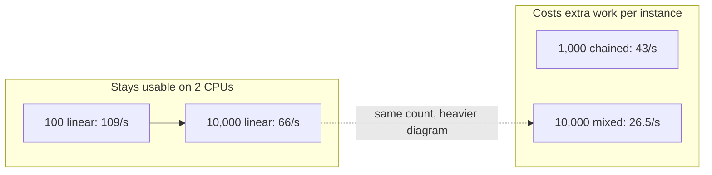
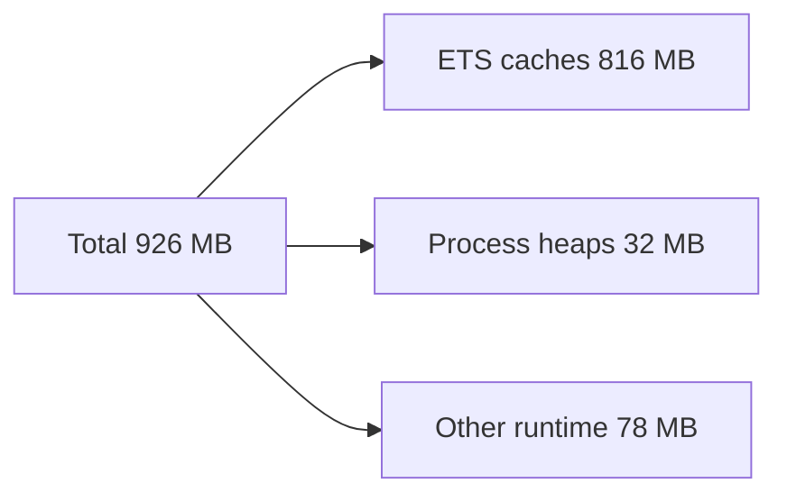

# Load bench: GitHub Actions (2 vCPU)

**Recorded:** 2026-09-04, 13:55 UTC
**Git:** `4238d8a` · Elixir 1.20.3 · OTP 29
**Machine:** GitHub Actions `ubuntu-latest` — **2 virtual CPUs**, about 7 GB RAM
**Database:** Postgres 16 Alpine as a job service on the same runner, port 5543
**Connection pool:** 16 (not the production default of 100)

[Index](README.md) · [Laptop run](2026-09-04_02_macbook-air-m4.md) · [Comparison](2026-09-04_03_comparison-and-outlook.md)

This is the **slow box**. The engine, the HTTP test client, and Postgres share two CPUs. Treat every rate as a floor, not a product SLA.

---

## TL;DR

- **Resume:** ~**600/s**, almost flat from 500 to 10,000 waiting instances
- **Linear HTTP:** **80–85/s** at 1,000 instances; still **66/s** at 10,000
- **Mixed 10,000** (parallel, multi-instance, call activity): **26.5/s** — about **6.3 minutes**
- **Database wait:** almost every checkout **under 165 ms**, even on that last test (well under the suite’s 1 s “badly queued” bar)

---

## HTTP execution: start, run, finish

Each row is: deploy the fixture, start N instances through the REST API, wait until they have all reached a terminal state. User tasks are completed at once by the harness.

| What ran | Count | Finished per second | Wall time |
|----------|------:|--------------------:|----------:|
| Short linear path | 100 | 109 | 0.9 s |
| Echo service task (linear) | 1,000 | 80 | 12 s |
| Linear, 1 KiB start payload | 1,000 | 85 | 12 s |
| Linear, 16 KiB start payload | 1,000 | 70 | 14 s |
| Linear, 64 KiB start payload | 1,000 | 56 | 18 s |
| User task (completed immediately) | 1,000 | 69 | 15 s |
| Async service task | 1,000 | 58 | 17 s |
| Longer chain of tasks | 1,000 | 43 | 23 s |
| Mixed shapes | 5,000 | 49 | 1.7 min |
| Linear path | 10,000 | 66 | 2.5 min |
| Mixed shapes (linear, parallel, multi-instance, call activity) | 10,000 | **26.5** | **6.3 min** |

**Where it slows down** is work per instance, not “crossing 1,000 instances”:

| Change | Rate | Reading |
|--------|------|---------|
| 100 → 1,000 linear | 109 → 85/s | Setup cost is amortized; still fine |
| 1 KiB → 64 KiB payload at 1,000 | 85 → 56/s | Larger JSON/token, about a third slower |
| Echo vs a longer chain at 1,000 | 80 → 43/s | More steps persisted per instance |
| 5,000 mixed → 10,000 mixed | 49 → 26.5/s | Parallel / multi-instance / child processes |
| 10,000 linear vs 10,000 mixed | 66 vs 26.5/s | Same count; **diagram shape** dominates |

On this runner, plan on roughly **80 completed instances/s** for simple HTTP-started diagrams, **~50/s** for mixed work at a few thousand, and the **mid-20s** for mixed 10,000.

While 10,000 mixed instances were running, starting one instance through HTTP took **27 ms** at the median and **204 ms** for the slowest 1% of starts.

---

## Resume: pick up waiting work

Instances are written to the database first. The timed section is only “rehydrate everything that is waiting.”

| Waiting instances | Resumed per second | Wall time |
|------------------:|-------------------:|----------:|
| 100 | 498 | 0.2 s |
| 500 | 599 | 0.8 s |
| 1,000 (user-task) | 580 | 1.7 s |
| 1,000 (mixed types) | 624 | 1.6 s |
| 5,000 (mixed) | 602 | 8.3 s |
| 5,000 (many steps per instance) | 597 | 8.4 s |
| 10,000 | **602** | 17 s |

From 500 to 10,000 the rate sits on **580–624/s**. The dip at 100 is fixed startup over a tiny batch. Concurrent GraphQL during resume did not move the needle on this box (it stayed around 600/s either way).

Inserting 10,000 instance rows (no HTTP) ran at **326/s** (31 s). Resume is not waiting on insert bandwidth.

---

## Database checkout wait

Time spent **waiting in line for a Postgres connection**, not query time. Almost-all (99 of 100 samples):

| Situation | Almost-all wait |
|-----------|----------------:|
| Burst of 200 starts while GraphQL is polled | 3 ms |
| 500 instances plus GraphQL readers | 5 ms |
| 5,000 mixed HTTP | 10 ms |
| 10,000 linear HTTP | 12 ms |
| 1,000 mixed plus heavy GraphQL | 40 ms |
| 10,000 mixed HTTP | **165 ms** |

165 ms is visible; it is not a one-second stall. The mixed 10,000 run is paying CPU and persist work per step (joins, inner iterations, child processes).

---

## Decision tables (DMN)

Batches of 1,000 instances, each evaluating a business-rule task. Table width (10 vs 500 rules) barely changes the picture. Later batches in the same test get slower — leftover heat on a 2-CPU box, not “500 rules are twice as slow as 10.” Typical batch: **11–25 seconds**.

---

## Memory at the end of the suite

Snapshot **after** every test, not a live production profile. About **926 MB** total. Most of it is ETS tables (in-memory caches), not 10,000 live processes:

The Elixir runtime had **324** processes at write time. Garbage collection ran millions of times; that matches short-lived tokens and JSON, not a leak by itself. A long-lived node that keeps every deployed model in cache will show a similar ETS pile-up.

---

## Verdict

| Area | On this runner |
|------|----------------|
| Resume | Strong: ~600/s to 10,000 waiting instances |
| Simple HTTP execution | 10,000 linear still 66/s; GraphQL alongside writes stays in the 80–110/s band at hundreds to 1,000 instances |
| Mixed 10,000 HTTP | 2.5× slower than linear 10,000. CPU and diagram fan-out, not a pool collapse. Do not use this runner as a hard SLA |

---

## Appendix: JSON workload ids

For readers who have the gitignored JSON artifact.

| Prose | `id` in the report |
|-------|-------------------|
| 10,000 mixed HTTP | `exec_10000_mixed_standard` |
| 10,000 linear HTTP | `exec_10000_linear` |
| 5,000 mixed HTTP | `exec_5000_mixed` |
| Resume 10,000 | `resume_10000_user_task_pis` |
| Seed 10,000 | `seed_10000_pis` |

Rows named `latencies`, `resume_kpi`, `seed_kpi`, and other 0 ms self-checks from the reporter are **not** real workloads and were ignored.
