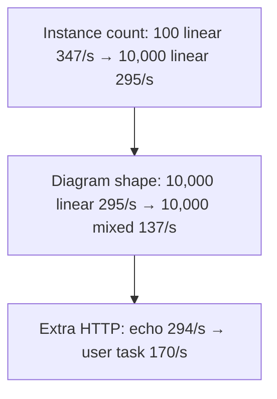
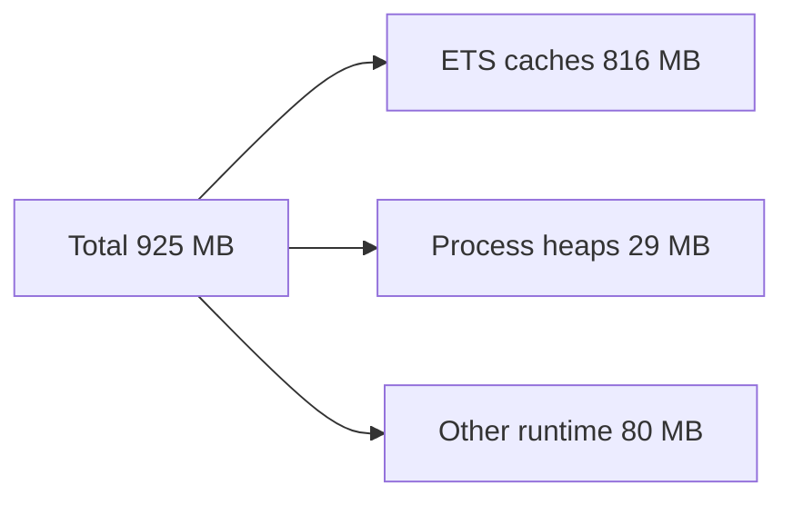

# Load bench: MacBook Air M4 (16 GB)

**Recorded:** 2026-09-04, 19:32 UTC
**Git:** `5c2b989` · Elixir 1.20.3 · OTP 29
**Machine:** MacBook Air, Apple **M4**, **16 GB** unified memory, manufactured January 2026
**Database:** Postgres 16 Alpine from [`scripts/create-test-db.sh`](../../scripts/create-test-db.sh) (Docker, port 5543)
**Connection pool:** 16 (not the production default of 100)

[Index](README.md) · [GitHub Actions run](2026-09-04_01_github-actions.md) · [Comparison](2026-09-04_03_comparison-and-outlook.md)

The engine ran on the host. Postgres ran **inside Docker Desktop** (a Linux VM). Every database round-trip therefore pays a virtualization tax that a native Linux server would not. Laptop thermals apply: this is still not a sustained-TDP server.

---

## TL;DR

- **Linear HTTP, 10,000:** **295/s** (34 s) — same rate as 1,000 echo instances
- **Mixed 10,000** (parallel, multi-instance, call activity): **137/s** (73 s)
- **Resume, 10,000:** **1,592/s** (6.3 s)
- **Database wait:** almost every checkout **≤ 5 ms**
- Instance *count* is nearly free for linear diagrams; extra *work per instance* still costs

---

## HTTP execution: start, run, finish

Each row: start N instances through REST, wait until they have all finished. User tasks are completed immediately by the harness (no human think time).

| What ran | Count | Finished per second | Wall time |
|----------|------:|--------------------:|----------:|
| Short linear path | 100 | 347 | 0.29 s |
| Echo service task (linear) | 1,000 | 294 | 3.4 s |
| Linear, 1 KiB start payload | 1,000 | 231 | 4.3 s |
| Linear, 16 KiB start payload | 1,000 | 276 | 3.6 s |
| Linear, 64 KiB start payload | 1,000 | 187 | 5.4 s |
| User task (completed immediately) | 1,000 | 170 | 5.9 s |
| Async service task | 1,000 | 258 | 3.9 s |
| Longer chain of tasks | 1,000 | 199 | 5.0 s |
| Mixed shapes | 5,000 | 203 | 25 s |
| Linear path | 10,000 | **295** | **34 s** |
| Mixed shapes (linear, parallel, multi-instance, call activity) | 10,000 | **137** | **73 s** |

The 1 KiB payload row sitting *below* 16 KiB is run-order noise, not a size inversion. **64 KiB** is the real payload hit.

| Change | Rate | Reading |
|--------|------|---------|
| 100 → 10,000 linear | 347 → 295/s | Count tax about 15%; 10,000 matches 1,000 echo |
| Echo vs user-task at 1,000 | 294 → 170/s | Extra HTTP round-trip to complete the task |
| Echo vs a longer chain at 1,000 | 294 → 199/s | More steps persisted per instance |
| 16 KiB → 64 KiB at 1,000 | 276 → 187/s | Larger JSON/token, about a third slower |
| 5,000 mixed → 10,000 mixed | 203 → 137/s | Parallel / multi-instance / child processes |
| 10,000 linear vs 10,000 mixed | 295 vs 137/s | Same count; diagram shape about **2.2×** |

**Practical band on this laptop:** about **280–350/s** for simple HTTP-started diagrams, **~200/s** for mixed work at a few thousand, **~140/s** for mixed 10,000.

While 10,000 mixed instances were running, starting one instance took **7.1 ms** at the median and **17.6 ms** for the slowest 1% of starts.

---

## Resume: pick up waiting work

On GitHub this rate was a flat ~600/s. Here it **climbs with batch size** as startup is amortized — with two exceptions.

| Waiting instances | Resumed per second | Wall time |
|------------------:|-------------------:|----------:|
| 100 | 943 | 0.11 s |
| 500 | 1,134 | 0.44 s |
| 1,000 (user-task) | 1,513 | 0.66 s |
| 1,000 (mixed types) | 1,342 | 0.75 s |
| 1,000 plus GraphQL readers during resume | 929 | 1.1 s |
| 5,000 (mixed) | 1,290 | 3.9 s |
| 5,000 (many steps per instance) | 810 | 6.2 s |
| 10,000 | **1,592** | **6.3 s** |

- **Many steps per instance (5,000):** 810/s — more rows to rehydrate, closer to database-bound.
- **GraphQL while resuming 1,000:** 929/s versus 1,513/s without readers (**39% drop**). Concurrent reads are visible on a fast box; the 2-CPU runner hid them inside ~600/s noise.

Inserting instance rows (no HTTP) is dead flat: **1,017 / 1,039 / 1,021 per second** at 1,000 / 5,000 / 10,000 (about 1 ms per row). Resume of 10,000 waiting instances is still faster than inserting them.

---

## Database checkout wait

Almost-all (99 of 100 samples) time waiting **in line for a connection**:

| Situation | Almost-all wait |
|-----------|----------------:|
| Burst of 200 starts while GraphQL is polled | 1 ms |
| 500 instances plus GraphQL readers | 1 ms |
| 5,000 mixed HTTP | 1 ms |
| 10,000 linear HTTP | 3 ms |
| 1,000 mixed plus heavy GraphQL | 5 ms |
| 10,000 mixed HTTP | **5 ms** |

Checkout wait is noise. The engine is spending CPU and persist work per step, not sitting on a starved pool of 16 connections.

GraphQL alongside execution stays around **240–260 finished instances/s** at 200–1,000 instances.

---

## Decision tables (DMN)

Batches of 1,000 business-rule-task instances. Ten-rule and 100-rule tables overlap (median about **280–310/s**). 500-rule batches fan out more (median about **221/s**) and later laps jitter — laptop heat plus leftover work, not a clean “500 rules are twice as slow” law. Typical batch: **2.6–6.1 seconds**.

---

## Memory at the end of the suite

**925 MB** total — within a few megabytes of the GitHub snapshot. Same story: caches of every diagram deployed during the suite, not 10,000 live instances.

**350** Elixir processes at write time. Garbage collection: 7.2 million runs, ~44 billion words reclaimed — the same shape as GitHub.

---

## Verdict

| Area | On this laptop |
|------|----------------|
| Resume | 1,592/s at 10,000. Heavy step counts and GraphQL-during-resume are the taxes |
| Simple HTTP execution | 10,000 linear **295/s**, matching 1,000 echo. Checkout wait 1–5 ms |
| Mixed 10,000 HTTP | **2.2×** slower than linear (137/s, 73 s). Fan-out, not the pool. Docker-on-Mac Postgres is a penalty a Linux server will not pay |

---

## Appendix: JSON workload ids

| Prose | `id` in the report |
|-------|-------------------|
| 10,000 mixed HTTP | `exec_10000_mixed_standard` |
| 10,000 linear HTTP | `exec_10000_linear` |
| 5,000 mixed HTTP | `exec_5000_mixed` |
| User-task 1,000 HTTP | `exec_1000_user_task` |
| Resume 10,000 | `resume_10000_user_task_pis` |
| Resume 1,000 + GraphQL | `rp1_resume_1000_with_graphql` |
| Seed 10,000 | `seed_10000_pis` |

`5c2b989` and the GitHub run’s `4238d8a` are sibling “sandbox load-test” commits from the same afternoon. Runtime engine code is equivalent; this is a hardware comparison, not a code delta.
