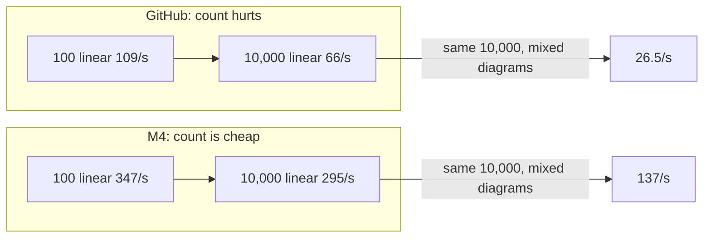
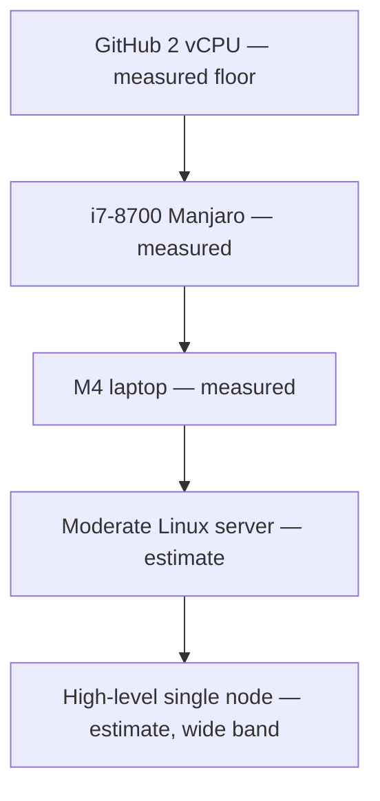

# Load bench: comparison and server outlook

**Runs compared:** [GitHub Actions, 2 vCPU](2026-09-04_01_github-actions.md) (13:55 UTC) and [MacBook Air M4, 16 GB](2026-09-04_02_macbook-air-m4.md) (19:32 UTC), both 2026-09-04.
**Same suite, same Elixir 1.20.3 / OTP 29, pool size 16.** The two git SHAs are sibling load-test commits from the same afternoon.

---

## TL;DR

- Extra cores **raise the floor**. They barely change the **cost of a fat diagram**.
- Mixed vs linear at 10,000 instances: **2.5× slower** on GitHub, **2.2× slower** on the M4
- Hardware moves the absolute rate; **BPMN shape sets the slope**
- Database almost-all wait on mixed 10,000: **165 ms** on GitHub (2 CPUs saturated) vs **5 ms** on the M4
- Growing the production pool (default 100) without growing cores is the wrong knob

---

## Side by side: HTTP execution

Finished instances per second, same tests.

| What ran | GitHub 2 vCPU | M4 Air 16 GB | M4 is faster by |
|----------|--------------:|-------------:|----------------:|
| 100 linear | 109 | 347 | 3.2× |
| 1,000 echo | 80 | 294 | 3.7× |
| 1,000, 16 KiB payload | 70 | 276 | 4.0× |
| 1,000 async service task | 58 | 258 | 4.5× |
| 1,000 longer chain | 43 | 199 | 4.7× |
| 1,000 user task | 69 | 170 | 2.5× |
| 5,000 mixed | 49 | 203 | 4.2× |
| 10,000 linear | 66 | 295 | 4.5× |
| 10,000 mixed | 26.5 | 137 | **5.2×** |

Median HTTP-execution speedup: about **4×**.

On GitHub, 10,000 linear had already slid from 109/s at 100 instances down to 66/s — **count itself** was a 2-CPU problem. On the M4, 10,000 linear (**295/s**) matches 1,000 echo. Count is cheap; diagram shape and extra HTTP (completing user tasks) are not.

---

## Side by side: resume

| Waiting instances | GitHub | M4 | Speedup |
|------------------:|-------:|---:|--------:|
| 100 | 498 | 943 | 1.9× |
| 1,000 user-task | 580 | 1,513 | 2.6× |
| 1,000 + GraphQL | 611 | 929 | 1.5× |
| 5,000, many steps | 597 | 810 | **1.4×** |
| 10,000 | 602 | 1,592 | 2.6× |

HTTP execution sped up ~4×; resume ~2×; “many steps” resume only ~1.4×. Rehydration is more serial row work. Docker Desktop’s Linux VM sits on that path on the M4 — a native Linux Postgres will help resume more than it helps already-fast linear HTTP.

On a fast box, GraphQL **during** resume is visible (929 vs 1,513/s). GitHub hid that inside a flat ~600/s.

Inserting 10,000 rows: **326/s** (GitHub) vs **1,021/s** (M4), 3.1×, and perfectly flat on the laptop at about 1 ms/row.

---

## Third anchor: Linux Machine

I ran the same tests on my own machine (Intel Core i7-8700 at 3.20 GHz 6 physical cores + 6 virtual, 32 GB DDR4, Manjaro with Linux Kernel 7.2.0). Postgres ran in Docker on the same host — native Linux Docker, not Docker Desktop’s VM.

| Test | GitHub 2 vCPU | i7-8700 12 Cores | M4 Air 16 GB |
|------|--------------:|----------------:|-------------:|
| 5,000 mixed | 49/s (103 s) | 87/s (58 s) | 203/s (25 s) |
| 10,000 linear | 66/s (152 s) | 119/s (84 s) | 295/s (34 s) |
| 10,000 mixed | 26.5/s (377 s) | 50/s (199 s) | 137/s (73 s) |
| Mixed 10,000: almost-all DB wait | 165 ms | 18 ms | 5 ms |
| Mixed 10,000: start median / slowest 1% | 27 / 204 ms | — | 7.1 / 17.6 ms |

Not too shabby, given the machine is roughly 9 years old. Of course, the M4 still beats it right through the wall.

---

## What we can actually deduce

1. **Execution is CPU-bound, not pool-bound.** Tests used 16 connections; production defaults to 100. On the M4, almost-all checkout wait never left 5 ms, so extra connections would not have bought the mixed 10,000 run. GitHub’s 165 ms was two saturated CPUs delaying checkouts.

2. **Diagram shape is a hardware-invariant tax.** Mixed/linear at 10,000: 0.40 on GitHub, 0.46 on the M4. Fat BPMN costs a bit more than 2× a linear path on both. A bigger server raises 26/s to 137/s to maybe a few hundred; it will not make mixed as cheap as linear.

3. **Resume and seed follow the database more than execution does.** That is why they sped up less, and why Docker-on-Mac is a self-imposed penalty.

4. **Memory is suite residue.** 925 vs 926 MB, ~816 MB ETS both times. 16 GB is ample for 10,000-instance tests. The next RAM topic is cache growth if a long-lived node keeps thousands of deployed versions — independent of CPU class.

5. **The M4 number is still a lower bound versus a Linux server with similar cores.** Postgres in a VM, laptop thermals, database stealing cores from the engine.

---

## Outlook: moderate vs high-level servers

**Interpolation, not a measurement.** Anchors: GitHub = 2 shared vCPUs, everything co-located. This Linux workstation = i7-8700 (6+6 cores), 32 GB DDR4, native Docker Postgres. M4 = roughly 10 cores (4 performance + 6 efficiency), 16 GB, Docker-on-Mac Postgres.

| Assumed box | What we mean |
|-------------|--------------|
| **Moderate** | 8 dedicated vCPUs for the engine, 32 GB RAM, Postgres 16 on NVMe with its own 4–8 vCPUs (sidecar or small managed instance), Linux, same datacentre, pools 100 / 50 |
| **High-level** | 16–32 vCPU engine node, 64–128 GB, dedicated Postgres with 16+ vCPUs and provisioned IOPS, Linux. **One engine node** — not a cluster |

| Workload | GitHub (measured) | M4 (measured) | Moderate (estimate) | High-level (estimate) |
|----------|------------------:|--------------:|--------------------:|----------------------:|
| Linear HTTP, 10,000 | 66/s | 295/s | 250–500/s | 500–1,200/s |
| Mixed HTTP, 10,000 | 26.5/s | 137/s | 120–250/s | 250–600/s |
| Mixed HTTP, few thousand | 49/s | 203/s | 180–350/s | 350–800/s |
| Resume 10,000 waiting | 602/s | 1,592/s | 1.5k–3k/s | 3k–6k/s |
| Insert 10,000 rows | 326/s | 1,021/s | 1k–2k/s | 2k–4k/s |
| Comfort band, simple HTTP | ~80/s | ~280–350/s | ~300–600/s | ~600–1,500/s |
| Mixed 10,000 wall clock | 6.3 min | 73 s | 40–90 s | 20–45 s |

**Confidence:** moderate band is medium (the M4 already sits inside it; native Linux Postgres and a dedicated database CPU should offset weaker per-core cloud Xeons). High-level band is low-to-medium. Execution will **not** scale linearly with cores: one test client, persist-per-step, and scheduler contention all cap it. The top of the high-level range needs concurrent API clients and Postgres off the engine box. Neither run tested a cluster — do not multiply by node count.

Why moderate is “about the M4, maybe 1.5×,” not “4× the M4”: GitHub → M4 was ~4× because we left **two shared vCPUs** for a 10-core Apple laptop with very fast performance cores. An 8-vCPU cloud instance is not 4× an M4. What the server *does* win: no Docker Desktop VM, no laptop throttle, Postgres not stealing engine cores, pool already 100.

### What would invalidate the estimate

| If this is true in production | Then the table above |
|-------------------------------|----------------------|
| User tasks wait on humans | Throughput is wait-time, not 170–350/s |
| Service tasks call slow backends | The engine sits idle; rate tracks the backend |
| Postgres is cross-AZ / high latency | Resume, inserts, and mixed persist drop first |
| Diagrams fatter than the mixed fixture | Apply the ~2.2× shape tax again |
| Several engine nodes | Untested; do not multiply by node count |
| The in-memory model cache holds thousands of versions | Memory, not CPU, becomes the story |

---

## Practical takeaway

On moderate dedicated Linux hardware, plan capacity around **a few hundred completed simple instances per second per node**, and **roughly half that** for mixed BPMN with fan-out. Picking up waiting work after a restart is an order of magnitude cheaper than executing it through HTTP. Do not size the database pool from GitHub’s 165 ms wait — that was CPU starvation. Size cores for the diagrams you actually run; keep Postgres close and native.
