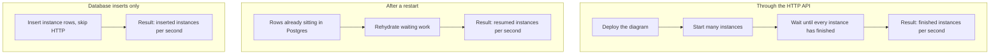

# Load benchmarks

These pages are written for people who have never opened the engine’s test suite.
They explain **what we ran**, **on which machines**, and **what the numbers mean**.

Internal test names (`E8`, `RP1`, …) are listed only in a short appendix on each report, so a recorded JSON file can still be matched to the prose.

| Report | Date | Machine | What it answers |
|--------|------|---------|-----------------|
| [GitHub Actions](2026-09-04_01_github-actions.md) | 2026-09-04 | Shared 2-vCPU CI runner | Floor: how slow is a tiny, contended box? |
| [MacBook Air M4](2026-09-04_02_macbook-air-m4.md) | 2026-09-04 | Laptop, 16 GB, Apple M4 | A current personal computer, database in Docker |
| [Comparison and outlook](2026-09-04_03_comparison-and-outlook.md) | 2026-09-04 | Comparison and learnings | What changes with hardware, and a cautious server estimate |

Raw JSON from `mix test.load` is **not** committed (see `.gitignore`). These markdown files are the published analysis.

---

## How to read a number

A **process instance** is one running copy of a BPMN process (one order, one onboarding, one claim).

**Instances per second** is how many of those copies **finished** in one second of wall-clock time, unless the text says otherwise (resume and seeding are called out).

Three different measurements appear throughout:



| Kind | What it feels like in production | What we actually did |
|------|----------------------------------|----------------------|
| **HTTP execution** | “Start 1,000 processes through the API and wait until they complete.” | REST start, full persistence, wait for a terminal state. User tasks are completed **immediately** by the test harness — no human think time. |
| **Resume** | “The engine process restarted; pick up every waiting instance.” | Rows are inserted first; then the resume path is timed. No HTTP start in the timed window. |
| **Seeding** | “How fast can we write instance rows?” | Sequential inserts. Useful as a database-write baseline, not as “engine throughput.” |

**Almost-all wait** (often called the 99th percentile): if we say “almost every database checkout waited less than 5 ms”, that means 99 out of 100 recorded waits were at or below 5 milliseconds. A few outliers may be slower.

**This is not production topology.** In every run the engine, the test client, and Postgres share one machine (on the laptop, Postgres runs in Docker). Production typically gives Postgres its own box and a larger connection pool. Default production pools are 100 writers and 50 readers; these tests used **16**.

---

## What the diagrams look like

When a table says **simple / linear**, the process is a short straight path (start → a few steps → end).

When it says **mixed**, instances are spread round-robin across four shapes:

- a linear path
- a parallel gateway (work splits and joins)
- a parallel multi-instance script task (many inner steps at once)
- a call activity (a child process must finish before the parent continues)

The mixed 10,000-instance run only counts **root** instances as complete, so child processes created by call activities cannot make the test look finished early.

---

## Reproduce a run

```bash
# Postgres: scripts/create-test-db.sh  (postgres:16-alpine on port 5543)
mix test.load

# 20k / 50k / 100k per shape. Can potentially take well over an hour, depending on the host machine.
# Don't try this at home (or with GH Actions).
mix test.load.durability

# Default suite + durability in one process, one JSON
mix test.load.all
```

These tests use a real connection pool (not the unit-test sandbox). They write a JSON file under `test/load/reports/` (gitignored).
