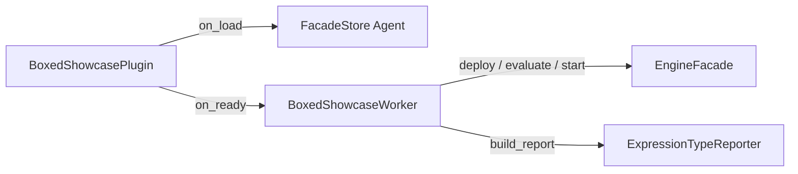

# Boxed Expression Showcase — example lifecycle plugin

Deploys a DMN model that exercises every CL3 boxed expression type, evaluates the full DRG, and logs a per-decision expression-type report.

## What this demonstrates

This plugin shows how to build a **facade-driven lifecycle plugin** that:

1. Deploys `expression_showcase.dmn` (all CL3 expression types in one DRG)
2. Deploys `showcase_runner_process.bpmn` and starts a process instance with sample employee data
3. Collects the Business Rule Task execution trace from `type_properties.trace`
4. Runs an ad-hoc `facade.decisions.evaluate/3` against the root decision with the same input
5. Maps each decision in the trace to its expression type via pure `ExpressionTypeReporter` functions
6. Logs structured report lines for process and ad-hoc evaluation paths

## Expression type catalog

| Decision | Expression type |
|----------|-----------------|
| Department Multiplier | `:decision_table` |
| Performance Bonus | `:boxed_invocation` |
| Certification Allowance | `:boxed_list` |
| Certification Total | `:literal_expression` |
| Benefits Package | `:boxed_context` |
| Salary Bands | `:relation` |
| Eligible for Promotion | `:boxed_conditional` |
| Qualified Certifications | `:boxed_filter` |
| Certification Details | `:boxed_for` |
| All Certs Premium | `:boxed_every` |
| Has Premium Cert | `:boxed_some` |
| Total Compensation | `:literal_expression` |

## DMN model overview

Model id **`expression-showcase`**, namespace `https://example.com/dmn/showcase`.

**Inputs:** `baseSalary`, `department`, `performanceRating`, `yearsOfService`, `certifications` (list of strings).

**BKM:** `Seniority Bonus Calculator` — literal FEEL body with formal parameters `years` and `rating`.

**Decisions (dependency order):** Department Multiplier → Performance Bonus → Certification Allowance → Certification Total → Benefits Package, Salary Bands, Eligible for Promotion, Qualified Certifications, Certification Details, All Certs Premium, Has Premium Cert → **Total Compensation** (root literal expression combining salary, multiplier, bonus, and certification total).

Side decisions (benefits package, bands, iterators) are required in the DRG so every expression type appears in the evaluation trace even when not used in the root arithmetic.

## BPMN process overview

`bpmn/showcase_runner_process.bpmn`:

```
Start → BusinessRuleTask("Calculate Compensation") → End
```

The Business Rule Task uses `implementation="dmn"` and `<evil:decisionRef>expression-showcase</evil:decisionRef>`. The engine evaluates the deployed DMN model against the process start payload.

## Expected output for sample input

Default worker input:

```json
{
  "baseSalary": 75000,
  "department": "engineering",
  "performanceRating": 4,
  "yearsOfService": 8,
  "certifications": ["AWS", "PMP"]
}
```

Approximate results (when the full engine evaluates the fixture):

| Decision | Expected shape |
|----------|------------------|
| Department Multiplier | `1.15` |
| Performance Bonus | `4000` (rating × 500, years &lt; 10) |
| Certification Allowance | `[2000, 3000, 0, 0]` |
| Certification Total | `5000` |
| Benefits Package | `{ healthTier, retirementMatch, stockOptions }` |
| Salary Bands | four-row relation table |
| Eligible for Promotion | `true` |
| Qualified Certifications | `["AWS", "PMP"]` |
| Total Compensation | `(75000 × 1.15) + 4000 + 5000` → **104250** |

Log lines are prefixed with `boxed_expression_showcase:` and include `process` and `ad_hoc` report entries.

## Usage steps

1. Copy `lib/*.ex` into your OTP application (or add the example path to code paths in development).
2. Set `:plugin_module` to `Examples.BusinessRules.BoxedExpressionShowcase.BoxedShowcasePlugin` and list your app in `TDE_PLUGINS_INBEAM`.
3. Start the engine; on plugin ready the worker deploys DMN + BPMN and runs the showcase.
4. Inspect engine logs for lines prefixed with `boxed_expression_showcase:`.
5. Run unit tests:

```bash
mix test examples/plugins/business_rules/boxed_expression_showcase/test/expression_type_reporter_test.exs
mix test examples/plugins/business_rules/boxed_expression_showcase/test/boxed_showcase_worker_test.exs
```

Or via the umbrella loader:

```bash
mix test apps/peripheral_plugins/test/examples/boxed_expression_showcase_from_examples_test.exs
```

## Architecture



- **`on_load/1`** — stores the wired facade in `FacadeStore`
- **`on_ready/1`** — starts `BoxedShowcaseWorker` with that facade
- **Worker** — deploy DMN/BPMN, start PI, poll FNI trace, ad-hoc evaluate, log reports
- **Reporter** — pure mapping from decision display names to CL3 expression type atoms

## Further reading

- [`EvilEngine.Plugin`](../../../../apps/engine_sdk/lib/evil_engine/plugin.ex) — lifecycle callbacks
- [`EvilEngine.EngineFacade`](../../../../apps/engine_sdk/lib/evil_engine/engine_facade.ex) — facade closure surface
- [`docs/architecture/dmn.md`](../../../../docs/architecture/dmn.md) — CL3 boxed expressions and evaluation traces
- [`docs/guides/handbook/business-rule-tasks.md`](../../../../docs/guides/handbook/business-rule-tasks.md) — DMN Business Rule Tasks
- [`examples/plugins/business_rules/decision_audit_reporter/README.md`](../decision_audit_reporter/README.md) — similar deploy + process + trace pattern
