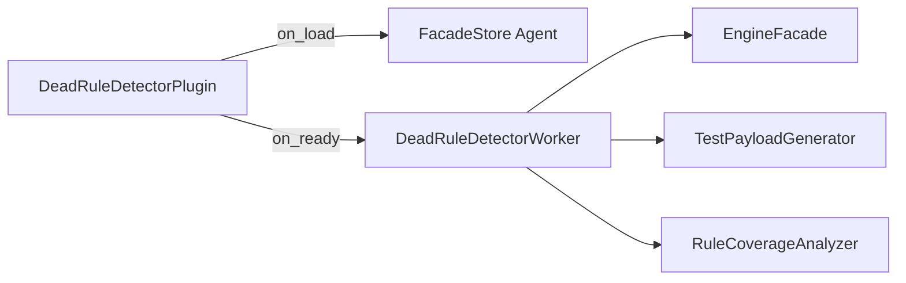

# Dead Rule Detector — example lifecycle plugin

Runs an employee-benefits BPMN process many times and reports DMN decision-table rules that never matched across those executions.

## What this demonstrates

This plugin shows how to build a **facade-driven lifecycle plugin** that performs rule-coverage analysis across multiple process instances:

1. Deploy bundled DMN and BPMN fixtures
2. Start the process once per generated test payload
3. Read BRT `type_properties.trace` from finished flow node instances
4. Aggregate `matched_rules` across all runs
5. Compare against the full rule catalog to find **dead rules** (never matched)
6. Log a structured coverage report

## DMN model overview

`dmn/employee_benefits.dmn` defines model id **`employee-benefits`** with decision **`Benefits Tier`** (FIRST hit policy).

| Inputs | Type |
|--------|------|
| `yearsOfService` | number |
| `department` | string |
| `performanceRating` | string |
| `employeeType` | string |

| Outputs | Type |
|---------|------|
| `tier` | string |
| `healthPlan` | string |
| `retirementMatch` | number |
| `vacationDays` | number |

The table has **12 rules** (`rule_1` … `rule_12`). Three are intentionally unreachable with the bundled test payloads:

| Rule | Why it is dead |
|------|----------------|
| `rule_10` | `>= 30` full-time tier — `rule_1` (`>= 20` outstanding) matches first under FIRST policy |
| `rule_11` | `discontinued_dept` department — never present in test data |
| `rule_12` | executive + `below` performance — `rule_7` (executive full-time) matches first |

## BPMN process overview

`bpmn/employee_benefits_process.bpmn` runs:

```
Start → BusinessRuleTask("Determine Benefits") → End
```

- Process id: `employee-benefits-process`
- Business Rule Task: `implementation="dmn"`, `<evil:decisionRef>employee-benefits</evil:decisionRef>`
- Version: `1.0.0` via `<evil:version>`

## How it works

On `on_ready/1`, `DeadRuleDetectorWorker`:

1. Deploys `employee_benefits.dmn` via `facade.decisions.deploy/1`
2. Parses and deploys `employee_benefits_process.bpmn` via `facade.processes.deploy/1`
3. Resolves the latest process version via `facade.processes.get_latest_version/1`
4. Generates nine payloads from `TestPayloadGenerator.generate_all/0`
5. Starts one process instance per payload via `facade.processes.start/1`
6. After a short delay, loads each BRT FNI via `facade.flow_node_instances.get/1`
7. Passes normalized traces and the known rule id list to `RuleCoverageAnalyzer.analyze/2`
8. Logs the report (`dead_rules`, `coverage_percent`, etc.)

Already-deployed DMN or BPMN versions (`:version_exists`) are treated as success so reruns are idempotent.

## Report format

```elixir
%{
  process_model_id: "employee-benefits-process",
  decision_model_id: "employee-benefits",
  total_rules: 12,
  matched_rules: 9,
  dead_rules: ["rule_10", "rule_11", "rule_12"],
  dead_rule_count: 3,
  coverage_percent: 75.0,
  execution_count: 9
}
```

Retrieve the last report from tests or interactive debugging with `DeadRuleDetectorWorker.get_last_report/1`.

## Architecture: facade-driven full orchestration



- **`on_load/1`** — stores the wired facade in `FacadeStore`
- **`on_ready/1`** — starts `DeadRuleDetectorWorker` with that facade
- **Worker** — deploy, start N instances, collect traces, analyze, log
- **Analyzer** — pure functions; no GenServer, no facade dependency
- **TestPayloadGenerator** — static fixture inputs that exercise rules 1–9 only

## Usage steps

1. Copy `lib/*.ex` into your OTP application (or add the example path to code paths in development).
2. Set `:plugin_module` to `Examples.BusinessRules.DeadRuleDetector.DeadRuleDetectorPlugin` and list your app in `EVIL_PLUGINS_INBEAM`.
3. Start the engine; on plugin ready the worker deploys fixtures and runs coverage analysis.
4. Inspect engine logs for lines prefixed with `dead_rule_detector:`.
5. Run unit tests:

```bash
mix test examples/plugins/business_rules/dead_rule_detector/test/rule_coverage_analyzer_test.exs
mix test examples/plugins/business_rules/dead_rule_detector/test/test_payload_generator_test.exs
mix test examples/plugins/business_rules/dead_rule_detector/test/dead_rule_detector_worker_test.exs
```

## Further reading

- [`EvilEngine.Plugin`](../../../../apps/engine_sdk/lib/evil_engine/plugin.ex) — lifecycle callbacks
- [`EvilEngine.EngineFacade`](../../../../apps/engine_sdk/lib/evil_engine/engine_facade.ex) — facade namespace surface
- [`docs/architecture/dmn.md`](../../../../docs/architecture/dmn.md) — DMN evaluation and traces
- [`docs/architecture/plugins.md`](../../../../docs/architecture/plugins.md) — plugin loading and facade wiring
- [`examples/plugins/business_rules/decision_regression_tester/README.md`](../decision_regression_tester/README.md) — similar FacadeStore worker pattern
- [`examples/plugins/lifecycle_and_api/api_consumer/README.md`](../../lifecycle_and_api/api_consumer/README.md) — BPMN deploy and process start orchestration
