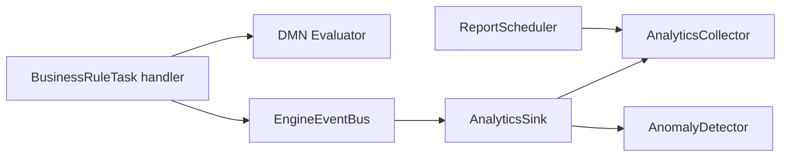

# Decision Analytics — example event sink

Observes DMN Business Rule Task completions and maintains live evaluation throughput, latency histograms (average, p95, p99, min, max), per-decision rule-hit distribution, and rolling-window latency spike detection.

This plugin runs in-BEAM. Operators and DMN observers load it into the engine process.

## What this demonstrates

This plugin implements the **Event Sink observation pattern** for Business Rule Tasks: it never executes decisions. The engine evaluates DMN via `BusinessRuleTask` → `DecisionResolver` → `ModelCache` → `Evaluator`; this sink listens on `EngineEventBus` for `FlowNodeInstanceFinished` events and records analytics from evaluation metadata carried in `type_properties`.

For a **simple KPI sink** (throughput / error rate / coverage only, no histograms or spike detection), copy `AnalyticsSink` + `AnalyticsCollector` and drop `AnomalyDetector` / `LatencyHistogram` / `ReportScheduler`. Do not resurrect the deleted `decision_kpi_calculator` tree.

## Architecture



The sink filters `FlowNodeInstanceFinished` where `flow_node_type == :business_rule_task` and `type_properties["mode"] == "dmn"`. It does not call `facade.decisions.evaluate` or modify process tokens.

## DMN model overview

`dmn/shipping_rates.dmn` defines model id **`shipping-rates`** in namespace `https://example.com/dmn/shipping`.

| Input | Type | Role |
|-------|------|------|
| `weight` | number | Parcel weight in kilograms |
| `destination` | string | `"domestic"` or `"international"` |
| `express` | boolean | Express shipping flag |

Decision **Shipping Cost** uses **FIRST** hit policy with eight rules covering express/economy, domestic/international, and weight bands. Outputs: `baseCost` (number), `deliveryDays` (number).

## BPMN process overview

`bpmn/shipping_cost_process.bpmn` runs a linear flow:

```
Start → BusinessRuleTask("Calculate Shipping") → End
```

The Business Rule Task uses `implementation="dmn"` and `<bfw:decisionRef>shipping-rates</bfw:decisionRef>`.

Sample start payload:

```json
{ "weight": 3, "destination": "domestic", "express": true }
```

## Usage steps

1. Copy `lib/*.ex` into your OTP application (or load the example path in development).
2. Set `:plugin_module` to `Examples.BusinessRules.DecisionAnalytics.DecisionAnalyticsPlugin` and add your app to `BFE_PLUGINS_INBEAM`.
3. Deploy `dmn/shipping_rates.dmn` via `POST /decisions` (or Studio deploy).
4. Deploy `bpmn/shipping_cost_process.bpmn` via `POST /processes`.
5. Start process instances with the sample payload above.
6. Watch engine logs for `decision_analytics:` JSON reports and `latency spike` warnings.

Inspect aggregates from IEx:

```elixir
stats = Examples.BusinessRules.DecisionAnalytics.AnalyticsCollector.get_stats()

report =
  Examples.BusinessRules.DecisionAnalytics.ReportFormatter.format(stats)
```

7. Run unit tests:

```bash
mix test examples/plugins/business_rules/decision_analytics/test/analytics_collector_test.exs
mix test examples/plugins/business_rules/decision_analytics/test/anomaly_detector_test.exs
mix test examples/plugins/business_rules/decision_analytics/test/latency_histogram_test.exs
mix test examples/plugins/business_rules/decision_analytics/test/analytics_sink_test.exs
mix test examples/plugins/business_rules/decision_analytics/test/report_scheduler_test.exs
```

## Configuration options

| Option | Module | Description |
|--------|--------|-------------|
| `collector_name` | `AnalyticsSink.init/1` | Registered name for the `AnalyticsCollector` agent |
| `anomaly_detector` | `AnalyticsSink.init/1` | `%AnomalyDetector{}` (defaults: window 20, spike factor 3) |
| `interval_ms` | `ReportScheduler.start_link/1` | Report period; default `60_000` |

Sink registration uses an empty option list by default:

```elixir
facade.register_event_sink.("decision_analytics", AnalyticsSink, [])
```

## Metrics tracked

| Metric | Source |
|--------|--------|
| Average / p95 / p99 / min / max duration | `duration_us` per evaluation via `LatencyHistogram` |
| Evaluation count | Per `decision_ref` |
| Top rules | Hit counts from `matched_rules` (top 10) |
| Latency spike | `current / rolling_average >= spike_threshold` over the last `window_size` samples |

## Further reading

- [`BfwEngine.Plugin.EventSink`](../../../../apps/engine_sdk/lib/bfw_engine/plugin/event_sink.ex) — sink callbacks
- [`docs/architecture/event-system.md`](../../../../docs/architecture/event-system.md) — `EngineEventBus` fan-out and crash isolation
- [`docs/architecture/dmn.md`](../../../../docs/architecture/dmn.md) — DMN evaluation and BRT `type_properties`
