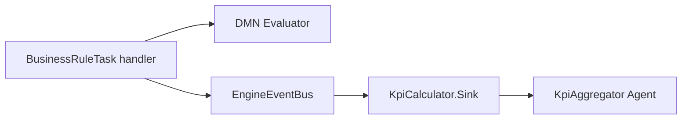

# Decision KPI Calculator — example event sink

Observes DMN Business Rule Task completions and maintains running latency, throughput, rule-hit, and error-rate aggregates.

## What this demonstrates

This plugin implements the **Event Sink observation pattern** for Business Rule Tasks: it never executes decisions. The engine evaluates DMN via `BusinessRuleTask` → `DecisionResolver` → `ModelCache` → `Evaluator`; this sink listens on `EngineEventBus` for `FlowNodeInstanceFinished` events and records KPIs from evaluation metadata carried in `type_properties`.

When Phase 7 trace integration adds `type_properties` to the public event struct, the sink’s `accepts?/1` and `handle_event/2` logic already match the intended wire shape (string-keyed maps with `mode`, `decision_ref`, `duration_us`, `matched_rules`, and related fields).

## DMN model overview

`dmn/shipping_rates.dmn` defines model id **`shipping-rates`** in namespace `https://example.com/dmn/shipping`.

| Input | Type | Role |
|-------|------|------|
| `weight` | number | Parcel weight in kilograms |
| `destination` | string | `"domestic"` or `"international"` |
| `express` | boolean | Express shipping flag |

Decision **Shipping Cost** uses **FIRST** hit policy with eight rules covering express/economy, domestic/international, and weight bands. Outputs: `baseCost` (number), `deliveryDays` (number).

## BPMN process overview

`bpmn/shipping_cost_process.bpmn` runs a linear flow:

```
Start → BusinessRuleTask("Calculate Shipping") → End
```

The Business Rule Task uses `implementation="dmn"` and `<evil:decisionRef>shipping-rates</evil:decisionRef>`. Deploy this BPMN and the DMN model to the engine before starting process instances.

## Usage steps

1. Copy `lib/*.ex` into your OTP application (or load the example path in development).
2. Set `:plugin_module` to `Examples.BusinessRules.KpiCalculator.KpiCalculatorPlugin` and add your app to `EVIL_PLUGINS_INBEAM`.
3. Deploy `dmn/shipping_rates.dmn` via `POST /decisions` (or Studio deploy).
4. Deploy `bpmn/shipping_cost_process.bpmn` via `POST /processes`.
5. Start process instances with input such as `{ "weight": 3, "destination": "domestic", "express": true }`.
6. Inspect aggregates:

```elixir
stats = Examples.BusinessRules.KpiCalculator.KpiAggregator.get_stats()

per_decision =
  stats.per_decision["shipping-rates"]
  |> Map.put(:decision_ref, "shipping-rates")

report =
  Examples.BusinessRules.KpiCalculator.StatsFormatter.format(
    per_decision,
    stats.global
  )
```

7. Run unit tests:

```bash
mix test examples/plugins/business_rules/decision_kpi_calculator/test/kpi_calculator_sink_test.exs
mix test examples/plugins/business_rules/decision_kpi_calculator/test/kpi_aggregator_test.exs
mix test examples/plugins/business_rules/decision_kpi_calculator/test/stats_formatter_test.exs
```

## Architecture: plugin observes, never executes



The sink filters `FlowNodeInstanceFinished` where `flow_node_type == :business_rule_task` and `type_properties["mode"] == "dmn"`. It does not call `facade.decisions.evaluate` or modify process tokens.

## Configuration options

| Option | Module | Description |
|--------|--------|-------------|
| `aggregator_name` | `Sink.init/1` | Registered name for the `KpiAggregator` agent (default `KpiAggregator`) |
| `name` | `KpiAggregator.*` | Override agent name in tests or multi-tenant setups |

Sink registration uses an empty option list by default:

```elixir
facade.register_event_sink.("decision_kpi_calculator", Sink, [])
```

## KPI metrics tracked

| Metric | Source |
|--------|--------|
| Average / p95 / min / max duration | `duration_us` per evaluation |
| Throughput per minute | Evaluation count over `first_seen` → `last_seen` window |
| Error rate | Fatal or flagged evaluations vs total count |
| Top rules | Hit counts from `matched_rules` rule ids |
| Coverage percent | Distinct rules hit vs `total_rule_count` (8 for shipping-rates) |

## Further reading

- [`EvilEngine.Plugin.EventSink`](../../../../apps/engine_sdk/lib/evil_engine/plugin/event_sink.ex) — sink callbacks
- [`docs/architecture/event-system.md`](../../../../docs/architecture/event-system.md) — `EngineEventBus` fan-out and crash isolation
- [`docs/architecture/dmn.md`](../../../../docs/architecture/dmn.md) — DMN evaluation and BRT `type_properties`
- [`docs/guides/handbook/business-rule-tasks.md`](../../../../docs/guides/handbook/business-rule-tasks.md) — BPMN Business Rule Task configuration
