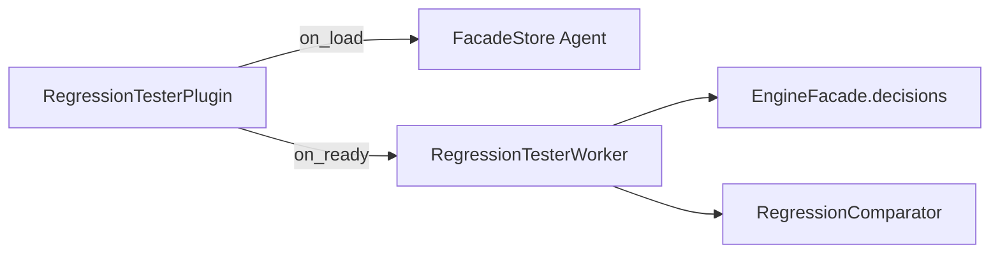

# Decision Regression Tester — example lifecycle plugin

Compares DMN evaluation results across two deployed versions for the same fixture inputs and logs a structured regression diff report.

## What this demonstrates

This plugin shows how to build a **facade-driven lifecycle plugin** that detects behavioral regressions when a DMN model changes between versions. On `on_ready/1` it:

1. Deploys `tax_rates_v1.dmn` and `tax_rates_v2.dmn`
2. Resolves version IDs via `facade.decisions.get_versions/1`
3. Evaluates each fixture input against both versions via `facade.decisions.evaluate/3`
4. Compares outputs with pure `RegressionComparator` functions
5. Logs a summary report (`regression_detected`, diverged input details)

## DMN model overview

Both files share model id **`tax-rates`** and decision **`Decision_tax_calculation`** (FIRST hit policy).

| Version | File | Notable changes |
|---------|------|-----------------|
| 1.0.0 | `dmn/tax_rates_v1.dmn` | Baseline single/joint brackets (exempt, low, middle, high) |
| 2.0.0 | `dmn/tax_rates_v2.dmn` | Raised exempt thresholds, lower low/middle rates, new `upper_middle` bracket, higher top rate |

Inputs: `annualIncome` (number), `filingStatus` (`"single"` | `"joint"`).  
Outputs: `taxRate`, `bracket`, `estimatedTax`.

## BPMN process overview

`bpmn/tax_calculation_process.bpmn` runs:

```
Start → BusinessRuleTask("Calculate Tax") → End
```

The Business Rule Task uses `implementation="dmn"` and `<bfw:decisionRef>tax-rates</bfw:decisionRef>`. Deploy this BPMN together with the DMN models when exercising end-to-end process execution; the regression plugin itself evaluates decisions directly through the facade.

## Usage steps

1. Copy `lib/*.ex` into your OTP application (or add the example path to code paths in development).
2. Set `:plugin_module` to `Examples.BusinessRules.DecisionRegressionTester.RegressionTesterPlugin` and list your app in `BFE_PLUGINS_INBEAM`.
3. Start the engine; on plugin ready the worker deploys both DMN versions and runs the comparison.
4. Inspect engine logs for lines prefixed with `decision_regression_tester:`.
5. Run unit tests:

```bash
mix test examples/plugins/business_rules/decision_regression_tester/test/regression_comparator_test.exs
mix test examples/plugins/business_rules/decision_regression_tester/test/regression_tester_worker_test.exs
```

## Architecture: facade-driven lifecycle plugin



- **`on_load/1`** — stores the wired facade in `FacadeStore`
- **`on_ready/1`** — starts `RegressionTesterWorker` with that facade
- **Worker** — deploy, `get_versions`, per-version `evaluate`, `build_report`, log
- **Comparator** — pure functions; no GenServer, no facade dependency

Evaluate calls pass `decision_version_id` in options so a future API can pin a specific version. Today `BfwEngine.Api.evaluate_decision/3` resolves the latest enabled version; for full cross-version pinning in production, extend the API or evaluate via `DMN.Evaluator` with an explicit `ModelCache.fetch/1`.

## Further reading

- [`BfwEngine.Plugin`](../../../../apps/engine_sdk/lib/bfw_engine/plugin.ex) — lifecycle callbacks
- [`BfwEngine.EngineFacade.Decisions`](../../../../apps/engine_sdk/lib/bfw_engine/engine_facade/decisions.ex) — facade closure surface
- [`docs/architecture/dmn.md`](../../../../docs/architecture/dmn.md) — DMN evaluation and versioning
- [`docs/architecture/plugins.md`](../../../../docs/architecture/plugins.md) — plugin loading and facade wiring
- [`examples/plugins/lifecycle_and_api/api_consumer/README.md`](../../lifecycle_and_api/api_consumer/README.md) — similar facade-store worker pattern
