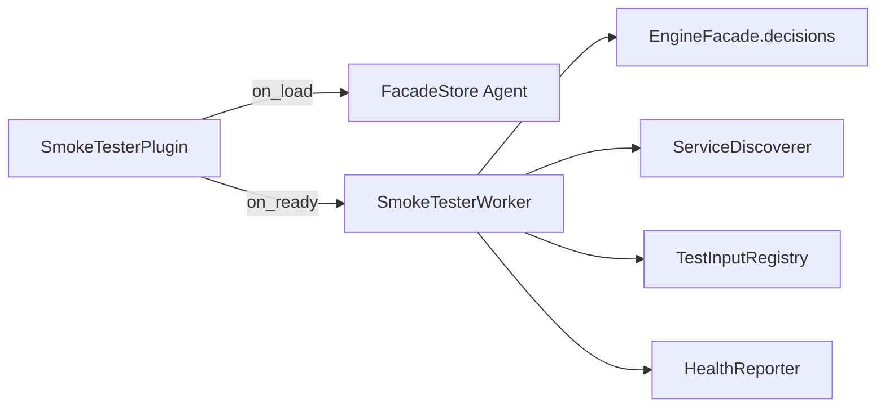

# Decision Service Smoke Tester — example lifecycle plugin

Automatically verifies every deployed DMN Decision Service is functional on engine startup.

## What this demonstrates

This plugin shows how to build a **facade-driven lifecycle plugin** that validates the DMN → Decision Service → evaluation pipeline without executing any Business Rule Task. On `on_ready/1` it:

1. Lists all deployed decision definitions via `facade.decisions.list/0`
2. Fetches DMN XML per model via `facade.decisions.get_xml/1`
3. Discovers Decision Service IDs with pure `ServiceDiscoverer` scanning
4. Evaluates each service via `facade.decisions.evaluate_service/4` using `TestInputRegistry` fixtures
5. Builds and logs a structured health report via `HealthReporter`

## DMN model overview

Model id **`insurance-pricing`**, namespace `https://example.com/dmn/insurance`.

| Element | Type | Role |
|---------|------|------|
| `age`, `smoker`, `coverage`, `preExistingConditions` | InputData | External inputs |
| Base Premium | DecisionTable (UNIQUE) | Age × coverage → `basePremium` |
| Risk Multiplier | DecisionTable (FIRST) | Smoker × conditions → `multiplier` |
| Final Premium | LiteralExpression | `basePremium * multiplier` |
| PricingService | DecisionService | Exposes Final Premium; encapsulates Base Premium and Risk Multiplier |

Fixture input for `PricingService`: age 35, non-smoker, standard coverage, one pre-existing condition → final premium **450**.

## BPMN process overview

`bpmn/insurance_quote_process.bpmn` runs:

```
Start → BusinessRuleTask("Get Insurance Quote") → UserTask("Review Quote") → End
```

The Business Rule Task uses `implementation="dmn"` and `<bfw:decisionRef>insurance-pricing</bfw:decisionRef>`. Deploy this BPMN together with the DMN when exercising end-to-end process execution; the smoke tester itself calls Decision Services directly through the facade.

## Health report format

```elixir
%{
  timestamp: ~U[2026-05-20T12:00:00.000000Z],
  total_models: 2,
  total_services: 3,
  healthy: 2,
  unhealthy: 1,
  details: [
    %{
      model_id: "insurance-pricing",
      service_id: "PricingService",
      status: :healthy,
      duration_us: 12_400,
      result_shape: %{output_count: 1, output_keys: ["Final Premium"]}
    },
    %{
      model_id: "other-model",
      service_id: "BrokenService",
      status: :unhealthy,
      error: {:service_not_found, "BrokenService"}
    }
  ]
}
```

- `total_models` — distinct `model_id` values in `details`
- `total_services` — number of service evaluations attempted
- `healthy` / `unhealthy` — pass/fail counts per service evaluation

## Usage steps

1. Copy `lib/*.ex` into your OTP application (or add the example path to code paths in development).
2. Deploy `dmn/insurance_pricing.dmn` via the engine API or Studio.
3. Set `:plugin_module` to `Examples.BusinessRules.DecisionServiceSmokeTester.SmokeTesterPlugin` and list your app in `BFE_PLUGINS_INBEAM`.
4. Start the engine; on plugin ready the worker runs the smoke test sweep.
5. Inspect engine logs for lines prefixed with `decision_service_smoke_tester:`.
6. Run unit tests:

```bash
mix test examples/plugins/business_rules/decision_service_smoke_tester/test/service_discoverer_test.exs
mix test examples/plugins/business_rules/decision_service_smoke_tester/test/health_reporter_test.exs
mix test examples/plugins/business_rules/decision_service_smoke_tester/test/smoke_tester_worker_test.exs
```

Or load all example tests via:

```bash
mix test apps/peripheral_plugins/test/examples/decision_service_smoke_tester_from_examples_test.exs
```

## Architecture: facade-driven, no BRT execution



- **`on_load/1`** — stores the wired facade in `FacadeStore`
- **`on_ready/1`** — starts `SmokeTesterWorker` with that facade
- **Worker** — list → get_xml → discover → evaluate_service → build report → log
- **Discoverer / Registry / Reporter** — pure functions; no GenServer, no facade dependency

Plugins observe and validate DMN through the facade; they do not replace Business Rule Task execution.

## Further reading

- [`BfwEngine.Plugin`](../../../../apps/engine_sdk/lib/bfw_engine/plugin.ex) — lifecycle callbacks
- [`BfwEngine.EngineFacade.Decisions`](../../../../apps/engine_sdk/lib/bfw_engine/engine_facade/decisions.ex) — facade closure surface including `evaluate_service`
- [`docs/architecture/dmn.md`](../../../../docs/architecture/dmn.md) — Decision Service evaluation
- [`docs/architecture/plugins.md`](../../../../docs/architecture/plugins.md) — plugin loading and facade wiring
- [`examples/plugins/business_rules/decision_regression_tester/README.md`](../decision_regression_tester/README.md) — similar facade-store worker pattern
