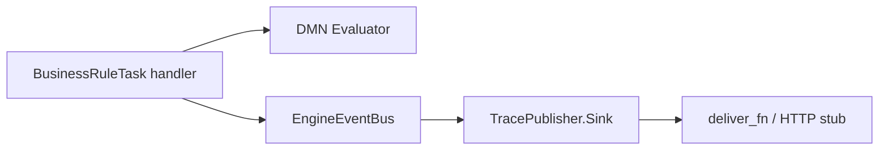

# Decision Trace Publisher — example event sink

Publishes structured DMN audit payloads when Business Rule Tasks finish in DMN mode.

## What this demonstrates

This plugin implements the **Event Sink audit publishing pattern**: it never executes decisions. The engine evaluates DMN via `BusinessRuleTask` → `DecisionResolver` → `ModelCache` → `Evaluator`; this sink listens on `EngineEventBus` for `FlowNodeInstanceFinished` events, builds an audit message from `type_properties` (including the execution trace), and delivers it through a configurable function (stubbed HTTP POST by default).

## DMN model overview

`dmn/order_risk_rules.dmn` defines model id **`order-risk-rules`** in namespace `https://example.com/dmn/risk`.

| Input | Type | Role |
|-------|------|------|
| `orderTotal` | number | Order value |
| `customerAge` | number | Buyer age |
| `paymentMethod` | string | Payment instrument |
| `shippingCountry` | string | Destination country code |

**Risk Score** — COLLECT + SUM over four inputs, ten rules assigning `riskPoints` (fraud signals stack).

**Risk Level** — UNIQUE, depends on **Risk Score** via DRG `requiredDecision`. Input `riskScore`; outputs `level` and `action` (`auto_approve`, `manual_review`, `reject`).

Evaluate the full DRG through REST with `decisionModelId: "Decision_Risk_Level"` (the model contains two decisions; omitting `decisionModelId` returns `ambiguous_decision`).

## BPMN process overview

`bpmn/order_risk_assessment.bpmn` runs:

```
Start → BusinessRuleTask("Assess Order Risk") → ExclusiveGateway("Risk Level?")
  → [token.action == "auto_approve"] → End("Approved")
  → [token.action == "manual_review"] → UserTask("Manual Review") → End("Reviewed")
  → [default] → End("Rejected")
```

The Business Rule Task uses `implementation="dmn"` and `<bfw:decisionRef>order-risk-rules</bfw:decisionRef>`. Gateway conditions read `token.action` from the DMN output.

## Usage steps

1. Copy `lib/*.ex` into your OTP application (or load the example path in development).
2. Set `:plugin_module` to `Examples.BusinessRules.DecisionTracePublisher.TracePublisherPlugin` and add your app to `BFE_PLUGINS_INBEAM`.
3. Deploy `dmn/order_risk_rules.dmn` via `POST /decisions`.
4. Deploy `bpmn/order_risk_assessment.bpmn` via `POST /processes`.
5. Start process instances with input such as:

```json
{
  "orderTotal": 1200,
  "customerAge": 22,
  "paymentMethod": "credit_card",
  "shippingCountry": "DE"
}
```

6. Observe audit delivery in logs (default stub) or your custom `deliver_fn`.
7. Run unit tests:

```bash
mix test examples/plugins/business_rules/decision_trace_publisher/test/trace_publisher_sink_test.exs
mix test examples/plugins/business_rules/decision_trace_publisher/test/audit_message_builder_test.exs
```

## Architecture: plugin observes, publishes, never executes



The sink filters `FlowNodeInstanceFinished` where `flow_node_type == :business_rule_task` and `type_properties["mode"] == "dmn"`. It does not call `facade.decisions.evaluate` or modify process tokens.

## Configuration

| Option | Module | Description |
|--------|--------|-------------|
| `deliver_fn` | `Sink.init/1` | `(audit_message :: map() -> :ok)` delivery hook; default logs a stub HTTP POST |

Production wiring example:

```elixir
deliver_fn = fn audit_message ->
  body = Jason.encode!(audit_message)
  # :httpc.request(:post, {url, headers, 'application/json', body}, [], [])
  :ok
end

facade.register_event_sink.(
  "decision_trace_publisher",
  Examples.BusinessRules.DecisionTracePublisher.Sink,
  [deliver_fn: deliver_fn]
)
```

## Further reading

- [`BfwEngine.Plugin.EventSink`](../../../../apps/engine_sdk/lib/bfw_engine/plugin/event_sink.ex) — sink callbacks
- [`docs/architecture/event-system.md`](../../../../docs/architecture/event-system.md) — `EngineEventBus` fan-out
- [`docs/architecture/dmn.md`](../../../../docs/architecture/dmn.md) — DMN evaluation and BRT `type_properties`
- [`docs/guides/handbook/business-rule-tasks.md`](../../../../docs/guides/handbook/business-rule-tasks.md) — Business Rule Task configuration
