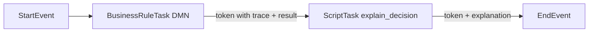

# Explain Decision — example named script

Transforms a DMN Business Rule Task evaluation trace on the process token into a human-readable explanation string.

## What this demonstrates

- **Named Script pattern** — one `BfwEngine.Plugin` module registers `explain_decision` via `register_named_script/2`
- **Trace consumption** — a Script Task reads the structured execution trace (`trace.decisions`) produced by a preceding Business Rule Task
- **Decide-then-explain** — linear BPMN flow: evaluate DMN, then explain the outcome for operators or end users

## DMN model overview

`dmn/loan_eligibility.dmn` defines model id **`loan-eligibility`** in namespace `https://example.com/dmn/loan`.

| Input | Type | Role |
|-------|------|------|
| `creditScore` | number | Applicant credit score |
| `annualIncome` | number | Gross annual income |
| `debtToIncomeRatio` | number | Debt-to-income ratio (0–1) |
| `employmentYears` | number | Years in current employment |

Decision **Loan Eligibility** uses **FIRST** hit policy with six rules (decline paths for low credit, low income, high DTI; approve paths for excellent, good, and standard profiles). Outputs: `approved` (boolean), `maxAmount` (number), `reason` (string).

## BPMN process overview

`bpmn/loan_approval_with_explanation.bpmn` runs:

```
Start → BusinessRuleTask("Assess Eligibility") → ScriptTask("Explain Decision") → End
```

| Element | Configuration |
|---------|----------------|
| Business Rule Task | `implementation="dmn"`, `<bfw:decisionRef>loan-eligibility</bfw:decisionRef>` |
| Script Task | `<bfw:scriptRef>explain_decision</bfw:scriptRef>` |

Output mappings on the Business Rule Task forward `approved`, `maxAmount`, and `reason` into the downstream token. The Script Task maps `explanation` and `decision_count` forward.

## Usage steps

1. Copy `lib/*.ex` into your OTP application (or load the example path in development).
2. Set `:plugin_module` to `Examples.BusinessRules.ExplainDecision.ExplainDecisionPlugin` and add your app to `BFE_PLUGINS_INBEAM`.
3. Deploy `dmn/loan_eligibility.dmn` via `POST /decisions` (claim `deploy_dmn`).
4. Deploy `bpmn/loan_approval_with_explanation.bpmn` via `POST /processes`.
5. Start a process instance with applicant data, for example:

```json
{
  "creditScore": 720,
  "annualIncome": 55000,
  "debtToIncomeRatio": 0.28,
  "employmentYears": 5
}
```

6. After the flow completes, read `explanation` on the final token (or query the Script Task FNI output token).

7. Run unit tests:

```bash
mix test examples/plugins/business_rules/explain_decision/test/explain_decision_script_test.exs
```

## Architecture: how the script reads the trace from the token

The DMN evaluator stores the full execution trace on the Business Rule Task FNI as `type_properties.trace` (snake_case keys inside the opaque map). The process token passed to the Script Task is the BRT **output payload** after output mappings — not the FNI row.

For `explain_decision` to receive trace data, the trace must appear on that token under the key `trace`:

```json
{
  "trace": {
    "decisions": [
      {
        "decision_name": "Loan Eligibility",
        "inputs": [...],
        "matched_rules": [...],
        "result": { "approved": true, "maxAmount": 500000, "reason": "Excellent profile" }
      }
    ]
  }
}
```

In production you typically forward trace with Business Rule Task **output mappings** once the mapping FEEL scope can reference evaluation metadata, or by merging trace from the BRT FNI via a dedicated integration step. The unit tests in `test/explain_decision_script_test.exs` supply this shape directly to `handle_enter/3`.

The script formats each decision as:

`Decision 'Name': Given input1 = val1, input2 = val2 → N rule(s) matched → Result: ...`

Multiple DRG decisions are joined with a blank line between entries.



## Further reading

- [Plugin Development — Getting Started](https://github.com/ElRaptorus/BFW-Engine/blob/main/docs/guides/plugins/getting-started.md)
- [NamedScript behaviour](https://github.com/ElRaptorus/BFW-Engine/blob/main/apps/engine_sdk/lib/bfw_engine/plugin/named_script.ex)
- [Business Rule Tasks handbook](https://github.com/ElRaptorus/BFW-Engine/blob/main/docs/guides/handbook/business-rule-tasks.md)
- [DMN architecture — evaluation trace](https://github.com/ElRaptorus/BFW-Engine/blob/main/docs/architecture/dmn.md)
- [Script Tasks handbook](https://github.com/ElRaptorus/BFW-Engine/blob/main/docs/guides/handbook/script-tasks.md)
