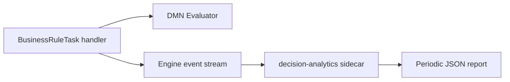

# Decision Analytics Sidecar

Real-time DMN decision analytics from a Node.js gRPC sidecar plugin.

## What this demonstrates

This example shows how a **gRPC sidecar** observes Business Rule Task (BRT) completions over an engine event stream and computes live analytics: evaluation throughput, latency histograms (average, p95, p99), per-decision rule-hit distribution, and latency spike anomaly detection. It mirrors the observation goals of the in-BEAM [`decision_kpi_calculator`](../../plugins/business_rules/decision_kpi_calculator/) example (8.1), but runs outside the BEAM as a language-agnostic sidecar process.

## Architecture

The sidecar **never executes** decisions. The engine evaluates DMN inside `BusinessRuleTask` handlers; the sidecar subscribes to `fni.finished` events (forward-looking wire name for `FlowNodeInstanceFinished`), filters DMN BRT completions, and aggregates metrics in memory.



Pure TypeScript modules (`AnalyticsCollector`, `LatencyHistogram`, `AnomalyDetector`, `ReportFormatter`) are unit-tested without a running engine.

## Forward-looking integration

Live integration requires the **gRPC sidecar bridge** planned for BPMN Implementation Phase 5. See [Implementation Phases — Phase 5 (sidecar bridge)](../../../docs/ImplementationPhases.md). Until then, `src/main.ts` uses a stub `SidecarPlugin` object that matches the `@elraptorus/daemonengine_sdk` contract shape.

## Configuration

| Variable | Default | Purpose |
|----------|---------|---------|
| `ENGINE_GRPC_HOST` | `localhost` | Engine gRPC host (when bridge lands) |
| `ENGINE_GRPC_PORT` | `50051` | Engine gRPC port |
| `REPORT_INTERVAL_MS` | `60000` | Interval for printing JSON analytics reports |

## Comparison with `decision_kpi_calculator` (8.1)

| Aspect | `decision_kpi_calculator` (8.1) | `decision-analytics` (8.9) |
|--------|--------------------------------|----------------------------|
| Runtime | In-BEAM Elixir event sink | Node.js gRPC sidecar |
| Registration | `register_event_sink` via OTP plugin | Sidecar `plugin.toml` + gRPC handshake |
| Aggregation | `KpiAggregator` GenServer | In-process `AnalyticsCollector` |
| Anomaly detection | Not included | `AnomalyDetector` rolling-window spikes |
| Tests | `mix test` | `pnpm test` (Vitest) |

Both examples use the same `bpmn/shipping_cost_process.bpmn` and `dmn/shipping_rates.dmn` fixtures.

## Running

From this directory (after `pnpm install` at `packages/js/`):

```bash
pnpm test
pnpm start
```

## DMN and BPMN fixtures

Deploy `dmn/shipping_rates.dmn` and `bpmn/shipping_cost_process.bpmn` to a running engine before starting process instances. The BRT references `shipping-rates` via `<evil:decisionRef>`.

Sample start payload:

```json
{ "weight": 3, "destination": "domestic", "express": true }
```
